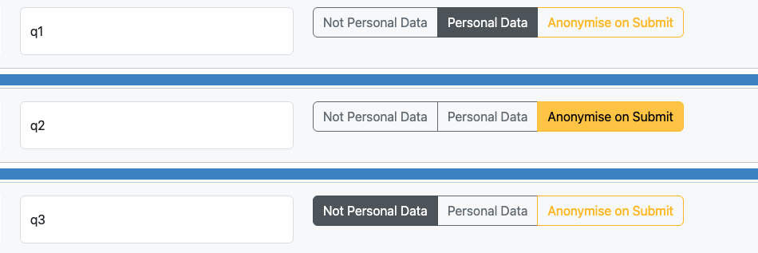
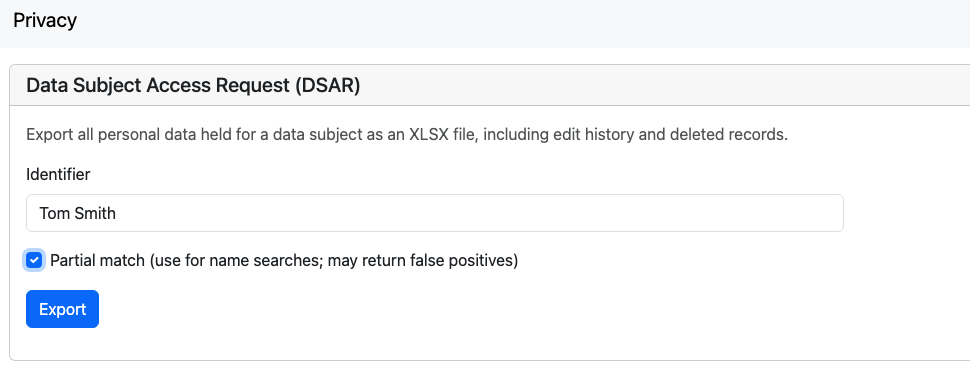
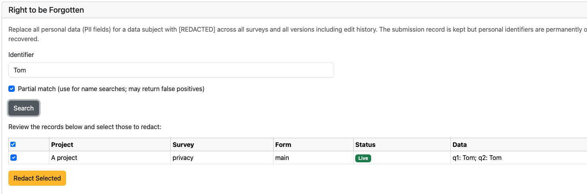

.. _admin-data-protection:

Data Protection (GDPR)
======================

.. note::

   The features on this page require server version **26.05 or later**.

.. contents::
 :local:

Overview
--------

Smap acts as a **Data Processor** on behalf of the organisation, which is the **Data Controller**.
The Data Controller owns responsibility for responding to Data Subject requests, notifying
regulators of breaches, and defining retention policies. Smap provides the tools to execute
those obligations.

Access to data protection tools requires the **DPO** (Data Protection Officer) role or
**Organisational Administrator** security group.

.. _pii-question-flags:

PII Question Flags
------------------

Questions in a survey can be marked to indicate whether they contain personal data.
Each question can be set to one of three states:

- **Not Personal Data** — default; no special handling
- **Personal Data** — flagged as PII; included in DSAR exports and RTBF searches
- **Anonymise on Submit** — value is SHA-256 hashed client-side (in WebForms and FieldTask)
  before transmission; the server never receives the plain-text value

Setting PII flags
+++++++++++++++++

In the **Online Editor**, select a question and use the three-button PII selector in the
question settings panel.

   Setting the PII flag in the online editor

In **XLSForm**, add a ``pii`` column to the ``survey`` sheet and set values to ``pii`` or
``anonymise`` (leave blank for not personal data).

Effect on email notifications
+++++++++++++++++++++++++++++

Fields marked as **Personal Data** or **Anonymise** are automatically suppressed from
notification email bodies. The notification is still sent but the PII field values are
omitted, satisfying requirements to keep personal data out of email bodies.

.. _dsar:

Data Subject Access Request (DSAR)
------------------------------------

A DSAR export produces a single XLSX file containing all records that match a given
identifier value across every survey in the organisation.

Accessing the DSAR tool
++++++++++++++++++++++++

The DSAR tool is available from the **Privacy** page, accessible via the user menu
(top-right dropdown) for users with the DPO or Analyst role.

Running a DSAR
++++++++++++++

1. Enter the identifier value (e.g. a name, ID number, or email address).
2. Optionally tick **Partial match** to find records where the identifier appears as a substring.
3. Click **Export**.

The downloaded XLSX contains one sheet per survey/form. Each sheet includes:

- **Project**, **Survey**, **Form**, **Status** columns followed by all PII-flagged columns
- **Status** is colour-coded: green = Live record, yellow = Edit history, coral = Deleted record
- PII column headers are bold and highlighted; PII data cells are highlighted

The export includes active records, edit-history rows, and soft-deleted records so that
the full data held for an individual is disclosed.

   Requesting a DSAR

.. _rtbf:

Right to be Forgotten
---------------------

The Right to be Forgotten (RTBF) workflow allows a DPO to search for an individual's
records and selectively redact PII fields. Redaction replaces field values with
``[REDACTED]``. Non-PII data is preserved for statistical integrity.

RTBF is a **two-phase** process — search first, then confirm — to prevent accidental
or over-broad redaction.

Phase 1 — Search
+++++++++++++++++

1. Open the **Privacy** page from the user menu.
2. Enter the identifier to search for. Tick **Partial match** if needed.
3. Click **Search**.

Results are displayed in a table with columns for Project, Survey, Form, Status (Live /
History / Deleted), and the matching field values. Each row has a checkbox selected by
default. Deselect any rows that are false positives before proceeding.

   Completed RBTF Search, ready to redact

Phase 2 — Redact
+++++++++++++++++

4. Review the results and deselect any false positives using the row checkboxes.
5. Click **Redact Selected**.

Only the checked rows are redacted. Redaction cascades to any child (repeat) forms
linked to the selected parent records. All redaction actions are audit-logged at
the organisation level.

.. _data-retention:

Data Retention
--------------

.. note::

   Automated retention and purge is **not yet available**. Records can be deleted
   manually using the :ref:`delete-restore` tools. Configurable retention policies
   with automatic purging are planned for a future release.

.. _cookie-compliance:

Cookie Compliance
-----------------

Smap uses only strictly necessary cookies:

- **JSESSIONID** — set by the server container for session management

No analytics, tracking, or third-party cookies are used. Under the ePrivacy Directive,
strictly necessary cookies are exempt from consent requirements; no cookie consent
banner is needed.
