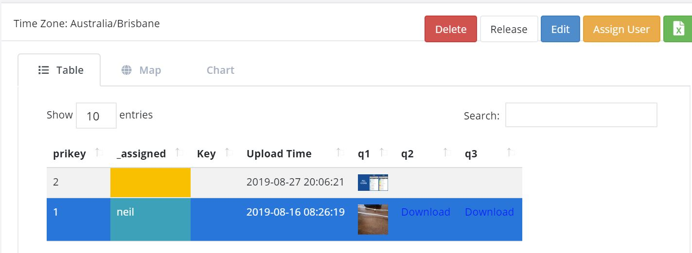
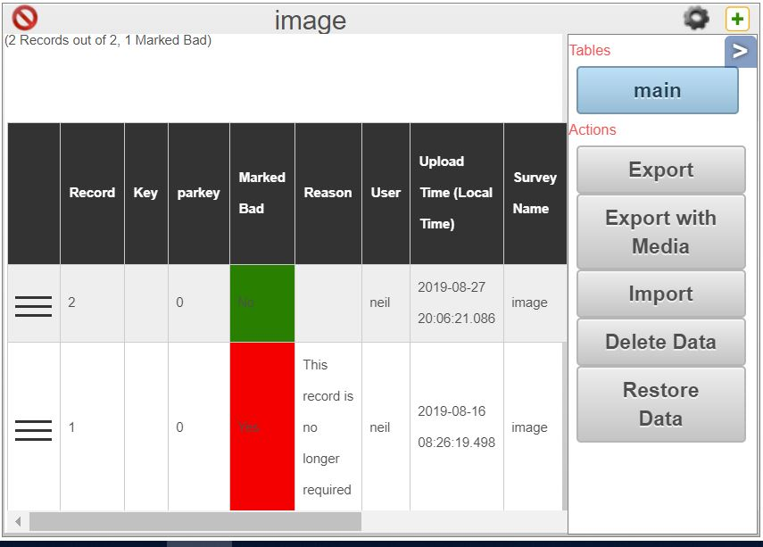

Deleting and Restoring Data
===========================

.. contents::
 :local:
 
There are 5 levels of data deletion each one more final than the previous ones.

#.  Marking as deleted
#.  Deleting all records
#.  Deleting the Survey Template and all its records
#.  Erasing the survey Template and all its records (automatic and manual)
#.  Purging of backups (automatic)

Marking Deleted
---------------

Records marked as deleted are not actually deleted but they no longer appear in exports and are not used when creating charts.  They are also not visible in 
the console unless you specifically request to see them.

.. note::

  Marking records as deleted is the recommended way to delete records that you don't want.  It leaves a clear audit trail and can easily be reversed if necessary.
  That is the record is never physically deleted unless the survey is deleted.

   Marking Records Deleted in the Console
   
The :ref:`console` can be used.  Select the record you want to delete and then click the delete button. You can optionally
enter a reason.

Restoring Records marked as Deleted
+++++++++++++++++++++++++++++++++++

.. figure::  _images/delete2.jpg
   :align:   center
   :width: 	 600px
   :alt:     Marking as Not Deleted in the Console

   Marking Records as Not Deleted in the Console
   
To restore a record toggle the switch "Include Deleted" then select the record you want to restore and click "Undelete".  You can optionally
enter a reason.

Deleting all Records
--------------------

This is still done in a table view of the analysis page.   You can mark records deleted here as well but the console is now the preferred
place to do that.

Create a table view of your survey. To do this click on the table button, then select your survey and press OK. Then click on the aside button "<".

   Deleting All Records
   
You can then click on the button to delete the data.

Restoring All Records
+++++++++++++++++++++

Underneath the "Delete Data" button is the "Restore Data" button.  This will restore the data by replaying all the submissions.

.. warning::

  Because the records are restored from the initial raw submissions, if you have done any data cleaning or updated the data via the console
  then these changes will be lost.
  
Recovering (Level 2)
++++++++++++++++++++

What if you have deleted a survey more than 100 days ago when you realise that a phone has some unsubmitted results. (Deleted surveys are erased after 100 days). 
Or perhaps you manually erased the deleted survey in case it had sensitive data recorded in it.  In this case you can send the submitted results to any other
survey.  

.. note::

  Its up to you to make sure that the survey you are sending the data to makes sense.  Generally this should be a later version but it does not
  have to be.  Data will be added for any questions that have the same name in the deleted survey and the surevey you are sending the results to.
  Any other questions are ignored.

Follow these steps to redirect the failing submissions:

#.  Select the **Monitoring** menu from the admin module

#.  Selected **Submitted** as the Source

#.  Select **Instances** under show

#.  In the data section you can restrict instances to only those in a specific project. You can also sepcify that only "Errors" are shown

#.  Find a submission to the deleted survey that has been marked as an error.  Any submission will do because once you have added the redirection
    you can resubmit from the phone(s) and all submissions will be redirected.

#.  Click on the redirect button.

Deleting the Survey Template
----------------------------

On the survey management page you can click the checkbox next to surveys you no longer want and then click the 
"Delete Forms" button at the bottom of the page.  The surveys and all their data will be deleted.

Restoring Deleted Surveys
+++++++++++++++++++++++++

Deleted surveys are easily recovered.  Select the checkbox marked "Show deleted forms" at the top of the form management page.  
Deleted surveys will be shown in red with the date and time that they were deleted appended to their name.  Select the ones that
you want to restore and click the "Restore Forms" button.

.. note::

  Deleted surveys will be automatically erased after 100 days.

Erasing Survey Templates
------------------------

Only deleted surveys can be erased, this happens automatically after 100 days, however you can manually erase a deleted 
survey at any time.  Follow the steps for restoring deleted surveys but instead of 
clicking on "Restore Forms" click on "Erase Forms". The data has now been removed from the production
server and only exists in backups. As these backups are purged after 100 days the timer is ticking if you
change your mind and want to get the data back.  

.. warning::

  Erased surveys can only be restored from data backups which requires work by IT operations.  
  So it won't happen unless you have a support contract.

Purging Backups
---------------

.. note::

  This applies only to hosted services provided by Smap Consulting.  If you are hosting the server youself
  then it will be up to you to manage backups and set a backup policy.

Backups of the database, media files, survey templates and the original xml files containing a submission are
retained for 100 days after the survey is erased, then the backup is purged.  The data is now gone for good and cannot
be recovered.

