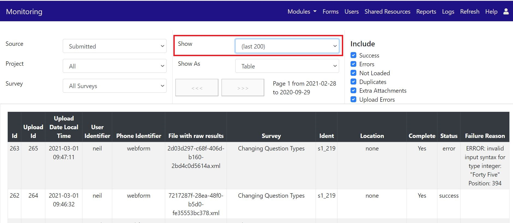

.. _admin_monitor:

Monitoring
==========

.. contents::
 :local:

The monitoring page can be used to track down problems with submissions of data or notifications. To access it select the `admin` module and then
the `monitoring` menu option. 

Submission Totals
-----------------

By default monitoring will show submission totals.

.. figure::  _images/monitor1.jpg
   :align:   center
   :alt:     The monitoring page showing submission totals

   Submission Totals

Submission Details
------------------

Show show details on each submission including error messages select

   Submission Details

Select "last (200)" to see details on the last two hundred submissions. If you have a lot of submissions or the problem happened a significnt 
amount of time ago then you can:

*  page through these submissions using the buttons labelled ">>>" and to get the previous 200 "<<<"
*  restrict the details to a single survey by selecting the project and then the survey
*  uncheck the status values that you are not interested in.  For example you may not want to see successful submissions so unchecking that
   will hopefully remove a lot of the unneeded details
