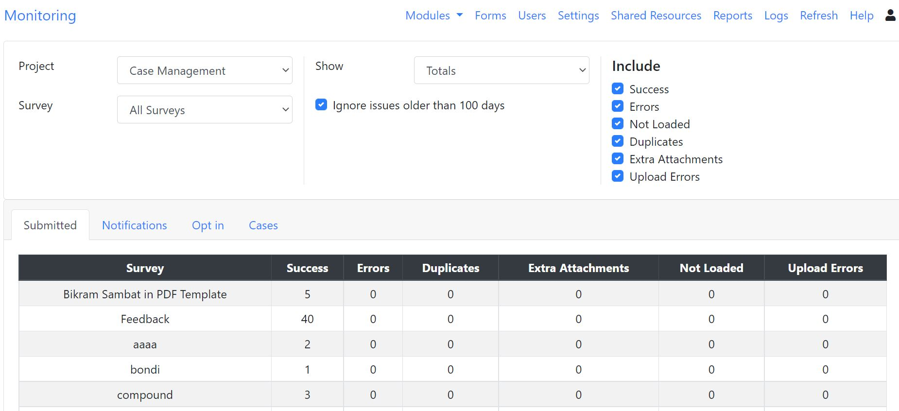
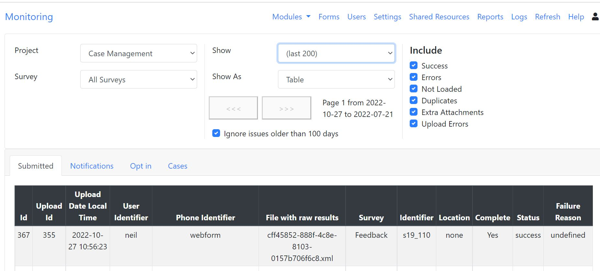

.. _admin_monitor:

Monitoring
==========

.. contents::
 :local:

The monitoring page can be used to track down problems with submissions of data or notifications. 
To access it select the `admin` module and then the `monitoring` menu option. 

The page has multiple tabs each of which show events from a different source.

Submitted
---------

Totals
++++++

By default monitoring will show submission totals.

   Submission Totals

Details
+++++++

Show show details on each submission including error messages select

   Submission Details

Select "last (200)" to see details on the last two hundred submissions. If you have a lot of submissions or the problem happened a significant
amount of time ago then you can:

*  page through these submissions using the buttons labelled ">>>" and to get the previous 200 "<<<"
*  restrict the details to a single survey by selecting the project and then the survey
*  uncheck the status values that you are not interested in.  For example you may not want to see successful submissions so unchecking that will hopefully remove a lot of the unneeded details

.. _admin_monitor_reapply:

Re-apply failed uploads
+++++++++++++++++++++++

This button will be shown if you select a specific survey and it will be enabled if submissions have failed to be applied to the database.  Unless the underlying
reason for the failure has been resolved there will be little point in clicking the button however, if you believe the problem may have been fixed then press the button.
The submissions in error should immediately be removed from the list.  They will either reappear as "success" or as an "error" again, after they have been processed.

Notifications
-------------

This shows the notifications that have been sent. When viewing the last 200 of these, you can select a retry 
button to resend a failed notification.

Opt in messages
---------------

Opt in messages are sent once to an email user before they are sent email tasks or email notifications.  You can view the status of these messages here. You
can request a resend of an opt-in message but you should check first with the recipient that they do actually want to opt in to email messaging.

Server
------

Only shown to users with the server owner security group.  This shows the state of the background processes that apply
submissions and send messages, so you can see whether work is backing up.

There is a panel for each queue:

*  Submissions.  Submitted results waiting to be written to the database.
*  S3 Storage.  Media files waiting to be moved to storage.
*  Messages.  Notifications, emails and other messages waiting to be sent.
*  Restore.  Requests to restore data.

Each panel shows the number of items being processed now (**Live**), the number waiting (**Backlog**), how many are arriving,
completed and failing per minute, and the number of workers active.  Below the panels are a snapshot of the current queues, a
chart of processing rates over the last 10 minutes, and a **Worker Detail** section listing each worker.

A backlog that keeps growing, or a rising error rate, indicates a problem that should be investigated in the server logs.

Client Errors
-------------

Written to tomcat log.  Search for these with the string "client-error"
