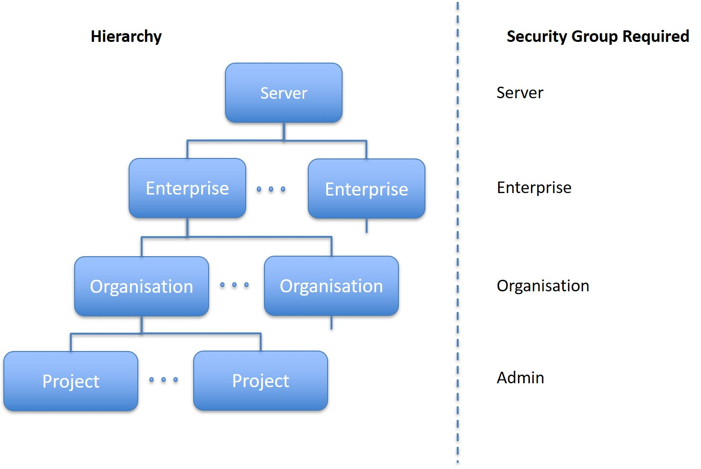
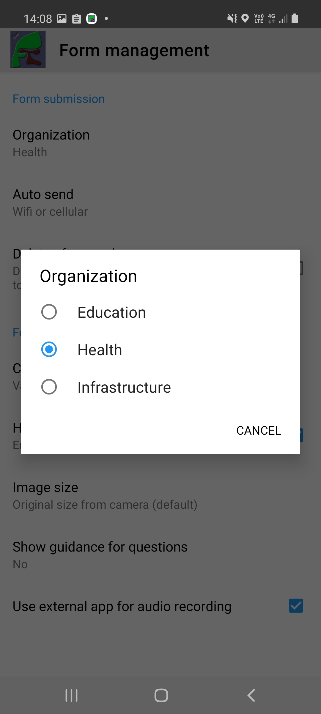

.. _organisations:

Organisations
=============

.. contents::
 :local:
 
Organisations can contain users, surveys and projects.  Each organisation is isolated from the others so that a user cannot move to a
different organisation unless they are invited to by an organisational administrator or the administrator who created the organisation. 
These features allow organisations to be used to manage surveys for security reasons and to keep things simple.  A user should only see
the surveys that they are currently working on. Refer to :ref:`organisational-hierarchy` for an overview of how organisations fit
with other techniques for managing surveys.

Users can be members of multiple organisations although they can only be active in one organisation at a time.  A user 
can belong to different security groups in each organisation that they are a member of. So a user in one organisation could be an administrator in another they
can be an enumerator.

Organisations are managed on one of the tabs of the users page.  To get to it select the menus; **Modules** then **Admin** then **Users**
then the **Organisations** tab.  

.. tip::

  If you have organisational administration privilege then you will see all of the organisations on the server listed on this tab.  Otherwise,
  if you have administrator privilege you will see the organisations that you have created.
  
.. _organisational-hierarchy:

Organisational Hierarchy
------------------------

Surveys and data are stored in a hierarchical structure. The security groups possessed by a user determines how high in that structure they
can go. 

   Organisational Hierarchy
   
Hence if a user has the **admin** security group then they can create and add themselves to projects.  However unless they have
the **organisation** privilege they cannot access projects in a different organisation.  The same applies to a user with the
**organisation** privilege.  They can create and access different organisations and all the projects within those organisations
however they cannot access organisations or projects in a different enterprise.

Private Organisations
---------------------

You need the `organisational administration` privilege to manage all of the organisations on the server. However any administrator can
add new organisations that only they (and the organisational administrator) has access to.  These are known as "private organisations".  They work 
exactly the same as an organisation created by the org administrator except that the admin who created them can also manage them.

.. _organisations-settings:

Settings
--------

Click on the name of the organisation.  This will open a dialog to edit the settings.

#. Organisation Details.  This is name and address details that can be automatically added to generated PDFs.

#. Email options. Sets up the email proxy server that this organisation will use.

  *  Email to get Help.  The administrator email.  If set this email address will also be sent emails notifying them of permission changes made to the organisation settings (See below for settings marked as "notify admin")
  *  Smtp Host.  The host name of the smtp relay that will forward email messages from the smap server.
  *  Email domain.
  *  Email user name
  *  Email password
  *  Email server port

#. Appearance

   *  Set the Banner logo for webForms
   
   *  Set the image for the home page
   
   *  Set the menu bar color

#. Other

   *  Allow results to be edited on the server (notify admin user if changed)
   
   *  Allow sending of tasks to email addresses (notify admin user if changed)
   
   *  Allow sending of notifications (notify admin user if changed)
   
   *  Allow submissions of data to this organisation (notify admin user if changed)
   
   *  Allow sending of SMS messages (in notifications) (notify admin user if changed)
   
   *  Set the default time zone for the organisation.  Usually time zone is obtained from a user's browser settings. However
      where reports are generated automatically this information may not be available and the time zone set here will be used.
	  
   *  Set the default language for the organisation. As for timezone normally the user's language is used.

   *  Minimum password strength

Moving between organisations
----------------------------

On the Server
+++++++++++++

If you are using a browser on the server then when you click on the user profile menu, the icon that looks like a person's head and shoulders, 
you will see a dialog that includes the
name of the organisation that you are currently in.  If you access other organisations then you can select a different organisation in this
dialog to move to it.

Using FieldTask
+++++++++++++++

If you have FieldTask version 6.300 or higher then you can select a new organisation from inside the app without having to log on to the server
using a browser.  Select the **General Settings** menu and then **Form Management**.  You can then select the **Organization** option.

   Selecting a new organisation in fieldTask

Once you have changed organisations FieldTask will automatically refresh and download the Surveys and Tasks that apply to the new organisation.

Providing permission to move to another organisation
----------------------------------------------------

This is done in the users tab.  Select a user for editing then you can specify which organisations they can access.

