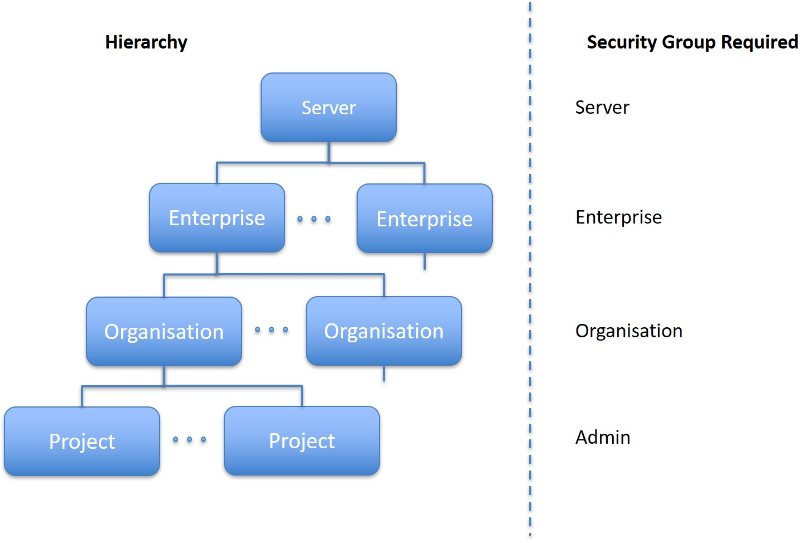
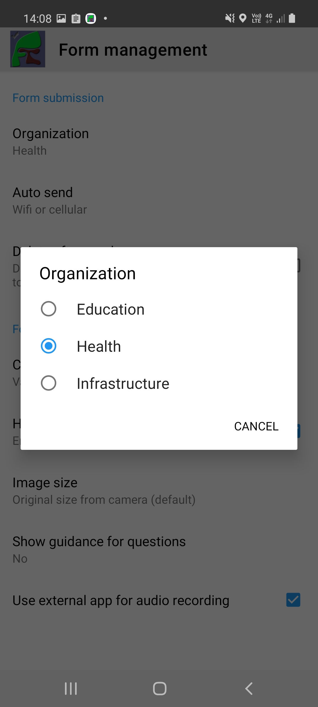

.. _organisations:

Organisations
=============

.. contents::
 :local:
 
Organisations can contain users, surveys and projects.  Each organisation is isolated from the others so that a user cannot move to a
different organisation unless they are invited to by an organisational administrator or the administrator who created the organisation. 
These features allow organisations to be used to manage surveys for security reasons and to keep things simple.  A user should only see
the surveys that they are currently working on. Refer to :ref:`organisational-hierarchy` for an overview of how organisations fit
with other techniques for managing surveys.

Users can be members of multiple organisations although they can only be active in one organisation at a time.  A user 
can belong to different security groups in each organisation that they are a member of. So a user in one organisation could be an administrator in another they
can be an enumerator.

Organisations are managed on one of the tabs of the users page.  To get to it select the menus; **Modules** then **Admin** then **Users**
then the **Organisations** tab.  

.. tip::

  If you have organisational administration privilege then you will see all of the organisations on the server listed on this tab.  Otherwise,
  if you have administrator privilege you will see the organisations that you have created.
  
.. _organisational-hierarchy:

Organisational Hierarchy
------------------------

Surveys and data are stored in a hierarchical structure. The security groups possessed by a user determines how high in that structure they
can go. 

   Organisational Hierarchy
   
Hence if a user has the **admin** security group then they can create and add themselves to projects.  However unless they have
the **organisation** privilege they cannot access projects in a different organisation.  The same applies to a user with the
**organisation** privilege.  They can create and access different organisations and all the projects within those organisations
however they cannot access organisations or projects in a different enterprise.

Private Organisations
---------------------

You need the `organisational administration` privilege to manage all of the organisations on the server. However any administrator can
add new organisations that only they (and the organisational administrator) has access to.  These are known as "private organisations".  They work 
exactly the same as an organisation created by the org administrator except that the admin who created them can also manage them.

.. _organisations-settings:

Settings
--------

Click on the edit button next to the organisation.  This will open a dialog to edit:

*  Name.  The name of the organisation.
*  Organisation details.  Name, address, phone and email details that can be automatically added to generated PDFs.

.. note::

  From SmapServer v26.10.  In earlier versions the dialog also contains the email, other options and monthly usage
  limit settings.

All other organisation settings are set on the :doc:`settings <admin-settings>` page for the organisation that you are
currently in.  To change them for a different organisation, first move to that organisation.

*  Access settings and monthly usage limits.  :ref:`organisation-admin-settings` tab.  Organisational administrators only.
*  Email server.  :ref:`email-settings` tab.
*  Time zone, language, map source, editing of results, opt in, redactions and password strength.
   :ref:`other-settings` tab.
*  Logos, menu bar colour and style sheet.  **Appearance** tab.
*  WebForm appearance.  **Webform Options** tab.

Moving between organisations
----------------------------

On the Server
+++++++++++++

If you are using a browser on the server then when you click on the user profile menu, the icon that looks like a person's head and shoulders, 
you will see a dialog that includes the
name of the organisation that you are currently in.  If you access other organisations then you can select a different organisation in this
dialog to move to it.

Using FieldTask
+++++++++++++++

If you have FieldTask version 6.300 or higher then you can select a new organisation from inside the app without having to log on to the server
using a browser.  Select the **Settings** menu and then **Form Management**.  You can then select the **Organization** option.

   Selecting a new organisation in fieldTask

Once you have changed organisations FieldTask will automatically refresh and download the Surveys and Tasks that apply to the new organisation.

Providing permission to move to another organisation
----------------------------------------------------

This is done in the users tab.  Select a user for editing then you can specify which organisations they can access.

