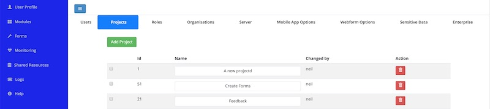
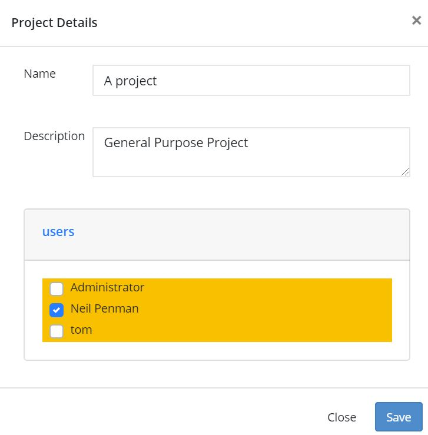

.. _projects:

Projects
========

.. contents::
 :local:
 
Surveys are stored in projects in the same way directories are used to store files on a computer.  They are the principle mechanism
for managing large numbers of surveys. Enumerators can be given access to a project which then gives them access to all the surveys in that 
project.

To get to the project page select the menu **modules** then **admin** then **users** then select the **projects** tab.

.. warning::

  The **admin** security group is required in order to access the projects page.

Simplify the work environment
-----------------------------

*  Enumerators would generally only have access to the project they are working on so they are not distracted by other surveys
*  Analysts may have access to several projects but only in the area they are working on
*  Keep the number of forms per project small

Security
--------

You can use projects to restrict access to surveys and their data to authorised users

.. warning::

  If a user has the "admin" security group then they will be able to give themselves access to any project in the organisation. Hence the
  use of projects for security is only applicable for non admin users.  
  
Getting to the project management page
--------------------------------------

Project management is in the users page of the admin module.  Select the menu **modules** and then **users**.  From the users 
page select the **Projects** tab.

   
Project Management
------------------

*  To add a project click on the **Add Project** button
*  To delete a project select the red button, with the trash icon, to the right of the project name.  All
   surveys inside a project will need to have been erased before you can delete it.
*  To edit a project click on the name of the project

   Project Details

When you create a project you are automatically added as a user of that project.  You can add other users by clicking on the "Users" link
in the project details dialog.  Alternatively you can
go to the **Users** tab and update the settings for each affected user.

