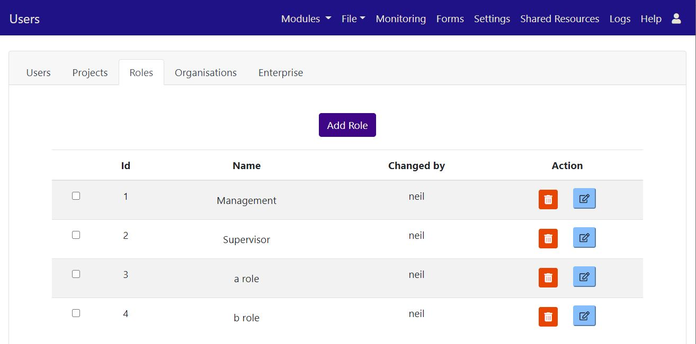
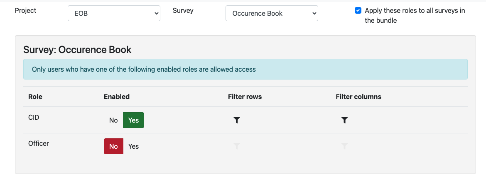

.. _rbac:

Role Based Access Control (RBAC)
================================

.. contents::
 :local:  
 
Introduction
------------

Security Roles allow you to:

*  Restrict access to specific surveys so that even administrators who don’t have the required role, cannot access them
*  Restrict access to specific columns that may contain sensitive data
*  Restrict access to specific rows, for example a user from Region A may only be allowed to see data from Region A 

A refresher on security groups:
 
*  Users can only access surveys in projects that they are members of
*  Users with Analyst privilege can access all data in all the surveys in their projects
*  Users with Admin privilege can give themselves access to any project in the organisation and can give 
   themselves Analyst privilege as well so in practice they can access everything

.. warning:

  Use Sparingly
  
  Setting up role based access control on lots of surveys will introduce a significant management overhead.
  
  It can also become quite complex and users who need access to data may be denied it because they do not have a role while other
  users may be given access by mistake.  You may also find yourself constantly answering queries from people who do not have
  access to a survey.
  
Recommended Approach
--------------------

1.  Set up Role Based access for just a few surveys which contain particularly sensitive data
2.  Mainly use it with surveys that are stable over time rather than surveys that come and go quickly
3.  The main security controls should still be implemented using projects
4. If you have a group of people who should work independently and not share data with other 
   groups then you can create a separate organisation for them

Setting up Roles
----------------

There are 3 steps to setting up roles

1.  Create a role
2.  Assign users to a role
3.  Assign surveys to a role

After completion of these 3 steps only users with the specified role with be able to 
access the survey that has that role.

1. Creating Roles
+++++++++++++++++

Select the menu **modules** then **admin** then **users**.  On the user management page select the **roles** tab.

   
   Adding a Role

Click on **Add Role** to create the role.  You can give a role any name you like so choose something that is meaningful to you.
Remember what is important about a role is not its name but the way it links a survey and a user.

2. Assign the role to a user
++++++++++++++++++++++++++++

You can add or remove users from a role inside the role details dialog.  Open the role for editing then click on 
"Users" to show the list of available users that can have the role.

ALternatively elect the users tab, then select the user that you want to assign the role. If you have the **security** privilege
then you will see a section in the dialog labelled **Roles**.  Select the roles that you want to assign to the user.

   
   Assigning a Role to a Users
   
3. Assign the role to a survey form (Online Editor)
+++++++++++++++++++++++++++++++++++++++++++++++++++

Open the survey in the online editor and then select the menu **File** then **Roles**.

   
   Assigning a Role to a Survey
   
You can then enable and disable roles for the form. If no roles are enabled then there are no role 
based restrictions on accessing the survey and its data.  If at one role is enabled 
then users will need that role in order to access it.  If more than one role is enabled then
users will need at least one of the roles to access the survey.

Filtering
---------

A user that has a role that is enabled for a survey can access the survey.  
However you can also restrict the rows and columns that they see.

If the user has more than 1 role enabled for the survey then the can access the union 
of the columns and rows allowed for each role.

For example role1 allows access to column q1 and role 2 allows access to column q2 then 
the user will have access only to columns q1 and q2.

Filtering is specified on the **survey roles** page where you have just enabled a role for a survey.

Filtering Rows
++++++++++++++

Rules for the rows that should be shown are entered the same syntax as for :ref:`server-calculations`.

   
   Filtering Rows
   
Example::

  ${region} = ‘region_a’

Only rows with a value of region_a for the region question will now be shown.

Filtering Columns
+++++++++++++++++

Simply select the columns / questions that people with the role can access.

.. figure::  _images/roles6.jpg
   :align:   center
   :width:   300px
   :alt:     Filtering Columns
   
   Filtering Columns

Filter Groups
+++++++++++++

A user can have multiple roles, each of which has a filter.  There are a number of ways you may want to combine these filters. For example
a survey may have the roles:

*  WASH Project
*  Food Distribution Project
*  Shelter Project
*  Security Level 1
*  Security Level 2
*  Security Level 3

A user may be given the roles:

*  WASH Project
*  Food Distribution Project
*  Security Level 1
*  Security Level 2

The expectation would be that this user can see all the records at security levels 1 or 2 for the WASH and Food Distribution projects. They should
not be able to see anything on the Shelter project at any security level nor anything at Security Level 3 in any project.  This logic can be
implemented using filter groups.

There are two groups available:

#.  Group A
#.  Group B

We can start by putting the project roles into group A. Each additional role we add in here increases the number of records that can be
accessed so the user will be able to see data from all the projects for which they have been given the role.  The security roles
will need to go into a different group, group B,  so that they restrict the records allowed from group A to the ones that match the
granted security roles.

Applying filters to whole bundle (Online Editor)
-------------------------------------------------

This feature is available in server version 25.01+.

When you are editing the roles that apply to a survey you will now see a checkbox labelled "Apply these roles to all surveys in the bundle".

If you select this checkbox then the settings for each role that is enabled in the current survey will be applied to all other surveys in the bundle.
These settings include:

#.  Row filters
#.  Column filters

In the above image the row filters and column filters in the CID role for the EOB survey will be applied to all other surveys
in the bundle that also have the CID role.  Furthermore if you subsequently change the row filters or column filters in any survey then other surveys
that have that role enabled will be updated.

Assign the role to a Survey (XLS Editor)
--------------------------------------------

To specify roles that filter columns add them to the survey work sheet and put a “yes” for each 
that is visible to that role.

To specify roles that filter rows add them to the settings work sheet and put the filter directly under the role

Specify roles as role::role_name

For example here is a form with a role called “test” that will filter rows.

   
   Assigning a Role to a Survey

