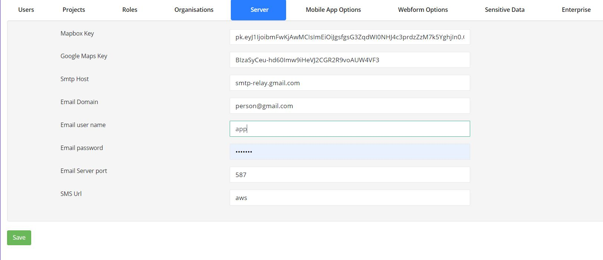

.. _admin-server:

Server
======

.. contents::
 :local:

.. warning::

  The **server** security group is required in order to access the server management page.
  
To get to the server management screen select the **Admin** module then **Users** then select the **Server** tab.
  

   Server Settings

The settings in the server page are defaults that apply to all organisations be default but can ususally be overridden by the
organisation settings for a single organisation.

Mapbox Key
----------

The key for the mapbox account which provides many of the maps used by the server.  Each mapbox key is permitted a number of
free map accesses per month after which there will be a charge. (Note the Mapbox and Google keys in the above image are not 
real keys).

Google Map Key
--------------

Where google maps are used a google map key is requried.  As for Mapbox Google have a free usage threshold after which there
will be a charge.

Email Settings
--------------

Smtp Host, Email Domain, Email user name, Email password, Email Server port are all used when setting up the email server.

SMS Url
-------

This can be set to a URL that will be used to send SMS notifications.   The URL should have a placeholder for the phone 
number and the message.  

* ${phone}
* ${msg}

For example::

  https://sms.provider.com/send?user=auser&password=apassword&number=${phone}&msg=${msg}

If AWS is to be used to send the SMS messages then enter the word **aws** into this field.

.. warning::

  SMS messaging may result in a cost.  Hence it cannot be set up at the organisational level and can only be specified in the
  server settings.
