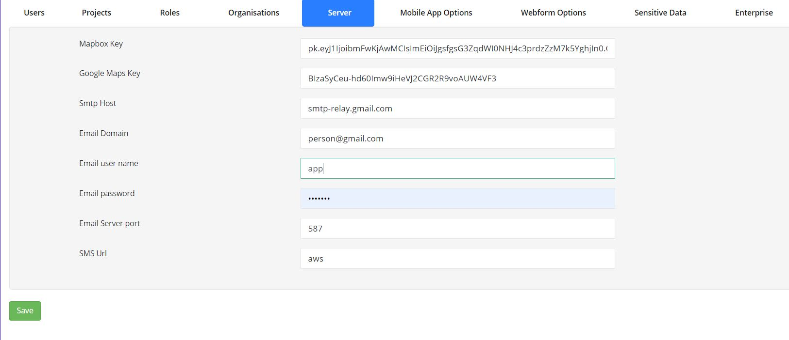

.. _admin-server:

Server
======

.. contents::
  :local:

.. warning::

  The **server** security group is required in order to access the server management page.
  
To open the server management screen, select **Admin**, then **Users**, and then the **Server** tab.
  

   Server Settings

The settings on the server page are defaults that apply to all organisations by default, but they can usually be overridden in
an individual organisation's settings.

The server security group
-------------------------

This security group indicates that the user owns the server and can therefore change server-wide settings or monitor
server-level events. You cannot set this security group through the user interface. Instead, run SQL directly:

#. Connect to the ``survey_definitions`` database.
#. Get the user ID for the user who should have server administration rights:

   .. code-block:: sql

      select id from users where ident = '{user_ident}';

   Replace ``{user_ident}`` with the user's ident.

#. Update the ``user_group`` table. The numeric identifier of the owner security group is ``9``:

   .. code-block:: sql

      insert into user_group (u_id, g_id) values (123, 9);

   Replace ``123`` with the user ID from the previous step.

Mapbox Key
----------

This is the key for the Mapbox account used by many of the server maps. Each Mapbox key allows a number of free map requests
per month, after which charges apply. (The Mapbox and Google keys in the image above are not real keys.)

Google Map Key
--------------

Where Google Maps is used, a Google Maps key is required. As with Mapbox, Google provides a free usage threshold, after which
charges apply.

Email Settings
--------------

``SMTP Host``, ``Email Domain``, ``Email Username``, ``Email Password``, and ``Email Server Port`` are used when configuring
the email server.

SMS Url
-------

Set this to the URL used to send SMS notifications. The URL should include placeholders for the phone number and message.

* ${phone}
* ${msg}

For example::

  https://sms.provider.com/send?user=auser&password=apassword&number=${phone}&msg=${msg}

If AWS is used to send SMS messages, enter **aws** in this field.

SMS messages can be sent from notifications. Once you set the SMS provider URL here, ``SMS`` becomes available as a notification
target. In the notification, you can specify the destination number directly or provide a question in submitted data that
contains the number. Define the message text in the notification ``content`` section. You can insert submitted data values
using ``${question_name}``.

.. warning::

  SMS messaging may result in a cost. Therefore it cannot be set up at the organisational level and can only be
  enabled in the server settings.

API requests per minute
-----------------------

If set to 0, there is no limit. Otherwise, this value sets the maximum number of API requests per organisation,
per module, per minute. The API services currently managed by this limit are:

*  /api/v1/data
*  /api/v1/data.csv
*  /surveyKPI/items

Minimum Password Strength
-------------------------

If set, this specifies the minimum password strength allowed on the server. The enforced strength is the higher of
this value and the organisation-level minimum password strength.
