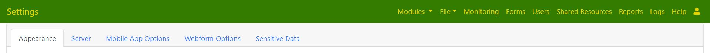

Settings
========

.. contents::
 :local:

The settings page is new from version `21.01`, previously it was part of the **users** page.

   
   Settings Tabs
   
Appearance
----------

From here you can set the appearance of server pages for the current organisation.  Each organisation can have
its own appearance.

You can:

*  Set an image to appear on the home page
*  Set the background colour of the menu bar
*  Set the text colour of the menu bar (New in version 21.01)
*  Set a custom style sheet to customise buttons, fonts etc

Custom Style Sheet
++++++++++++++++++

Smap server from version 21.01 uses Bootstrap version 4.5.  The buttons and other elements of the pages
are styled using the default bootstrap style sheet.  However you can upload alternatives.  Various websites offer 
themes that you can adapt in order to get the appearance that suits your organisation.  

To add a customised stylesheet using `Themestr.app <https://themestr.app/theme>`_ you can:

*  Navigate to the Themestr website
*  Select a theme palette
*  Customise the colors, fonts and variables
*  Select **Download CSS**
*  Rename the downloaded file to something that is meaningful for you
*  In the appearance tab click on "Upload a CSS style sheet" 
*  Click on "Select a style sheet" and select the file you just uploaded
*  Click "Save"

Refer to the following video for a demonstration of the process.

.. raw:: html
  
 <iframe width="560" height="315" src="https://www.youtube.com/embed/gnFFWl-8DHo" frameborder="0" allow="accelerometer; autoplay; encrypted-media; gyroscope; picture-in-picture" allowfullscreen></iframe>

Server
------

The server tab is only shown to users who have the server owner group.  It can be used to set parameters for the entire server:

*  Mapbox key.  This key can be obtained from https://mapbox.com and allows you to use maps from mapbox as backgrounds.
*  Google maps key.  A key can be obtained from https://developers.google.com and entered here.  It allows you to use maps and satellite images from google.
*  Smtp Host.  The host name of the smtp relay that will forward email messages from the smap server.
*  Email domain.
*  Email user name
*  Email password
*  Email server port
*  SMS Url.  Url of service to send SMS messages, or just "aws" if the AWS SMS service is to be used.

There is also a section on setting a server wide custom style sheet.  The approach is identical to that for the per organisation style sheet described in the
appearance tab.

.. mobile-device-settings:

Mobile App Options
------------------

This tab allows setting of options for FieldTask.  When the user presses refresh on FieldTask these settings will be applied on their device.  Many
of these settings include the option "set on phone" as they can also be set by the phone user.  However if another setting is selected then the 
on-phone setting will be overridden. These settings apply to all fieldTask instances logged on as a user in the current organisation.

*  Allow finalised forms to be opened for review.  If set the user will be able to view completed surveys in read only mode and add comments. They will not
   be able to change the answers to any questions.
*  Automatically synchronise.  If set the phone will refresh when a form changes on the server.  The refresh can be specified to occur if connected to wifi only or
   when also connected via a cellular network.  If the option **set on phone** is selected then the enumerator can enable or disable automatic synchronisation
   using the menus on the phone.
*  Delete submitted results from the phone. After a completed survey has been sucessfully submitted it can be automatically deleted from the device.  This is
   recommended to improve security.  If you do not select this option then you should manually delete completed forms when you are confident that you have the
   data.
*  Backward navigation. The ability of the user to go back to a previous question can be blocked using this option.
*  High Resolution Video.  If set prevents the recording of high resolution videos.
*  Screen navigation.  Can be set to use swipes, buttons or both.
*  Guidance.  How and when survey guidance should be shown.
*  Maximum pixels of the long edge of an image. This is a very useful setting to reduce the size of images that have to be sent over the network and stored
   on the server.  The image will be scaled according to this setting, so if the image on the phone is 2,000 by 1,000 pixels and you set a value here of
   **500** then the submitted image will be 500 by 250 pixels.
*  Password Policy.  How often the user needs to re-logon.  By default the enumerator never has to logon to fieldTask.  In this case as long as valid 
   credentials have laready been entered they can continue to use the device without knowing what those credentials are.  Using this setting you can
   override that default behaviour and require the user to logon every time they use fieldTask.  You can also require periodic logons after the specified 
   number of days has elapsed.
*  Maximum number of tasks to download.  The tasks are ordered by due date in ascending order.
*  Enable ODK style menus.  Usually a FieldTask user will just use the menu option "refresh".  However you can also enable to ODK style menus where
   downloading forms, uploading results etc are sepearate menu options.
*  Enable ODK admin menu.  The fieldTask admin menu is generally not used. Instead set admin values on the server as described here.  However you can 
   enable the on device admin menu if you wish.
*  Enable server settings menu.  The menu to change the server can be disabled with this setting.
*  Enable user and identity menu.  The menu to set user identity can be disabled with this setting.
*  Disable exit menu.  The exit menu shuts down fieldTask. It can be disabled with this setting.
*  Allow user to set instance name.  Instance names can be set automatically using collected data. This is specified in the survey.  However if this
*  Allow user to mark a completed form as not finalized.  If enabled then a checkbox labelled **Mark form as finalized**, will be shown when the enumerator finishes a
   survey and gets to the `save` screen.  By default this will always be checked. If the enumerator unchecks this option then the survey will be saved as an
   incomplete instance and the enumerator can open it to continue editing from the tasks tab.  Note incomplete instances are not sent to the server. 
   (Requires version 21.02+ of the server and 6.302+ of fieldTask)
*  Enable Geo-fence.  Enables the geo fence feature that can download or show tasks when the user is within a specified perimeter.

Webform Options
---------------

This tab allows customisation of webform appearance:

*  Page background colour.
*  Paper background colour.
*  Footer position.  The position of the "powered by" icon in the footer of the page.
*  Button colour.
*  Button text colour
*  Heading text colour
*  The webform banner logo

