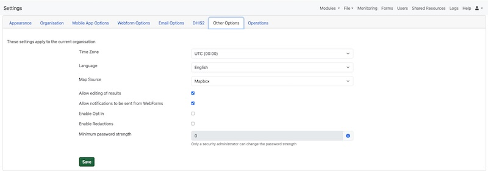

Settings
========

.. contents::
 :local:

The settings page can be accessed from the **Admin** module.  It has multiple tabs that allow you to configure
various parts of the system.  Apart from the **Server** tab, the settings apply to the organisation that you are
currently in.  Some tabs are only shown to users with a particular security group:

*  **Server**. Server owner.
*  **Organisation**. Organisational administrator.
*  **Operations**. Administrator.
*  **Sensitive Data**. Security manager.

   
   Settings Tabs
   
.. note::

  Each survey also has **Settings** which can be specified in the online editor or the settings tab of an XLSForm. 
  Documentation on these can be found here, :ref:`settings-reference`.

Appearance
----------

From here you can set the appearance of server pages for the current organisation.  Each organisation can have
its own appearance.

You can:

*  Set an image to appear on the home page
*  Set the background colour of the menu bar
*  Set the text colour of the menu bar (New in version 21.01)
*  Set a custom style sheet to customise buttons, fonts etc

Custom Style Sheet
++++++++++++++++++

The Smap server from version 21.01 uses Bootstrap version 4.5.  The buttons and other elements of the pages
are styled using the default Bootstrap style sheet.  However you can upload your own CSS file that will override
these styles.

To add a customised stylesheet:

*  In the appearance tab click on "Upload a CSS style sheet"
*  Click on "Select a style sheet" and select the file you just uploaded
*  Click "Save"

.. _server-settings:

Server
------

The server tab is only shown to users who have the server owner group. It can be used to set parameters for the entire server.

Map services
++++++++++++

*  Mapbox key. This key can be obtained from https://mapbox.com and allows you to use maps from Mapbox as backgrounds.
*  Google maps key. A key can be obtained from https://developers.google.com and entered here. It allows you to use maps and satellite images from Google.
*  MapTiler key. A key can be obtained from https://www.maptiler.com and entered here.

Messaging
+++++++++

*  Vonage application ID.
*  Vonage webhook secret.
*  SMS URL. URL of service to send SMS messages, or just "aws" if the AWS SMS service is to be used.

Email Server
++++++++++++

*  Email type. Select SMTP or AWS SES.
*  AWS region (AWS SES).
*  SMTP host.
*  Email domain.
*  Email user name.
*  Email password.
*  Email server port.

Load management
+++++++++++++++

*  Maximum number of API requests per minute.
*  Maximum API records per request.

.. note::

    Changes to these values can take up to a minute to take effect

Security
++++++++

*  Minimum password strength.
*  Allow security managers to delete submissions.
*  Turnstile Site Key
*  Turnstile Secret Key

If you specify the Turnstile keys and add your server domain to the domains protected by your Cloudflare account then Turnstile protection can be added
to a public form.  You will still need to specify the use of Turnstile in the form settings. This feature is available in version 26.03.09+.
Turnstile provides protection against automated bots completing your public surveys
and works in a similar way to CAPTCHA.

Server custom style sheet
+++++++++++++++++++++++++

This section sets a server wide custom style sheet. The approach is identical to that for the per organisation style sheet described in the appearance tab.

.. _organisation-admin-settings:

Organisation
------------

Requires SmapServer v26.10+.  In earlier versions these settings are in the organisation dialog on the
**Organisations** tab of the users page.

The organisation tab is only shown to users who have the organisational administrator group.  These settings apply
to the organisation that you are currently in and cannot be changed by an administrator who does not also have
the organisational administrator group.  To change them for a different organisation, first move to that
organisation.

Access
++++++

These settings control what the organisation is allowed to do.  If any of the "allow" settings are changed then an
email is sent to the help email address set in the :ref:`email-settings` tab.

*  Allow submissions. Allow data to be submitted to this organisation.
*  Allow API access.
*  Allow notifications.
*  Allow sending of task emails.
*  Allow SMS. Allow SMS messages to be sent in notifications.  Only shown if the server uses AWS to send SMS messages.
*  Analysis auto refresh interval.  The interval in minutes at which charts and maps on the analysis dashboard are
   refreshed.  Setting a value of zero disables automatic refresh.

Monthly usage limits
++++++++++++++++++++

Limits on the use of chargeable services each month.  The current usage for the month is shown next to each limit.

*  AWS Translate. Letters translated.
*  AWS Transcribe. Seconds of audio transcribed.
*  AWS Transcribe Medical. Seconds of audio transcribed.
*  AWS Rekognition. Images analysed.
*  AWS Comprehend. Sentiment analysis requests.
*  Submissions. A limit of zero means submissions are unlimited.

.. _mobile-device-settings:

Mobile App Options
------------------

This tab allows setting of options for FieldTask. When the user presses refresh on FieldTask these settings will be applied on their device. Many
of these settings include the option "set on phone" as they can also be set by the phone user. However if another setting is selected then the
on-phone setting will be overridden. These settings apply to all FieldTask instances logged on as a user in the current organisation.

Mobile security
+++++++++++++++

*  Force login token. Requires FieldTask to use the server-issued token rather than a stored password.
*  Password policy. How often the user needs to re-logon. By default the enumerator never has to logon to FieldTask. In this case as long as valid
   credentials have already been entered they can continue to use the device without knowing what those credentials are. Using this setting you can
   override that default behaviour and require the user to logon every time they use FieldTask. You can also require periodic logons after the specified
   number of days has elapsed.
*  Disable exit and tracking menu. Hides the menu used to exit FieldTask and the tracking controls.
*  Disable background stop menu. Prevents users from stopping background tracking on the device.

Mobile menus
++++++++++++

*  Enable ODK style menus. Usually a FieldTask user will just use the menu option "refresh". However you can also enable the ODK style menus where
   downloading forms, uploading results etc are separate menu options.
*  Enable ODK admin menu. The FieldTask admin menu is generally not used. Instead set admin values on the server as described here. However you can
   enable the on device admin menu if you wish.
*  Enable server settings menu. The menu to change the server can be disabled with this setting.
*  Enable user and identity menu. The menu to set user identity can be disabled with this setting.
*  Disable exit menu. The exit menu shuts down FieldTask. It can be disabled with this setting.

Mobile completion
+++++++++++++++++

*  Allow finalised forms to be opened for review. If set the user will be able to view completed surveys in read only mode and add comments. They will not
   be able to change the answers to any questions.
*  Allow user to mark a completed form as not finalized. If enabled then a checkbox labelled **Mark form as finalized**, will be shown when the enumerator finishes a
   survey and gets to the `save` screen. By default this will always be checked. If the enumerator unchecks this option then the survey will be saved as an
   incomplete instance and the enumerator can open it to continue editing from the tasks tab. Note incomplete instances are not sent to the server.
   (Requires version 21.02+ of the server and 6.302+ of FieldTask)
*  Allow user to set instance name. Instance names can be set automatically using collected data. If you are combining multiple names use concat() or join(). For example **concat(${name}, ' ', ${last_name})**
*  Backward navigation. The ability of the user to go back to a previous question can be blocked using this option.
*  Screen navigation. Can be set to use swipes, buttons or both.
*  Guidance. How and when survey guidance should be shown.

Mobile sync
+++++++++++

*  Automatically synchronise. If set the phone will refresh when a form changes on the server. The refresh can be specified to occur if connected to wifi only or
   when also connected via a cellular network. If the option **set on phone** is selected then the enumerator can enable or disable automatic synchronisation
   using the menus on the phone.
*  Delete submitted results from the phone. After a completed survey has been successfully submitted it can be automatically deleted from the device. This is
   recommended to improve security. If you do not select this option then you should manually delete completed forms when you are confident that you have the
   data.
*  Maximum number of tasks to download. The tasks are ordered by due date in ascending order.

Mobile media
++++++++++++

*  High resolution video. If set prevents the recording of high resolution videos.
*  Maximum pixels of the long edge of an image. This is a very useful setting to reduce the size of images that have to be sent over the network and stored
   on the server. The image will be scaled according to this setting, so if the image on the phone is 2,000 by 1,000 pixels and you set a value here of
   **500** then the submitted image will be 500 by 250 pixels.

Offline maps
++++++++++++

*  Manage offline map layers on the server. When set, FieldTask downloads the offline map layers belonging to the projects a
   user has access to (:ref:`offline-maps`). The user chooses which of those layers is displayed, and cannot delete one that
   came from the server, but they can still add their own layers on the phone. This setting applies to every user in the
   organisation, so leaving the manual option available means someone who needs a layer larger than the 500 MB upload limit
   is not blocked.

Mobile tracking
+++++++++++++++

*  Prevent disabling tracking. Locks tracking so it cannot be turned off on the device.
*  Enable Geo-fence. Enables the geo fence feature that can download or show tasks when the user is within a specified perimeter.
*  Send location. Controls whether FieldTask sends location updates when refreshing.
*  Location input method. Sets how FieldTask records points (point, manual, or automatic).
*  Automatic tracking interval. When input method is automatic, sets the time between points.
*  Automatic tracking accuracy. When input method is automatic, sets the accuracy threshold in meters.
*  GeoShape and GeoTrace input method. If these are set on the server then a dialog is no longer shown to FieldTask users before they start recording points. This reduces the time required to start recording and allows a consistent approach to recording geo poly types.

WebForm Settings
----------------

This tab allows customisation of WebForm appearance:

*  Page background colour.
*  Paper background colour.
*  Footer position.  The position of the "powered by" icon in the footer of the page.
*  Button colour.
*  Button text colour.
*  Heading text colour.
*  The WebForm banner logo.
*  Hiding the "save as draft" checkbox.

.. _email-settings:

Email Options
-------------

Sets up the email server that this organisation will use.  If these are not set then the email server specified
in the :ref:`server-settings` tab is used.

*  Email to get help.  The administrator email.  This address is also sent an email when the access settings in the
   :ref:`organisation-admin-settings` tab are changed.
*  SMTP host.  The host name of the SMTP relay that will forward email messages from the Smap server.
*  Email domain.
*  Email user name.
*  Email password.
*  Email server port.
*  Content.  Default content for emails.
*  Server identification.

DHIS2
-----

Requires SmapServer v26.09

This tab holds the connection to a DHIS2 instance.  One connection is held per organisation, so
a test instance should be set up in its own organisation.

From here you can set the DHIS2 URL and personal access token, optionally pin the API version,
and test the connection.  The test reports the DHIS2 version, the user the token belongs to and
how many organisation units that user can capture data for, so a connection that authenticates
but cannot do anything useful is apparent before it is relied on.

For the full description, including how to prepare the token in DHIS2, see :ref:`dhis2-connection`.

.. _other-settings:

Other Options
-------------

This tab allows you to set other organisation level settings for the organisation that you are currently in.
Before SmapServer v26.10 only the minimum password strength was set here, and the other settings were in the
organisation dialog on the **Organisations** tab of the users page.

*  Time zone.  The default time zone for the organisation.  Usually the time zone is obtained from a user's browser
   settings.  However where reports are generated automatically this information may not be available and the time
   zone set here will be used.
*  Language.  The default language for the organisation.  As for time zone, normally the user's language is used.
*  Map source.  The default source of background maps: Mapbox, Google or MapTiler.  The keys for these services are set
   in the :ref:`server-settings` tab.
*  Allow editing of results.  Allow results to be edited on the server.
*  Allow notifications to be sent from WebForms.
*  Enable opt in.  Require the recipient of an email to opt in before they are sent emails.
*  Enable redactions.  Allow personal data to be redacted, see :ref:`rtbf`.
*  Minimum password strength.  See :ref:`password-strength`.  Only a user with the security manager group can change
   this setting.  Other administrators can see the value but not change it.
