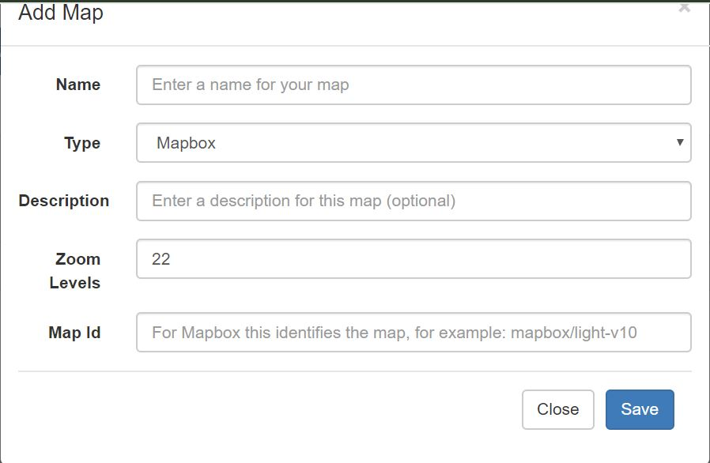
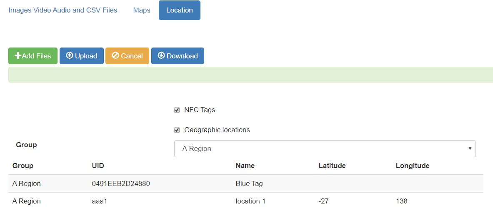

.. _shared-resources:

Shared Resources
================

.. contents::
  :local:

To get to shared resources select the **Admin** module and then **Shared Resources**.

Shared resources are made available to all surveys in an organisation.  They conist of:

*  Images, Video, Audio that can be included in questions and choices
*  CSV files that contain reference data accessed using the search() function and the pulldata() function
*  Maps used on the server for analysis
*  Locations

CSV Files
-----------------

CSV files loaded here can be used by any survey.

*  A CSV file can be added by uploading a CSV file (surprise!) or an XLSX file.
*  In the upload dialog box you can specify the name that is used to reference the CSV data
*  You cannot upload a file with the same name as an existing file, instead use the "replace" button to replace the existing file.
*  A history is kept of changes to each CSV file.  Select the history button next to the shared resource file to view. This history includes the original uploaded file but only for the last 10 uploads.  Earlier uploads are deleted and the download button is disabled.
*  The download button on the CSV page will download the CSV contents as used in surveys.  If you are editing in an XLSX file, which is recommended, then you can go to the history page and download the latest XLSX version of the data as it was originally uploaded.

Media Files
-----------------

Images, video, audio files loaded here can be used by any survey.

.. _shared-maps:

Maps
----

Maps from `Mapbox <https://www.mapbox.com/maps/>`_ can be used as the basemap for a map view on the analysis page or the console map. These maps
can be one of the standard maps:

*  mapbox/light-v10
*  mapbox/dark-v10
*  mapbox/streets-v11
*  mapbox/outdoors-v11
*  mapbox/satellite-streets-v11

Alternatively you can design your own maps that are customised to your requirements using the Mapbox Studio.  You will need you own account on Mapbox to  
design your own maps and you will need to set the key for that mapbox account in your organisation settings.

To add a shared map click on the "Add Map" button and then fill in the dialog shown below.  For the Map Id you can use one of the standard mapbox Id's listed
above.

   Add Map Dialog

Locations
---------

Select the **Location** tab.

   
   Locations
   
Locations identify where a task should take place.  They consist of GPS Coordinates and/or the ID of an NFC chip that will
launch the task.  The use of NFC chips allows a much greater precision in identify the task location as the NFC chip may
be on a particular peice of equipment that needs to be maintained or control access to a room where the survey needs to take
place.

When :ref:`editing-adding-tasks` you can select a named location rather than specifying the GPS coordinates / NFC chip. However
you can also create new named locations while adding tasks.

Locations are stored in Groups which are defined in a spreadsheet.  One group per worksheet.  

Editing / Adding Groups
+++++++++++++++++++++++

Click the download button.  This will download all the groups of locations into a spreadsheet.  If there are no existing
locations then this spreadsheet will have a single default worksheet called **Group**.  The headings are::

  UID - Enter the ID of the NFC chip here
  name - name of the location
  lat - Latitude of the location
  lon - longitude of the location
  
Rename the group worksheet.  Add additional groups if required.  Add locations to these groups and then to upload and replace
the existing locations:

1.  Click on Add Files
2.  Click on Upload

