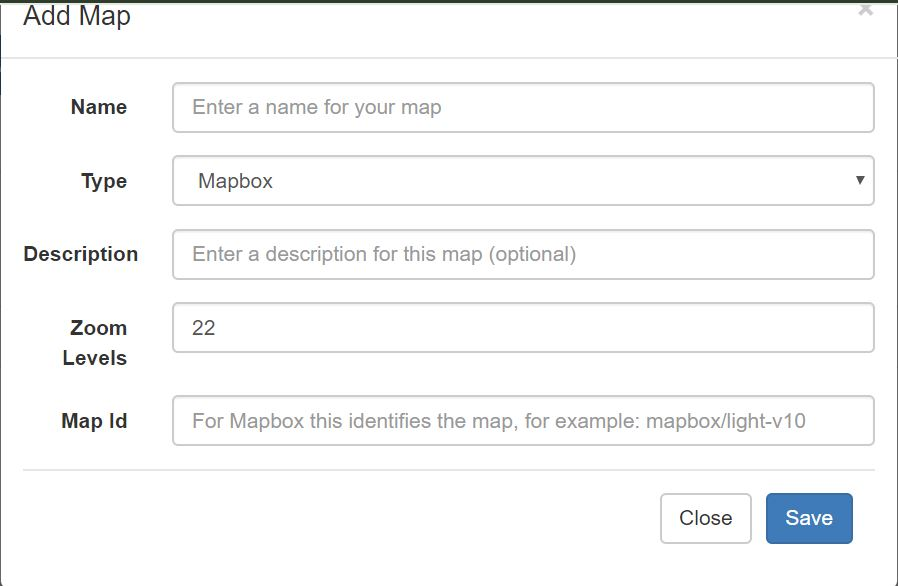
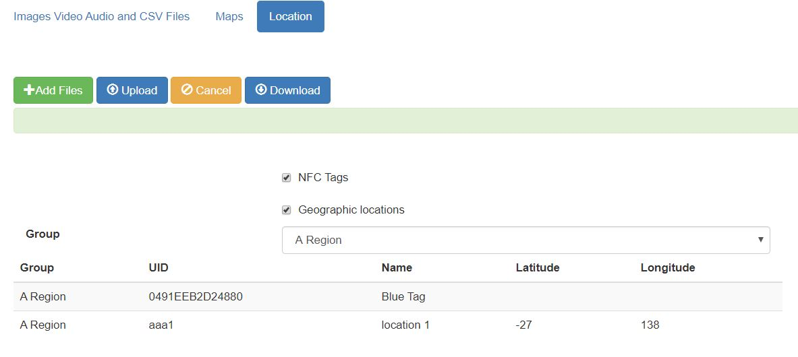

.. _shared-resources:

Shared Resources
================

.. contents::
  :local:

To get to shared resources select the **Admin** module and then **Shared Resources**.

Shared resources are made available to all surveys in an organisation.  They consist of:

*  Images, Video, Audio that can be included in questions and choices
*  Spreadsheets that contain reference data accessed using the search() function and the pulldata() function
*  Maps used on the server for analysis
*  Offline map layers that are downloaded by FieldTask
*  Locations

Spreadsheets
------------

Spreadsheets loaded as a shared resource file contain tables of reference information which can be used
to get lists of choices for a select question or lookup a value.   Spreadsheets loaded here can be used by any survey.

*  A spreadsheet can be added by uploading a CSV file or an Excel XLSX file.
*  In the upload dialog box you can specify the name that is used to reference the data
*  You cannot upload a file with the same name as an existing file, instead use the "replace" button to replace the existing file.
*  A history is kept of changes to each spreadsheet.  Select the history button next to the shared resource file to view. This history includes the original uploaded file but only for the last 10 uploads.  Earlier uploads are deleted and the download button is disabled.
*  The download button on the Spreadsheet page will download the CSV contents as used in surveys.  If you are editing in an XLSX file, which is recommended, then you can go to the history page and download the latest XLSX version of the data as it was originally uploaded.

Media Files
-----------------

Images, video, audio files loaded here can be used by any survey.

.. _shared-maps:

Maps
----

Maps from `Mapbox <https://www.mapbox.com/maps/>`_ can be used as the basemap for a map view on the analysis page or the console map. These maps
can be one of the standard maps:

*  mapbox/light-v10
*  mapbox/dark-v10
*  mapbox/streets-v11
*  mapbox/outdoors-v11
*  mapbox/satellite-streets-v11

Alternatively you can design your own maps that are customised to your requirements using the Mapbox Studio.  You will need you own account on Mapbox to  
design your own maps and you will need to set the key for that mapbox account in your organisation settings.

To add a shared map click on the "Add Map" button and then fill in the dialog shown below.  For the Map Id you can use one of the standard mapbox Id's listed
above.

   Add Map Dialog

.. _offline-maps:

Offline Maps
------------

Requires SmapServer 26.08+.

Select the **Offline Maps** tab.

Offline map layers are mbtiles files that FieldTask shows over the basemap when there is no network coverage in the
field.  Rather than copying the file onto each device by hand, you upload it here, choose which projects need it, and
FieldTask downloads it the next time each device refreshes.

To use this you must first select **Manage offline map layers on the server** in the Mobile App Options tab
(:ref:`mobile-device-settings`).  The phone user chooses which of the layers they have been given is displayed, and a
layer that came from the server can only be removed by unassigning it here.  They can still add their own layers on the
device as before, which is the only way to load a file that is too large to upload here.

To add a layer press the **Add Offline Map** button and then:

*  Give the layer a **name**.  This is the name the phone user sees, and it must be unique within your organisation
*  Add a **description** if it helps your administrators
*  Select the **mbtiles file**.  Files of up to 500 MB are accepted
*  Tick the **projects** that should get this layer

The upload shows a progress bar as these files are large.  To replace a layer, edit it and select a new file.  Devices
notice that the file has changed and download the new version.  If you only want to change the name, description or which
projects get the layer then leave the file empty.

Layers are assigned to projects rather than to individual users.  Everybody with access to a selected project gets the
layer, in the same way that they get the surveys in that project.  A user in more than one project that has been given
the same layer still only downloads it once.  If one person needs a layer, give it to a project that only they have
access to.

Creating an mbtiles file
++++++++++++++++++++++++

An mbtiles file holds a set of map tiles in a single file.  Smap does not create these files, you make
them from your own map data before uploading them here.

`QGIS <https://qgis.org>`_ can do this without any extra plugins.  Load the layers you want, then select
**Processing**, **Toolbox**, **Raster tools**, **Generate XYZ tiles (MBTiles)**.  Set the extent to the
area your field teams work in and choose the range of zoom levels you need.
`MapTiler <https://www.maptiler.com/>`_ will also produce these files.  If you already use GDAL then::

  gdal_translate -of MBTILES myimage.tif mylayer.mbtiles
  gdaladdo -r average mylayer.mbtiles 2 4 8 16

Keep both the area and the range of zoom levels as small as you can.  Each additional zoom level roughly
quadruples the number of tiles, and the whole file has to be downloaded onto every phone that needs it.

Raster and vector layers
++++++++++++++++++++++++

An mbtiles file contains either raster tiles, which are images, or vector tiles, which are shapes and
their attributes.  To check which you have look at the format recorded in the file::

  sqlite3 mylayer.mbtiles "select value from metadata where name = 'format';"

A value of **png** or **jpg** is a raster layer.  A value of **pbf** is a vector layer.

Use raster layers wherever you can.  They are shown whichever basemap the phone user has chosen, and they
look on the phone the way they looked when you created them.

Vector layers are much more limited:

*  They are only drawn when the phone user has selected **Mapbox** as their basemap.  With Google or
   OpenStreetMap selected the layer is ignored
*  They are drawn without any styling.  FieldTask cannot tell that one shape is a road and another is a
   river, so every layer inside the file is drawn as thin lines in a colour chosen automatically from the
   layer name.  Areas appear as outlines rather than filled, and there are no place names

Vector files are considerably smaller than the equivalent raster ones, which is worth having when a team
is downloading over a poor connection.  Against that, a vector layer is only useful for showing something
simple over the basemap, such as a boundary or a set of plot outlines.  It will not look like a map.  If
your field teams need a readable map where there is no coverage, supply it as raster.

Checking that devices have the offline map
++++++++++++++++++++++++++++++++++++++++++

The **Devices** column counts the devices that have told the server they hold the current version of an offline map.  Devices
report this each time they refresh, so use it to confirm that a field team has its maps before they go out of coverage.

The count only includes devices holding the **current** version.  If you replace an offline map the count drops back and climbs
again as devices download the new file.

.. note::

  These files are large and field devices are often on a poor or expensive connection.  A device only downloads a layer
  automatically when it has wifi.  A download interrupted part way through resumes from where it stopped rather than
  starting again, and a layer already on the device is never fetched twice.  A phone user who needs a layer sooner can
  start the download over mobile data from **Settings** then **Maps** in FieldTask.

Locations
---------

Select the **Location** tab.

   
   Locations
   
Locations identify where a task should take place.  They consist of GPS Coordinates and/or the ID of an NFC chip that will
launch the task.  The use of NFC chips allows a much greater precision in identify the task location as the NFC chip may
be on a particular piece of equipment that needs to be maintained or control access to a room where the survey needs to take
place.

When :ref:`editing-adding-tasks` you can select a named location rather than specifying the GPS coordinates / NFC chip. However
you can also create new named locations while adding tasks.

Locations are stored in Groups which are defined in a spreadsheet.  One group per worksheet.  

Editing / Adding Groups
+++++++++++++++++++++++

Click the download button.  This will download all the groups of locations into a spreadsheet.  If there are no existing
locations then this spreadsheet will have a single default worksheet called **Group**.  The headings are::

  UID - Enter the ID of the NFC chip here
  name - name of the location
  lat - Latitude of the location
  lon - longitude of the location
  
Rename the group worksheet.  Add additional groups if required.  Add locations to these groups and then to upload and replace
the existing locations:

1.  Click on Add Files
2.  Click on Upload

