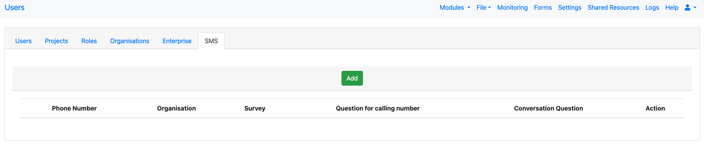
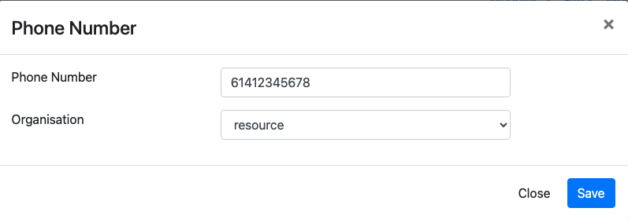

.. _sms:

SMS
===

.. contents::
 :local:  
 
The SMS numbers that can be used to create cases and record a conversation within a case are set up here.  Only the Vonage cloud platform
is currently supported as a source of numbers.  Details on how to get a number can be found here :ref:`sms-server-admin`

Adding a number is a two step process.

#.  Firstly the server owner has to add a number and associate it with an organisation.
#.  Then an administrator within the organisation can then configure the number to update a survey.

Add a Number
------------

As the server owner navigate to the users page and select the SMS tab.  You will see a button labelled "Add".

   Add Button

The dialog then allows you to enter the number and select the

   Add Dialog

 Edit the number
 ---------------

 Once the number has been added an administrator for that organisation will be able to see the number and edit it.

 .. figure::  _images/sms3.png
    :align:   center
    :width:   600px
    :alt:     A list of SMS numbers available in an organisation

Clicking on the edit button shows the edit dialog. Note there is no "Add" button shown unless the user is also the server owner.

    SMS Numbers List

 .. figure::  _images/sms4.png
     :align:   center
     :width:   600px
     :alt:     The settings dialog showing the survey details that can be associated with a number

     Editing the settings

  The administrator can bow set:

  *  The survey that will be populated when a message is received
  *  The question in the survey that will be used to store the number that sent the message
  *  The question in the survey that will be used to store the message

  
