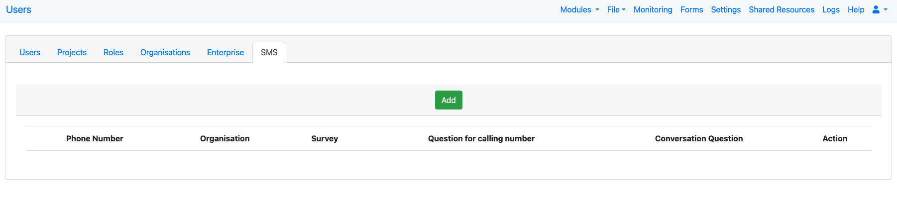
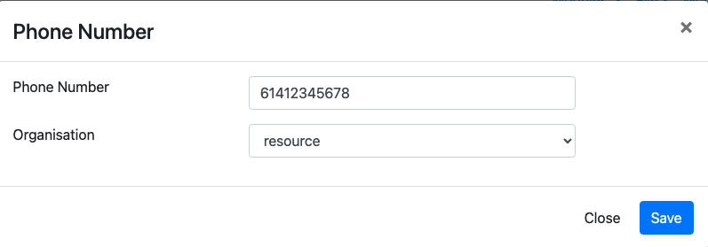
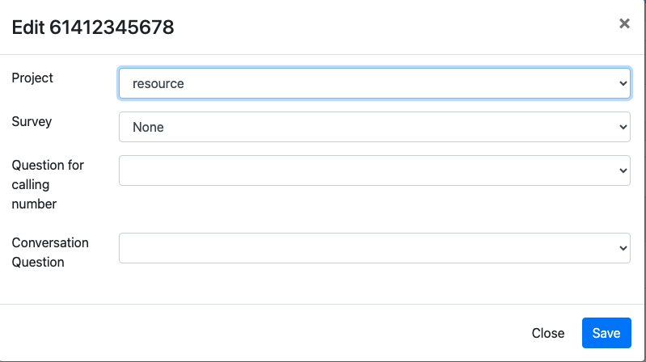

.. _sms:

SMS
===

.. contents::
 :local:  
 
The SMS and WhatsApp numbers that can be used to create cases and record a conversation within a case are set up here.  Numbers
can come from Vonage, see :ref:`sms-server-admin`, or for WhatsApp from Smap Server version 26.10, directly from Meta, see
:ref:`whatsapp-meta`.  Requires Smap Server version 24.09+.

Adding a number is a two step process.

#.  Firstly the server owner has to add a number and associate it with an organisation.
#.  Then an administrator within the organisation can then configure the number to update a survey.

Add a Number
------------

As the server owner navigate to the users page and select the **Conversation** tab.  You will see a button labelled "Add".

   Add Button

The dialog then allows you to enter the number, its channel (SMS or WhatsApp) and select the organisation.  Enter the number
with its country code and no spaces, for example +442071838451.  If the number is connected directly to Meta, also enter its
**WhatsApp Phone Number Id**.

   Add Dialog

Edit the number
---------------

 Once the number has been added an administrator for that organisation will be able to see the number and edit it.

 .. figure::  _images/sms3.png
    :align:   center
    :width:   600px
    :alt:     A list of SMS numbers available in an organisation

Clicking on the edit button shows the edit dialog. Note there is no "Add" button shown unless the user is also the server owner.

    SMS Numbers List

     Editing the settings

The administrator can now set:

*  The survey that will be populated when a message is received
*  **Question for calling number**.  The question used to store the number that sent the message.  Replies from the case
   are only ever sent to this number
*  **Conversation Question**.  The question used to store the conversation.  Both the messages received and the replies
   sent from the case are stored here, so there is one conversation per case.  Use a question of type conversation so
   that it is shown as a conversation
*  **Multi case message**.  An automatic reply sent when the person has more than one open case, see :ref:`multiple-open-cases`

The server owner can also change the number itself, its channel, its organisation and its WhatsApp Phone Number Id:

*  Moving the number to another organisation removes its link to a survey.  An administrator in the new organisation
   then links it to one of their surveys
*  Messages already received on the old number stay with it, they are not moved to the new number

