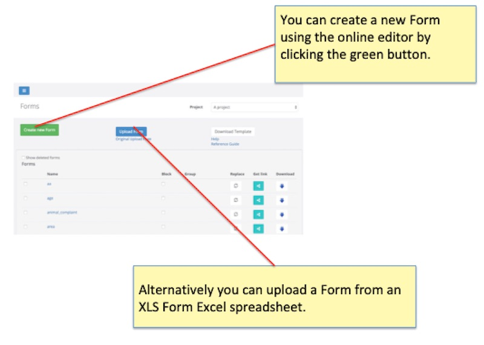
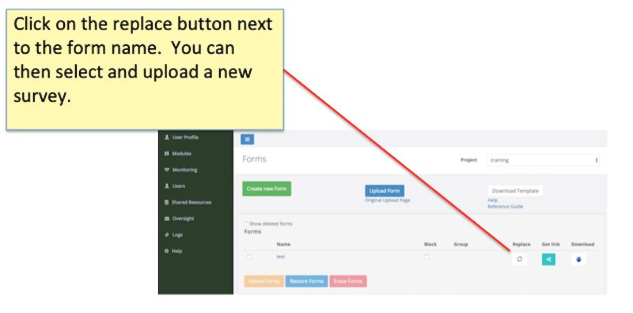
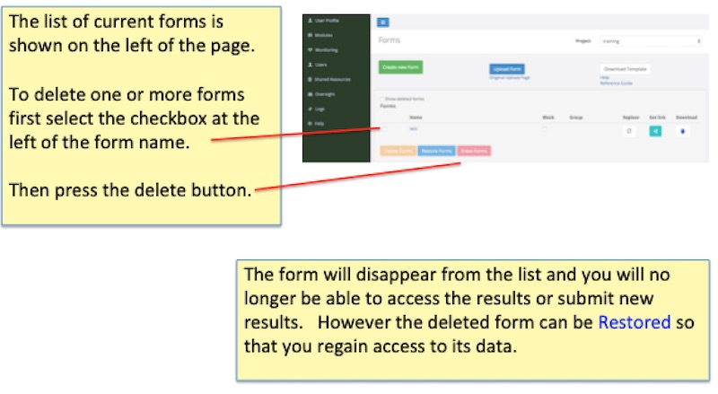
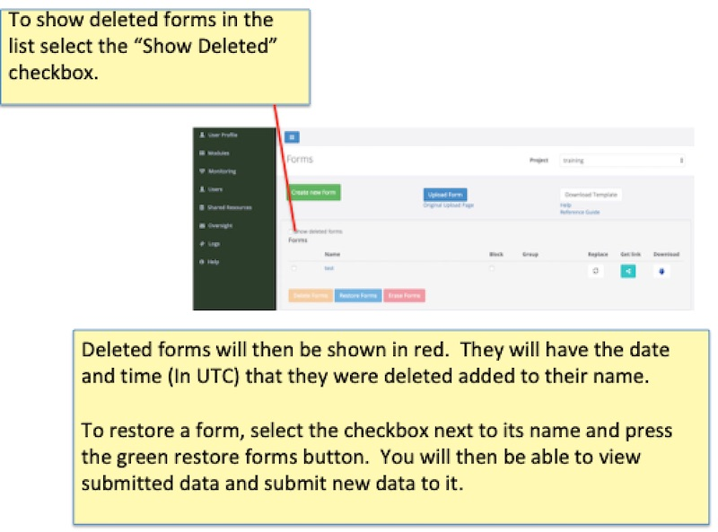
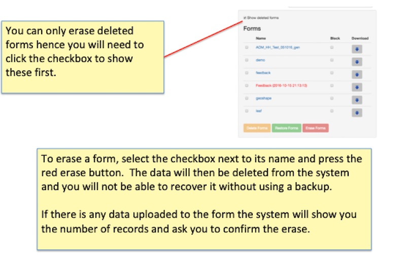

Survey Management
=================

.. contents::
 :local:

.. note::

  The terms **survey** and **form** are used interchangeably.   However strictly speaking a survey can consist of multiple
  forms.   A main form and optionally sub-forms that are specified using the "begin repeat" question type.  
  
Getting to the survey management page
-------------------------------------

As Survey Management is the default page of the Administration module you can get to it by select Modules and the then Admin.  
Alternatively if you are already in Administration but on a different page, select the “Forms" menu.

   
Creating Surveys
----------------

If you are creating a brand new survey using the XLS Form editor then you can first download a template by clicking on the 
**Download Template** button.

Clicking on the **Create new Form** button will show a dialog where you can select the XLS file and specify a name for 
your survey.

The dialog also includes the option of grouping the new survey with an existing surveys.  Refer to :ref:`survey_groups` for details 
on what this means. Only do this if you want to the new survey to share a common table with an existing survey. To add the
new survey to a group select the name of the survey you want to group it with from the drop down.

.. _replacing-surveys:

Replacing Surveys
-----------------

This only applies to surveys that you are editing in XLS.  After you have made changes in Excel you can replace the existing 
survey.

   
The advantage of replacing a survey is that any data you have already collected is unaffected.  Hence **always use replace
if you are editing a survey currently in use**.  

The alternative to replacing a survey is to:

1.  Delete the old survey
2.  Upload the new version with the same name

However if you are making last minute changes to a survey before starting data collection then you run the risk
that some enumerators may not download the new version.  Then when they try and submit their results that will be
blocked because their survey has been deleted. To get around this you would need to un-delete the old version, resubmit and 
then manually merge the required records from the old version to the new one.  Hence it is again recommended that you use
**replace** particularly as you approach production in order to prevent these problems.

.. warning::

  Using replace you can change the survey as you go and collect data with different versions of it.  This is great unless the
  different versions have an impact on the data in a way that affects your analysis. However when exporting
  data for analysis the name and version of the survey used for each record is shown so you can adjust the data to take the 
  changing versions into account.

.. note::

  You can change any aspect of the survey when using **replace**.  However if you have already collected data and you change the
  type of a question then that may cause problems that will require technical support.  For example if you had a text question 
  "What is the child's age?" with response such as "Five".  Then if you change that to an integer question the old data will
  not be compatible with this new question type.

Deleting Surveys
----------------

   

.. _restoring-surveys:

Restoring Surveys
-----------------

Surveys can be restored if they have only been deleted and not **erased**.  Restoring recreates the form definition and makes
all the previously collected data accessible again.

.. warning::

   If you delete a survey then it will be automatically **erased** after 90 days.   After that you will not be able to restored
   the data or the survey definition.
   

   
Erasing Surveys
---------------

Surveys can be erased once they have been deleted.  This is good for security in that it will prevent the data being accessed.
However after erasure the data cannot be recovered.
   

   
Downloading
-----------

Select the download button next to a survey.  A dialog will be shown allowing the selection of the type of download.  The 
options are:

*  XLS Form.  
*  XML Form.  This is in XForm standard and may be useful if you need to copy your survey to a different system that
   imports data in this format.
*  Codebook.  Shows the codes used in the survey with the corresponding label text.  For example you may have specified
   the values for choices as a, b.  The codebook will show what these values mean.
*  PDF Template.  A PDF view of the survey that looks a little like a paper form might look.

The current version of the survey will be downloaded.  If you want to get older XLS Form versions you can use the changes page.

Blocking Surveys
----------------

Click the checkbox next to the survey name in the **blocked** column.

This will prevent the uploading of results to the server.  Also the survey will no longer be available to download to phones
and when the user of FieldTask presses the refresh button it will be deleted from their device.

If the user has results on their phone that belong to a survey that has been **blocked** then when they try to 
submit they will see a **Not Found** message.  That is the survey was not found.  If you want these results you can un-block
and ask the enumerator to re-submit.

Public Links to WebForms
------------------------

You can get a public link to a WebForm.  To do this click on the **Get Link** button.  You can then add or delete the link for the survey.
The link button will show in dark blue when there for all surveys that have a public link.

The link can be copied and emailed to someone so that they can complete a survey without having to have an account on the 
server.

.. warning::

  The public link does not expire.  If you want to stop submissions from anonymous users you can delete the link by clicking on the **Get Link**
  button and then selecting **delete**.

