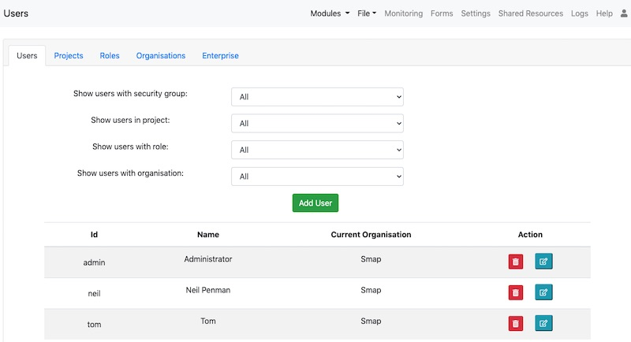
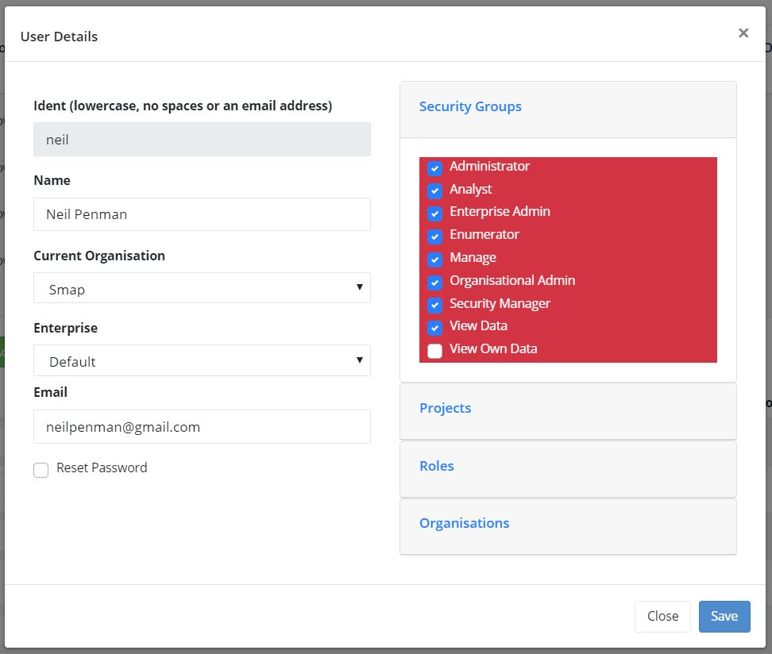

Users
=====

.. contents::
 :local:
 
To get to the user management screen select the **Admin** module and then **Users**.

.. warning::

  The **admin** security group is required in order to access the users page.

User Management has multiple tabs.  The first one, **users** contains the list of acutal users, the remaining tabs
can be used to group and mange the users by project, role, organisation and enterprise. 

   
   User Management
   
The top part of the tab has a number of filters that you can use to restrict the list of users.  This can be useful
if you have a lot of users.  You can also use it to verify which users are assigned to a particular project or role.
You can filter on:

*  Security group
*  Projects
*  Roles
*  Organisations

Add User
--------

Click on the green **Add User** button to add a user.

Edit 
-----

Click on the user's name to edit their details.

User Details
------------

   
   User Details
   
*  **ident**.  This is readonly.  Once a user has an ident with which they logon to the system then this cannot
   be changed.
*  **Name**.  The user name.
*  **Current Organisation**.  If you have organisation administration privilege then you can move a user
   to a different organisation.
*  **Enterprise**.  If you have the enterprise administration privilege then you can move a user to a different 
   enterprise.
*  **Email**.  Set the users email address.

If you are editing a user then you will see a **reset password** checkbox that allows you to change their password.

Alternatively if you are creating a new user then you will see radio buttons and can select:

*  Send email to new user,
*  or Specify password.

If you select "send email" then the new user will get an email asking them to set their own password.  You should
use this option when creating analyst or admin users.  If you select specify password then you can set the password
for the new user.  This may be appropriate if you are creating "enumerator" users.

.. note::

  Admin and Analyst users have access to collected data and should all have their own accounts that they do not share. In addition they should
  specify strong passwords.  

  However if the user only has enumerator privilege then you may decide to allow multiple
  enumerators to share the same account. This may simplify administration of devices shared by multiple users. 

.. _security-groups:

Security Groups
+++++++++++++++

Specify the security groups that they user belongs to. These include:

*  admin:  Can manage users and passwords
*  analyst: Can view, modify or delete collected data.
*  enum: Can download surveys and submit data
*  manage data: Can access the console
*  manage tasks: Can create and manage tasks
*  org admin.  Organisational Administrator. Can create and move between organisations.
*  enterprise admin.  Can create and move between enterprises.
*  security.  Can create and assign security roles
*  view data.  Can view data but not modify it.
*  view own data.  Can view their own data, that is data records that they submitted.

.. note::

  The view own data security group can currently only be used to access data using the data API (:ref:`survey-data-json`).  However if the user also
  has the "manage" security privilege then they can see their data in the console.

Refer to :ref:`organisational-hierarchy` for an overview of how these security groups can be used to compartmentalise data.

Projects
+++++++++

Users will only be able to access forms that are in the projects they have been given access to.  
This can be used to prevent enumerators and analysts access forms that they are not working on.  
However users with the admin security group can always give themselves access to any project.

Roles
+++++

Assign roles to the user.

Organisation
++++++++++++

If multiple organisations are selected then the user will be able to move between them using their profile.
You can use this option to give a user the ability to change organisation even if they do not have the **org admin**
privilege.

