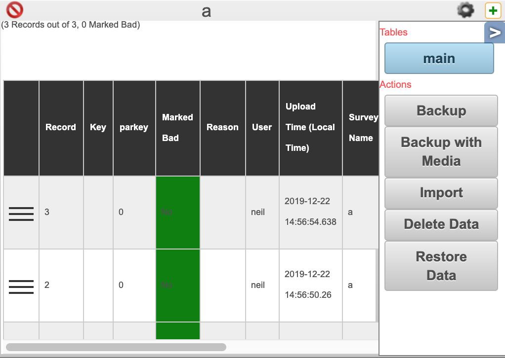

.. _backup-import:

Backup and Import of Survey Data
================================

.. contents::
 :local:
 
If you want to keep a local copy of your survey data then you can back it up.  If you also save a copy of the survey
template then you can import that data later.  This is useful in the following scenarios:

*  **Playing it safe**.  Having your own copy is prudent just in case something happens to the server.  However it can be a lot of
   work as you would need to create the backup regularly so that it is up to date.  Hosted Smap servers are backed up and run on
   reliable hardware so generally this isn't necessary.
*  **Archiving a checkpoint**.  Perhaps you have reached a checkpoint in the collection of data and have completed a report.  You can create
   a data backup and save it with your report.
*  **Copying data to another survey**.  You can backup the data from one survey and then import it into another.  
*  **Initialise a survey with custom data**.  This is particularly useful if the survey is going to be used to generate tasks.

Backup
------

1.  In the **Analysis** module create a table view of your data
2.  Select the "aside" button **<** to open the side panel

   
3. Click on the **Backup** button or the **Backup with Images** button

The data will be downloaded into a zip file. 

4.  If you are going to archive the data then you should also download the survey template from the survey management page.

Import
------

We want to discourage accidental loading of data from an excel file.  Data should really be loaded through the submission of completed
form instances.  Hence you need to explicitely allow importing of data into a survey.

1. Open the survey in the online editor.
2. Click on the menu **File** then **Settings**
3. Select the checkbox "Allow Loading data from file"

Now we are ready to import:

1. As for backups open the aside panel of a table view in the analysis module
2. Select the **Import** button
3. **Very Important** Select, or leave blank the checkbox "Clear Existing Data".  Are you replacing all the data in the survey or
   appending to it?
4. You can import directly from another Survey or from a backup file
5. Choose the zip file to import
6. Press the **Import** button

If there are no errors a message with a green background will be shown.  This message will list any columns that have been ignored.  For 
example if you backed up data from a survey that had a question "comment" but then imported it into a survey without that question then 
the **comment** question will be ignored.

In your data the "Survey Name" will be set to the name of the file that you used to import the data.  This way you can differentiate data 
submitted from the phone from data imported from a file.
 
Backup Format
-------------

Data backups are in a zip file which consists of:

*  An excel spreadsheet containing all the data.  One worksheet per form / sub form
*  Optionally all the images

Importing Custom Data
---------------------

Creating your own data for importing is straightforward.  The easiest way is to create a template for your data by backing up the 
survey that you want to import into.  You can do this even if there is no data in the survey.  You can then add your data to the downloaded
zip file and import.
