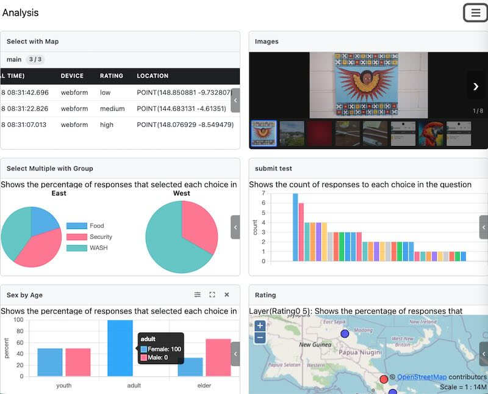
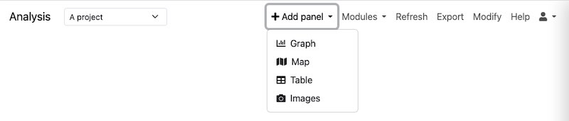
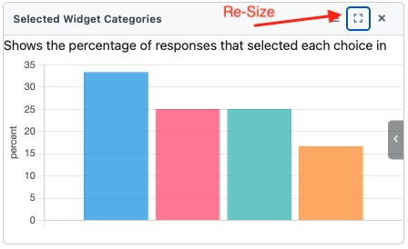
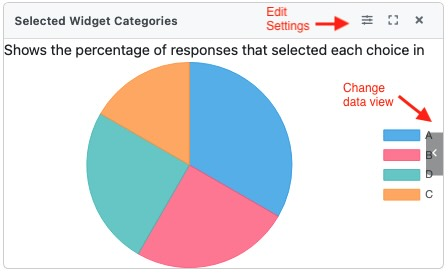
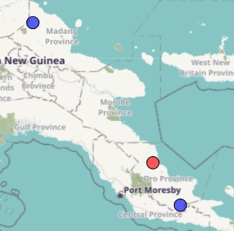
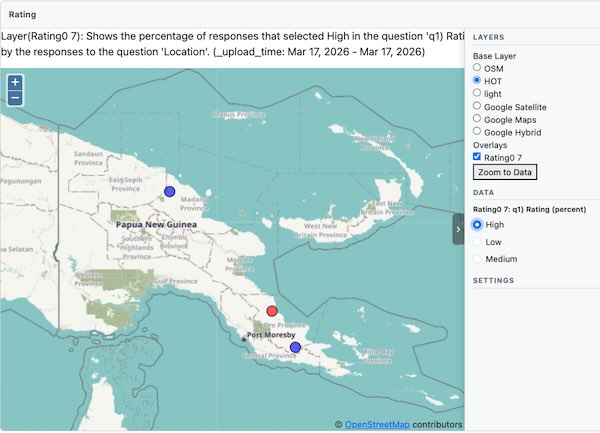

.. _dashboard:

Dashboard
=========

.. contents::
 :local:
 
The purpose of the dashboard is to give a quick insight into data for Quality
Assurance. Dashboards are also useful for providing a view of ongoing
operations. They are not a substitute for a data analysis system such as Excel
or a GIS.

Dashboards also do not have drill-down capability for problem identification.
If an anomaly is shown in a dashboard, an AI tool can be used to identify
cause and impact.

   An Example Smap Dashboard

Managing Panels
---------------

Panels have buttons at the top right to resize, edit settings, and delete.
These buttons are visible only when you hover over the panel.

Adding Panels
+++++++++++++

   
   Adding a Panel
   
Select **Add Panel**, then select one of the panel types: graph, table, map,
or image.

Resizing a Panel
++++++++++++++++

   
   Resizing a Panel

Panels can be shown in two sizes: expanded to the size of the screen, or
minimised so multiple panels can be viewed at once.
   
Editing a Panel
+++++++++++++++

   
   Editing a Panel
   
Clicking the settings icon opens the same dialog that was used to create the
panel. Clicking the "Data View" drawer opens a side panel that allows
selection of map layers or subforms in a survey. For a graph created from
select question responses, you can choose which options are shown.

Closing a Panel
+++++++++++++++

A panel can be closed by clicking the **X** at the top right.

Panel Settings
--------------

Subject
+++++++

For all panel types, the default subject is "Data". However, for table and
map panels, you can select one of:

*  Data
*  User Activity
*  User Locations

**Data** shows information collected for a specific survey, including answers
to survey-specific questions.

**User Activity** shows information about the activities of a specific user
for all surveys they have completed. This information includes metadata about
a survey:

*  Location
*  Survey name
*  Upload Time
*  Start Time
*  End Time
*  Device
*  Comments on survey
*  Instance Name 
*  Scheduled Start (For tasks)

**User Locations**

For a map panel, this shows the location where users last refreshed FieldTask.
Each user's location is represented by a coloured circle with their name shown
in red next to it. The circle colour changes depending on how long it has been
since they refreshed their phone:

*  less than 1 hour - red
*  between 1 and 2 hours - orange
*  between 2 and 3 hours - yellow
*  between 3 and 4 hours - green
*  more than 4 hours - blue

For a table panel, the last refresh time is shown for each user.

Only users who are members of the currently selected project will be shown.

To view user locations, you need the security groups ``analyst`` or
``view data``. If the user only has ``view data``, they are restricted to
viewing only the locations of users with the same security role, or users with
no security role if the dashboard user does not have one.

.. warning::

  If no location is available with the last refresh, the user will not be
  shown in either the map panel or the table panel.

Survey
++++++

Select the survey whose data you want to show. This option is used only with
"Data" subjects.

User
++++

Select the user whose activity you want to show. This option is only for
"User Activity" subjects.

Graph Panels
------------

After you select the survey, you must select a question to analyse on the
graph. Alongside each question, you can select the function that is applied to
the data. This can be either:

*  Percent (The percentage of responses with this value, or the percentage of
   responses within the group that had this value)
*  Count (Counts of responses with this value)

There are two graph types:

#.  Histograms (Shown as a Pareto chart - limited to the largest 30 values)
#.  Pie Charts

Data is shown as a time series if you select a time interval. For example, if
you select an interval of *week*, values are shown on a week-by-week basis.

Question types that can be graphed:

*  select one
*  select multiple
*  text
*  calculates
*  server calculations
*  integer
*  decimal

Map Panels
----------

Whole of Survey View
+++++++++++++++++++++

It is not necessary to select a question. Select the survey and save. The
resulting map shows all locations where data was collected. If you click a
point, details of the data at that point are shown.

If you have multiple location questions in a survey, you can select the
location question to show on the map.

Map view of a select question
+++++++++++++++++++++++++++++

When creating the map panel, specify a question to analyse. This works best
for ``select_one`` or ``select_multiple`` question types.

   
   Question level map view

The locations are colour coded according to relative frequency:

*  Red: High
*  Orange
*  Yellow
*  Green
*  Blue: Low

These frequency values apply to one of the choices in the question. To view
the results for a different choice, select that choice in the drawer to the
right of the map.

If a location contains only a single record, it is coloured "red" if the choice
was selected, or "blue" if the choice was not selected. However, if you have
more than one record clustered at a single location, you will see the range of
colours described above, depending on the percentage of times that choice was
selected.

   
   Question level map view zoomed out to show clustering

Table Panels
------------

Table panels are useful for viewing all data collected in a survey. They show
200 records at a time, and you can page through all records using the
next **>>>** and previous **<<<** buttons.

If you open the drawer on a table panel, you can apply actions to the data,
such as backing it up or importing new data. Refer to :doc:`analysis-archive`,
:doc:`analysis-delete-restore`, and :doc:`analysis-backup`.

Filters
-------

You can apply filters. This can include a date range filter, where you select
the date question and then choose start and end dates. You can also specify an
**advanced** filter for data values.

Automatic Refresh
-----------------

This can be enabled for a specific organisation in the Organisations tab on
the Users page. You will find it under "Other Options". Setting a value of
zero disables auto refresh. Otherwise, you can specify the refresh interval in
minutes.

Only charts and maps will be automatically refreshed.
