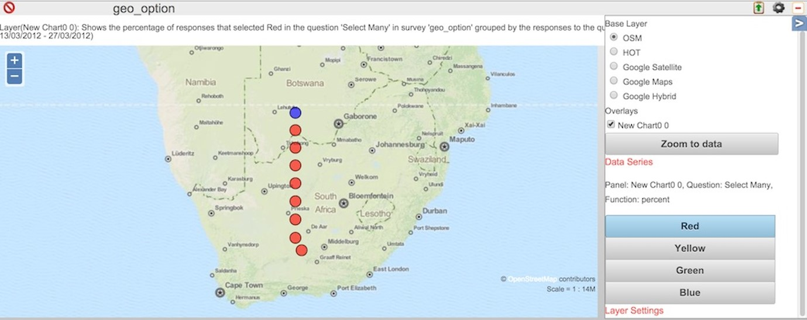
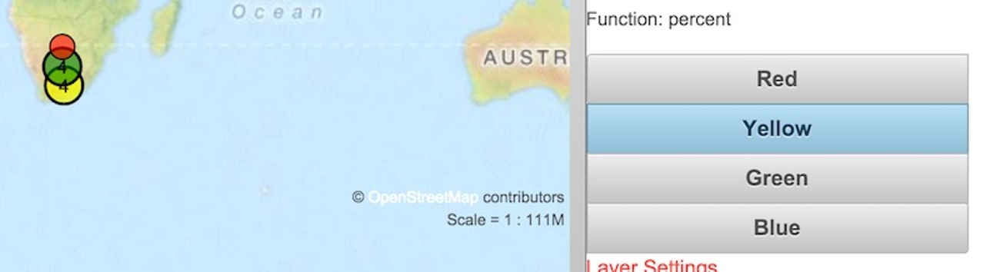

Dashboard
=========

.. contents::
 :local:
 
The purpose of the dashboard is to give a quick insight into the data for Quality Assurance. They are not a
substitute for an analysis system such as Excel, or a GIS.

Managing Panels
---------------

Adding Panels
+++++++++++++

.. figure::  _images/analysis1.jpg
   :align:   center
   :width:   300px
   :alt:     Adding a Panel
   
   Adding a Panel
   
Click on one of the add panel buttons for graph, table, map or image chart types... _integration:

Resizing a Panel
++++++++++++++++

.. figure::  _images/analysis2.jpg
   :align:   center
   :width:   300px
   :alt:     Resizing a Panel
   
   Resizing a Panel
   
Editing a Panel
+++++++++++++++

.. figure::  _images/analysis3.jpg
   :align:   center
   :width:   300px
   :alt:     Editing a Panel
   
   Editing a Panel
   
Clicking on the settings icon will open the same dialog that was used in creating the panel.  Clicking on the "data view"
will open a side panel that allows selection of map layers or sub forms in a survey.  For a graph created from
select question repsonses, the choices that are shown can be selected.

Panel Settings
--------------

Subject
+++++++

For all panel types the default subject is "data".  However for table and map charts you can select one of:

*  Data
*  User Activity
*  User Locations

**Data** subjects show information collected for a specific survey including the answers to the survey specific question. 

**User Activity** subjects show information about the activities of a specific user for all surveys that they have completed.  This 
information includes meta data about a survey:

*  Location
*  Survey name
*  Upload Time
*  Start Time
*  End Time
*  Device
*  Comments on survey
*  Instance Name 
*  Scheduled Start (For tasks)

**User Locations**

For a map panel this shows the location at which the users last refreshed fieldTask.  Each users location is represented by a colored circle with their name in
red next to it.  The colour of the circle changes depending on the length of time since they refreshed their phone:

*  less than 1 hour - red
*  between 1 and 2 hours - orange
*  between 2 and 3 hours - yellow
*  between 3 and 4 hours - green
*  more than 4 hours - blue

for a table panel the last refresh time is shown  for each user.

Only users who are members of the currently selected project will be shown.

To view user locations you need security groups ``analyst`` or ``view data``.  If the user only has ``view data`` then 
they will be restricted to viewing only the locations of users that have the same security role.  Or no security
roles if the dashboard user does not have one.

.. warning::

  If no location is available with the last refresh then the user will not be shown in either the map panel or the table panel.

Survey
++++++

Select the survey whose data you want to show.

.. note::

  This option is only used with "data" subjects.

User
++++

Select the user whose activity you want to show.

.. note::

  Only for "User Activity" subjects.

Map Panels
----------

Whole of Survey View
+++++++++++++++++++++

It is not necessary to select a question.  Just select the survey and save.  The resultant map will show you all the locations at which data
was collected.  If you click on a point it will show details of the data at that point.

Map view of a select question
+++++++++++++++++++++++++++++

When creating the map panel specify a question to analyse.  This works best for select_one or select_multiple type questions.

   
   Question level map view

The locations are colour coded according to relative frequency:

*  Red: High
*  Orange
*  Yellow
*  Green
*  Blue: Low

These frequency values apply to one of the choices in the question.  To view the results for a different choice select that choice in the aside to the
right of the map.

If a location only contains a single record then the location will be coloured either "red" the choice was selected or "blue" the choice was not selected.  
However if you have more than one record clusted at a single location then you will see the range of colours described above depending on the percentage
of times that choice was selected.

   
   Question level map view zoomed out to show clustering

Recovering (Level 2)
++++++++++++++++++++

What if you have deleted a survey more than 100 days ago when you realise that a phone has some unsubmitted results. (Deleted surveys are erased after 100 days). 
Or perhaps you manually erased the deleted survey in case it had sensitive data recorded in it.  In this case you can send the submitted results to any other
survey.  

.. note::

  Its up to you to make sure that the survey you are sending the data to makes sense.  Generally this should be a later version but it does not
  have to be.  Data will be added for any questions that have the same name in the deleted survey and the surevey you are sending the results to.
  Any other questions are ignored.

Follow these steps to redirect the failing submissions:

#.  Select the **Monitoring** menu from the admin module

#.  Selected **Submitted** as the Source

#.  Select **Instances** under show

#.  In the data section you can restrict instances to only those in a specific project. You can also sepcify that only "Errors" are shown

#.  Find a submission to the deleted survey that has been marked as an error.  Any submission will do because once you have added the redirection
    you can resubmit from the phone(s) and all submissions will be redirected.

#.  Click on the redirect button.

Automatic Refresh
-----------------

This can be enabled for a specific organisation in the organisation tab on the users page. You will find it under "Other Options".  Setting a value
of zero disables auto refresh.  Otherwise you can specify the refresh interval in minutes.   

Only charts and maps will be automatically refreshed.
