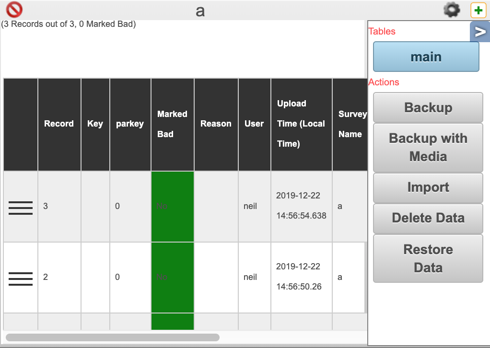

.. _analysis-delete-restore:

Deleting and Restoring Data
===========================

.. contents::
 :local:

Delete
------

1.  In the **Analysis** module create a table view of your data
2.  Select the "aside" button **<** to open the side panel

   
3. Click on the **Delete Data** button

A dialog will be shown that asks if you are really sure you want to do this.

.. _analysis-delete-restore-restore:

Restore
-------

1.  In the **Analysis** module create a table view of your data
2.  Select the "aside" button **<** to open the side panel

3. Click on the **Restore Data** button

A dialog will be shown that asks if you are really sure you want to do this.  All of the previously
loaded data will first be deleted then submissions re-applied.  This means that you will lose any changes
your have made to the data.