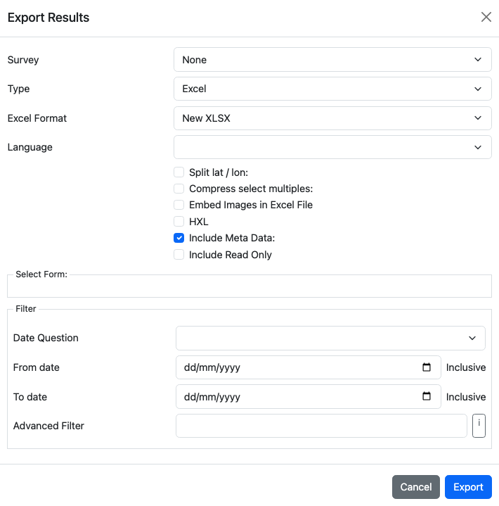

Export
======

.. contents::
 :local:
 
Select the “Export” menu in the analysis page. 

   Exporting Results

The default output format will be XLS. 
Select your survey and press the “Export” button which will download the survey.

Options
-------

Type
++++

*  XLS
*  CSV
*  Shape File
*  Media.  A zip file containing media.  The name of each media file will be taken from questions that can be 
   specified in the dialog.
*  KML
*  Stata
*  SPSS

Depending on the type of export that is selected other options will change.

XLS Options
+++++++++++

*  Excel Format.  Specify XLSX or the older HTML format.
*  Language.  If specified an extra line will be added to the header containing the labels for the selected language.
*  Compress select multiples.  If selected the choices for select multiples will be put into a single cell with each 
   choice separated from the others by a space.  If not selected then a column will be exported for each choice with a 
   value of "1" if the choice was selected or "0" if not selected.
*  Split Lat / Lon.  If selected latitude and longitude for geopoint questions will be put in separate columns.
*  Embed images in Excel File.  If thumbnails of selected images will be included in the exported excel file. 
*  Include Meta Data.  Select to include meta data in the export.

Select Form
+++++++++++

When a survey is selected a hierarchical list of the forms will be shown here.  From main Form download
through the children and the children's children.  If you select a sub form then that form and all its 
parent forms will be exported.

Filters
+++++++

The data exported can be filtered by date range and using the advanced filter.

