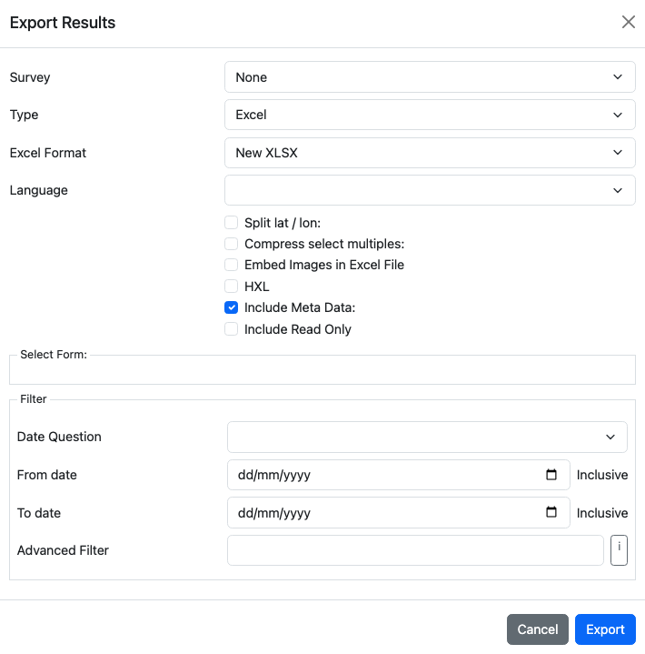

Export
======

.. contents::
 :local:
 
Select the **Export** menu on the analysis page.

   Exporting Results

The default output format is XLS.
Select your survey, then click **Export** to download the data.

Options
-------

Type
++++

*  XLS
*  CSV
*  Shapefile
*  Media. A ZIP file containing media. The name of each media file is taken from questions
   specified in the dialog.
*  KML
*  Stata
*  SPSS

Depending on the selected export type, other options change.

XLS Options
+++++++++++

*  Excel format. Specify XLSX or the older HTML format.
*  Language. If selected, an extra header row is added with labels for the selected language.
*  Compress select multiples. If selected, choices for select-multiple questions are exported
   in one cell, separated by spaces. If not selected, each choice is exported in its own column,
   with a value of ``1`` if selected and ``0`` if not selected.
*  Split lat/lon. If selected, latitude and longitude for geopoint questions are exported in
   separate columns.
*  Embed images in Excel file. If selected, images are included in the exported Excel file.
   Image width is set to 300 pixels. Click an image in the spreadsheet to open the full-size image.
*  Include metadata. Select to include metadata in the export.

Select Form
+++++++++++

When a survey is selected, a hierarchical list of forms is shown here.

*  Select the main form to export just the data in the main form.
*  Select a subform to export that subform and its parent forms.

Filters
+++++++

You can filter exported data by date range and by using the advanced filter.
For details, see `Help on specifying advanced filters <https://www.smap.com.au/docs/server-expressions.html>`_.
