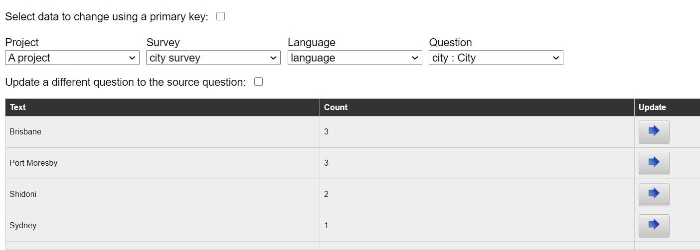
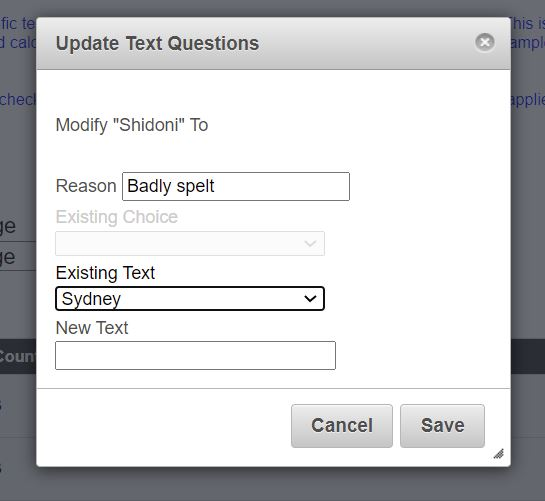

.. _analysis-modify:

Data Cleaning
=============

.. contents::
 :local:
 
You can apply bulk changes to data quickly and easily on the data cleaning page.  This is accessed from the Analysis module by 
selecting the **Modify** menu.  Any changes made using data cleaning can be reviewed and reversed out using :ref:`analysis-review`.

Make the spelling and wording of text questions consistent
----------------------------------------------------------

This feature applies to text questions.  Normally to get consistency of your text response you would use a **select** question. However some times
that is not possible.  For example you may not know which locations you are going to visit before heading out to do the survey.  In these cases
you can use a text question and clean the data afterwards.

On the modify page select the text question that you want to review.

   
   A text question selected for cleaning

In the above example we have selected a text question called city.  We can then see that there were 3 surveys completed in 3 different cities 
however the spelling of Sydney was inconsistent and there were 2 records that spelt it wrongly. If we then select the "Update" button next to the
text we want to change a dialog is shown.
  

   
   Update dialog

I have entered a reason for the change and then selected "Sydney" from the existing alternate answers to the question as the new value for the answer.
After pressing "Save"all the wrongly spelt values are updated.

Replace an other selection with a different option
--------------------------------------------------

Sometimes interviewee's might specify an "other" response to a select question when one of the choices should have been selected.  This affects the 
statistics generated from the analysis of the results and you may want to replace that "other" response with a selected value.

On the modify page select the "other text" question that you want to review.

.. figure::  _images/clean3.jpg
   :align:   center
   :alt: Other responses to a question
   
   Other responses to a question

In the above example you can see that there were 8 surveys completed where the "other" choice was not selected and one where the response was
"2 wheeled self propelled vehicle".  We have a choice "bicycle" that should probably have been used instead.  Select the update button next to that
response and a dialog is shown.

.. figure::  _images/clean4.jpg
   :align:   center
   :width: 400px
   :alt: A dialog that can be used to replace text or select an alternate choice
   
   Update dialog where a choice can be selected

We could just make the text consistent as we did previously for pure text questions.  However in this case because the text question is attached to a 
select then you can select a choice.  I have selected "Bicycle".  After pressing "Save" the old text value is cleared and the select question is marked
as having a response of "Bicycle".
