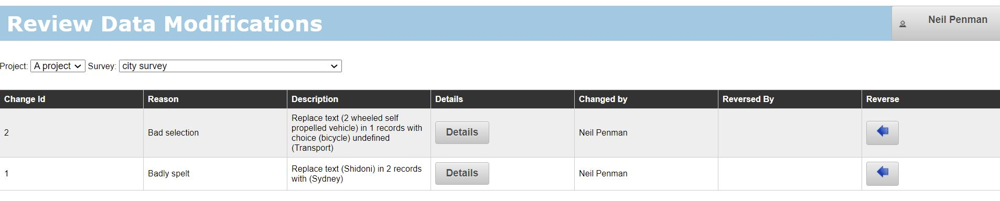

.. _analysis-review:

Review and Restore Cleaned Data
===============================

.. contents::
 :local:
 
Any data changed using :ref:`analysis-modify` can be reviewed and the change reversed out here. This page can be selected from the "analysis" page or
the "modify" page.

On the review page select the survey whose changes you want to review.

   
   A list of changes applied to a question

As you can see in the above example two changes have been applied to the survey.  These are shown in the order: last change at top. If you press the 
"Reverse" button the changes will be reversed out.

