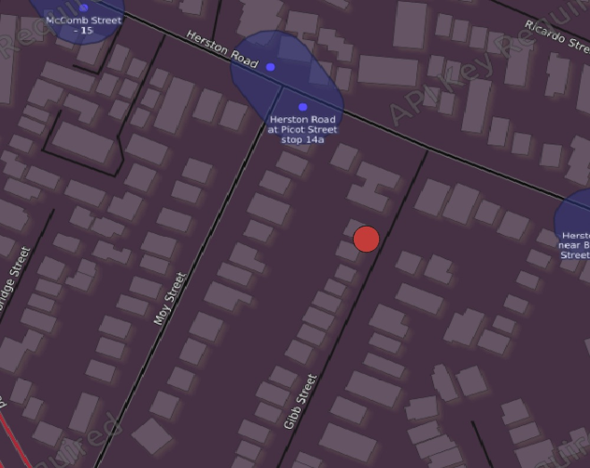

Audit
=====

.. contents::
 :local:

Audit Data End Points
---------------------

.. http:get:: /api/v1/audit

  :synopsis: get a list of services to retrieve audit data
  
  **Example response**:
  
  https://sg.smap.com.au/api/v1/audit
  
  .. sourcecode:: http
  
	HTTP/1.1 200 OK
	Vary: Accept
	Content-Type: application/json
	
	[
		{
			"id": 20361,
			"id_string": "s1554_20361",
			"title": "street light",
			"description": "street light",
			"url": "https://sg.smap.com.au/api/v1/audit/s1554_20361"
		}
	]
	
  :reqheader Authorization: basic
  :statuscode 200: no error

Per Question Audit Data
-----------------------

.. http:get:: /api/v1/audit/(survey ident)

  :synopsis:  Get per question audit data from a survey. (survey ident) is the survey identifier which can be found in the list of services retrieved above. A GeoJson object is returned for each question and includes the time it took for the data collector to answer the question and the gps coordinates of where the question was answered. This data is only returned if "Timing Data" and "Record Location" were enabled for the survey.`
  
  **Example response**:
  
  https://sg.smap.com.au/api/v1/audit/s1554_20361

  Data is returned as GeoJSON
  
  .. sourcecode:: http
  
	HTTP/1.1 200 OK
	Vary: Accept
	Content-Type: application/json

	{
	  "type": "FeatureCollection",
	  "features": [
		{
		  "type": "Feature",
		  "properties": {
			"question": "occupation",
			"value": "Builder",
			"time_spent": 8404,
			"prikey": 1,
			"user": "neil",
			"start": "2019-11-09 09:24:07.837+00",
			"end": "2019-11-09 09:24:37.296+00",
			"device": "863914040631978"
		  },
		  "geometry": {
			"type": "Point",
			"coordinates": [
			  153.0120208,
			  -27.4465832
			]
		  }
		},
		{
		  "type": "Feature",
		  "properties": {
			"question": "name",
			"value": "Bob",
			"time_spent": 11493,
			"prikey": 1,
			"user": "neil",
			"start": "2019-11-09 09:24:07.837+00",
			"end": "2019-11-09 09:24:37.296+00",
			"device": "863914040631978"
		  },
		  "geometry": {
			"type": "Point",
			"coordinates": [
			  153.0120208,
			  -27.4465832
			]
		  }
		},
		{
		  "type": "Feature",
		  "properties": {
			"question": "age",
			"value": "25",
			"time_spent": 6310,
			"prikey": 1,
			"user": "neil",
			"start": "2019-11-09 09:24:07.837+00",
			"end": "2019-11-09 09:24:37.296+00",
			"device": "863914040631978"
		  },
		  "geometry": {
			"type": "Point",
			"coordinates": [
			  153.0120208,
			  -27.4465832
			]
		  }
		}
	  ]
	}

  :query start: The primary key to start from
  :query limit: The number of records to return
  :query sort: The column name to sort on
  :query dirn: One of `asc` or `desc`, the sort direction
  :query form: Form name of a sub form, to retrieve the audit data for the sub form
  :query start_parkey:  The parent key to start from.  This is only useful if you are getting the audit data for a subform and you want to limit the data to only one or more submissions
  :query parkey: Get audit data for a subform that corresponds to a single submission
  :query hrk: Restrict records to a specific key
  :query bad: One of `yes`, `only` or `none`.  `none` is the default.  If set to `yes` then audit data for records that have been marked bad (deleted) will be retrieved.
  :query tz: Timezone
  :reqheader Authorization: basic
  :statuscode 200: no error

Viewing Per Question Audit Locations in a GIS
+++++++++++++++++++++++++++++++++++++++++++++

Because this service returns data in GeoJSON format it can easily be analyzed in a GIS.  For example if you use QGIS the steps are:

#.  Start QGIS (Assumes version 3.6+)
#.  Select **Layer**, **Add Layer**, then **Add Vector Layer**
#.  Select Source type as HTTP(s)
#.  Select the encoding as UTF-8
#.  In the protocol section set the type to **GeoJSON**
#.  Paste the URL that returns your audit data into the URI field
#.  Select the basic authentication tab and enter your username and password
#.  Press the **Add** button
#.  Press **Close**.  Your layer should have been added.

Once you have a vector layer in your GIS you can analyse by, for example, setting the size of the point proportional to the time
taken to answer the question.  

   Audit data in QGIS
   

Raw Audit Log File
------------------

.. http:get:: /api/v1/audit/(survey ident)

  :synopsis:  Download the audit file that contains the original audit data before it is processed by the server
  
  **Example response**:
  
  The URL's to the log file can be found by calling the data API with the links=yes query parameter.

  The downloaded file is in CSV format. 
  
  .. figure::  _images/api2.jpg
   :align:   center
   :alt:     Raw audit log file

   Raw audit log file

If auditing of changes to questions is enabled then the raw audit log includes that information.  In the above image the user
initially set the name of the interviewee to Tom, they then went back and changed it to Bob.  The GPS coordinates of each changed
along with the times are recorded.

Audit Log Times
+++++++++++++++

All times are in milli seconds since 1st January 1970 and are in the UTC timezone.  Spreadsheets store date/time values
as a number of days.   Hence to convert to a spreadsheet date time
in your time zone you can use the following formula::

  =C2/(1000*3600*24) + DATE(1970,1,1) + (timezone difference)/24
  
  C2 is the cell containing the time in the log CSV file
  Divide this by (1000*3600*24) to get the number of days
  Add the number of days value for 1st January 1970
  Then add the timezone effect which is the number of hours difference from UTC divided by 24
  
  
FieldTask Refresh Log
---------------------

.. http:get:: /api/v1/audit/refresh/log

  :synopsis: Get a list of all calls from fieldTask to refresh the list of forms and tasks. Responds with the user ident, the refresh time, the time on the device and the difference in time between the server and the mobile device, the device id and the version of fieldTask.  To show the fieldTask version requires Smap 21.11 and FieldTask 6.515.
  
  **Example response**:
  
  https://sg.smap.com.au/api/v1/audit/refresh/log
  
  .. sourcecode:: http
  
	HTTP/1.1 200 OK
	Vary: Accept
	Content-Type: application/json
	
	[
	  {
	    "id": 65,
	    "user": "neil",
	    "refresh_time": "2020-01-11 21:47:18",
	    "device_time": "2020-01-11 21:47:10",
	    "server_ahead": "00:00:08.602204",
	    "deviceid": "fieldTask:yufdiashfdsaf",
	    "appversion": "6.515"
	  },
	  {
	    "id": 64,
	    "user": "neil",
	    "refresh_time": "2020-01-11 21:44:39",
	    "device_time": "1970-01-01 00:00:00",
	    "server_ahead": "18272 days 21:44:39.059854",
	    "deviceid": "fielTask:dsgfgfdgfdgdfd"
	  }
	]
	
  :query user: The user ident to retrieve
  :query start: The id to start from
  :query limit: The number of records to return
  :query tz: Timezone

  :reqheader Authorization: basic
  :statuscode 200: no error

