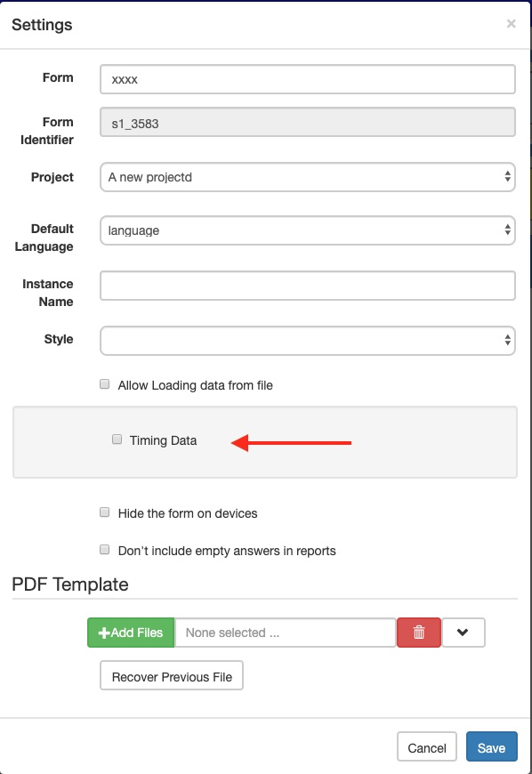
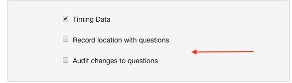
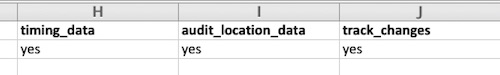

.. _auditing-survey-completion:

Auditing Survey Completion
==========================

.. contents::
 :local:

When a survey is being completed in fieldTask the following data about how the survey is filled in can be collected:
 
1. How long each question took to answer, 
2. The location where the question was answered.
3. How many times the answer to a question was changed and what those changes were.

Enabling in the Online Editor
-----------------------------

Open the survey in the editor and then select the menu File and then Settings.

   Settings Dialog
   
Click the checkbox labelled "Timing Data".   This will enable auditing for the survey and collect how long each question took to answer.
Once timing is enable you will see some additional options in the settings dialog.

   Additional Audit Options

You can optionaly also enable these in order to record location and changes to questions.  Once you are done click on the save button
to save your new settings.

Enabling in the XLSForm Editor
------------------------------

Auditing is enabled in the Settings sheet.  Enter "yes", or "no" directly underneath the headings timing_data, audit_location_data and
track_changes. 

   XLSForm Settings

.. note::

  Timing_data has to be set to "yes" for either of the other two settings to also be enabled.

Viewing Timing and Location audit Data
--------------------------------------

You can include timing and location audit when viewing your survey results via the API.  Use the API builder to create a URL for
a request to return the data in the format you need. To do this:

1.  Login or navigate to the survey management page
2.  Select the menu Modules then API
3.  Select the format that you want the data in, either CSV or JSON
4.  Select the project containing your survey
5.  Select the survey that has the audit data
6.  Select the audit checkbox

CSV Format
++++++++++

JSON Format
+++++++++++
  

Using a GIS
+++++++++++

Viewing Changes to Questions
----------------------------

There can be many changes to the answer for a question for each record of data.  For this reason it is necessary
to view the audit log of a single record at a time.

1.  Go to the API builder page.
2.  Select JSON format.
3.  Select the project containing your survey.
4.  Select the survey that has the audit data.
5.  Select the "Links" checkbox.
6.  Click on the URL.

.. note::

  Because the data will be shown in JSON format you will find it a lot easier to view if you install a JSON viewer plugin into
  your browser.
  
Navigate down the JSON data until you find the record that you want to see the audit data for and then click on the "audit_log" link.

