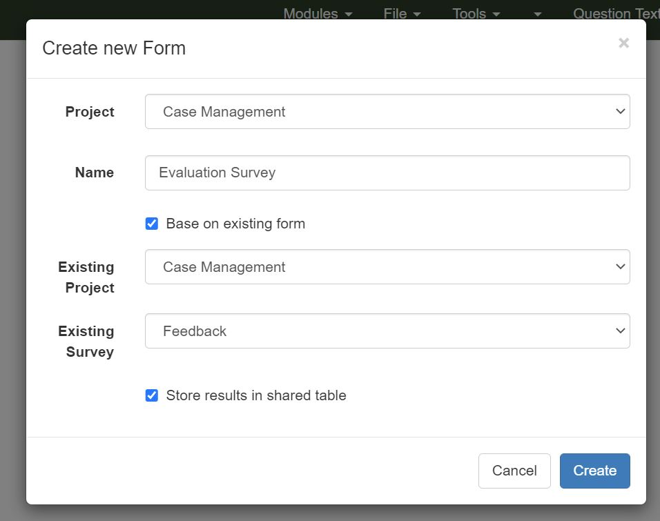

.. _survey_groups:

Grouping surveys into bundles
=============================

Multiple surveys can act on a single set of data tables. These tables can contain the details of cases.  Hence a
case can be created using one survey in a bundle and then updated using a second survey in the same bundle. 
Commonly a task will be created to get a user to perform the update.  The task can include data from the first survey
where the question names are the same. 

A survey can be added to a bundle when it is created using either the spreadsheet editor or the online editor.

Spreadsheet Editor
------------------

.. figure::  _images/bundle1.jpg
   :align:   center
   :width: 	 600px
   :alt:     Dialog to upload a new survey showing bundle option

   Adding a new spreadsheet survey to a bundle

In the above example the new survey called "Evaluation Survey" is being added into the bundle identified 
by the existing survey "Feedback" in the "Case Management" project.  

Online Editor
-------------

   Creating a new survey using the online editor and adding it to a bundle

In the above example the user has selected the option to base the new survey on an existing one.  This means that 
the two surveys will start out being identical.  The user then selected the option to "store results in a
shared table" which creates the bundle.  Once the new "Evaluation Survey" is created questions can be deleted 
and/or added.

Bundle Settings
---------------

Bundles are related to case management in that they are used to manage cases.  There is a single page to
specify the settings for a bundle and the case management on that bundle.  You can access this from the
online editor.  Select the menu "Tools" and then "Bundle and Case Management".  The first two settings are:

*  Bundle Name
*  Bundle Description
\d linked_forms
The name will be shown on the survey management page next to surveys in that bundle.  The description will be used by Large Language Models
to access data from your bundle if you give them permission to do so.
