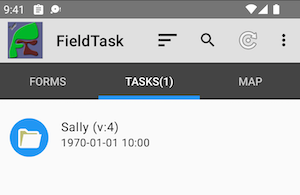
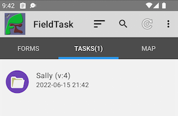

.. _mobile_case:

Cases on Mobile Devices
=======================

Eligible Cases
--------------

Cases assigned to the device user that are not complete will be downloaded.

.. note::

  If you have not set up :ref:`complete_case` then no cases will be downloaded. However if you want to get cases on devices even without
  case completion then you can set up a dummy status that will never be met to enable downloads of any assigned case. 

Icons
-----

The case will be shown on the tasks tab as a folder icon with a blue background if un-modified and a purlple background if modified,

   Unmodified Case

   Modified Case

Modifying an Updated Case
-------------------------

Cases can always be modified on a mobile device even after they have been updated.  The concept is that the user is assigned the case and therefore can manage it 
and make changes.  Hence the user can select the icon with the purple folder on the task screen to re-modify.

This behaviour contrasts with tasks and instances that have been filled in on a device which are by default not editable. However this behaviour can be 
changed in the mobile app settings.  (:ref:`mobile-device-settings`).  

Replicating updates to the server
---------------------------------

When the mobile device is refreshed the cases go through the following process:

#.  Updated cases are sent to the server
#.  These updated cases are retained on the device and the status changed back to accepted (no longer updated)
#.  Background processing on the server applies the changes to the database 
#.  On the next refresh if the case has been closed it is removed from the device.

Note that when a device is refreshed updated information is sent to the server first.  So any changes will always be sent before a case is closed.

Auto Refresh
------------

The device will auto refresh when a case is assigned to the user, unassigned, or the data is modified.

A version of the case for each survey!
--------------------------------------

Currently if a user has access to two data surveys in a bundle and they are assigned a case then two copies of the case will be downloaded onto their device
Both containing the same data but they will be opened by the different data surveys.

It is possible that this situation will not happen in the real world.  Users who complete cases on phones might only be given access to one of the surveys
in the bundle and hence will see only once case.

If this is a situation that you need to deal with then contact smap support with a description of why this will happen and we will implement an appropriate 
solution.
