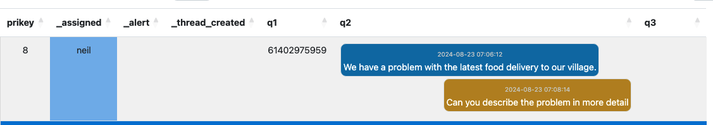
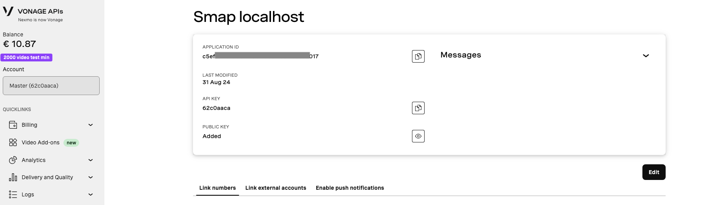

.. _sms_case:

Message Conversations
=====================

If you have an SMS or WhatsApp number from a cloud provider and attach it to a survey then you can receive and send
messages. See details here on how to set this up :ref:`sms`. Without cases each inbound message will create 
a new record in your survey.  However by setting up a case you can create a conversation within which
you send and receive messages to a number and all of these messages are kept together in the case.

Inbound Message
---------------

If there is no open case for the sending number then a new case will be created containing the message. 
Subsequent messages from the same sending number will be added to the case.  Messages from different
numbers will go into their own separate case.

If there are one, or more, open cases for a number then the message will be sent to all of those cases.

Replying
---------

#.  Lock the case for editing then select "Edit".
#.  Select send notification
#.  Select the target "Message Conversation"
#.  Type your response and click send

Your response will be sent to the number that created the case and will be added to the question that holds the message.
If the type of the question is set to "conversation" then the messages
will be formatted for easy reading

   A conversation

Any response from the sending number will also be added to the conversation.

Closing the case
----------------

Once the case is closed it will not receive any additional messages.  Instead if a new message is received from 
the same number it will create a new case as if it was the first time that person had sent a message.

Sending a message to a specific case
------------------------------------

When you reply to a message, a reference is automatically appended to your message.  For example "#123".  If the person sending messages to you,
includes that reference then the message will be sent only to the case that sent the response.

You can specify a reply, associated with the inbound number,  that will automatically be sent if there is more than one open case
associated with the senders number.  This "reply" can contain the placeholders %s1 and %s2.  These will be replaced by the number of
open cases and the first message of each open case along with its reference respectively.  For example::

    Hello thank you for your message.  Currently you have %s1 open cases that we are working on (%s2).
    Please include a # and the reference number to identify to the case you want to to comment on or add #0 to create a new case.

Creating a second case
----------------------

Add #0 to your message to always create a new case from your message.

Creating a new case from a message
----------------------------------

Sometimes, while you are working on a case, the person that sent the first message will send another message that should be in its own case.
You can address this by opening the case for viewing, (editing in versions before 25.01). in the console and clicking on the message that should be moved to its own case.

   A conversation with a message that needs moving to its own case

This will open a dialog where you can add a comment and confirm or backout of moving the message.  The comment will be included in the survey notes
of the new case.
