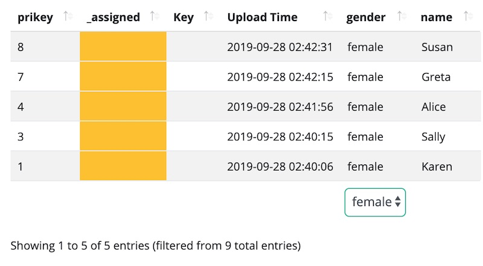
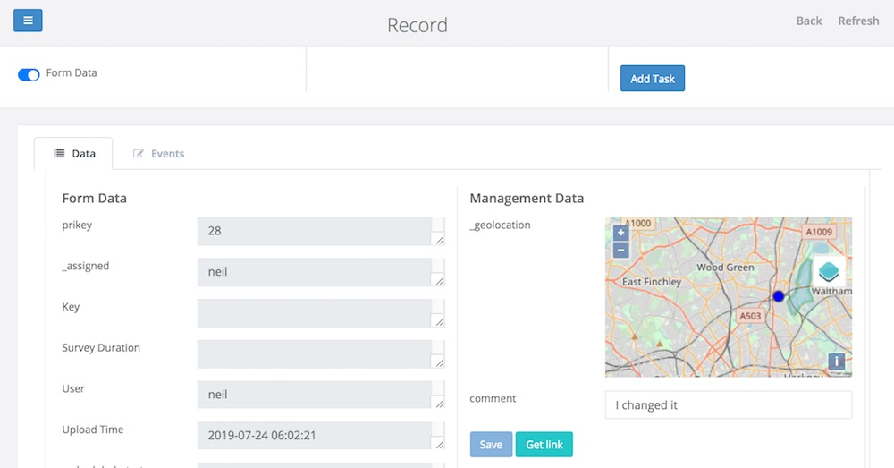
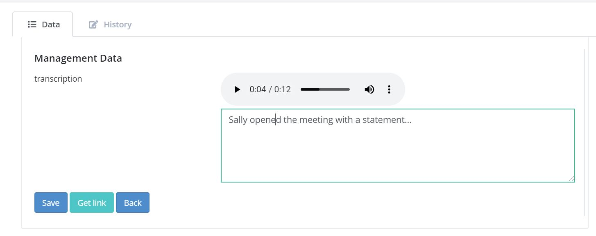
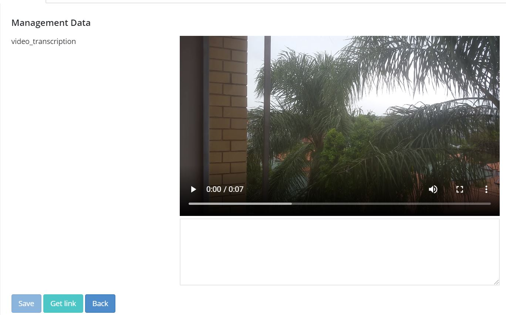
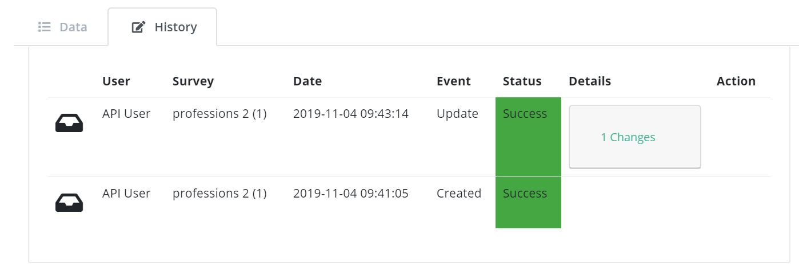
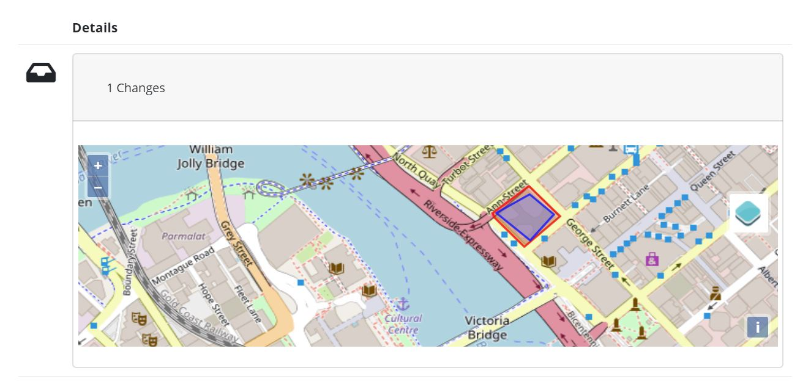

.. _console:

Console
=======

.. contents::
 :local:  
 
The console provides a view of the individual records so that they can be managed.  It is a key component of the Case Management 
capability but is also useful when tracking
submitted result for an Evaluation. 

To get here select the menus *Modules* and then *Console*.

   The Console
   
Records are shown in order with most recent at the top.  
   
Changing the records displayed
------------------------------

The top half of the page contains the filters.  These are:

* **Project:** Choose the project containing the survey.
* **Survey:** Select the primary survey, that is the one whose data you want to view.
* **Oversight Survey:** Choose a second survey containing questions that you want to add or edit in the primary survey.
* **Form:** The name of a subform whose data you want to view.  This defaults to "none" which means show the data from the main form.
* **Date Question:** If you only want to see data within a date range then use this to choose the date question that you want to filter by. For example the Upload time, start time of the survey or any other date question in the survey.
* **From Date:** The start date of the filter.
* **To Date:** The end date of the filter. This date range is inclusive, so all date that falls on the selected dates and any date between will be shown.
* **Include Deleted:** Select this if you want to see records that have been deleted.
* **My records:** Records that you have selected for editing.
* **Unassigned Records:** Records that no one has selected for editing.
* **Other Records:** Records being edited by other people.
* **Filter:** This is the advanced filter. For help on how to use this click on the (i) info symbol.  An example might be: ${age} < 25.  This would then only show records where the answer to the question "age" was less than 25.
* **Max Records:** The maximum number of records you want to load.  If you set this to 0 then all records will be loaded.  By default this is set to 1,000 so that loading does not take too long when you have a lot of data.  If you have a lot of records you may want to apply other filters to find the ones you are interested in.
* **Show Entries:** Show records in pages with the specified number of rows.  This filter is found just above the table on the left.
* **Search:** Only show records which have the specified text somewhere within them.

Select Filters
++++++++++++++

A drop down select is automatically created for each question of type select_one and placed underneath the colum that it filters.

   A select filter on gender

Sorting
+++++++

Clicking on a column heading will sort on that column.  Clicking again will change the sort direction.

Editing a record
----------------

Using Oversight Surveys
+++++++++++++++++++++++

Restricting editing of records to using oversight surveys provides a lot of control over what can and cannot be changed.
For example you may have a survey that is used to record customer feedback.  The back office staff are allowed to change
the original status and add comments and resolution but they cannot change any other information collected in the original
feedback.  In this case the oversight form will just have the questions that the back office staff can change.

1.  Select the oversight survey that has the questions to be changed,  the available oversight surveys are those
    surveys in the same group as the main survey
2.  Select the record to be edited
3.  Lock the record.  Only the person who has locked a record, and therefore assigned it to themselves, can
    edit the record.  Administrators can assign records, including those currently locked, to someone else.
4.  Click on the edit button

   Console Edit Page
   
On the console edit page questions are placed in 2 columns. The ones shown on the left are read only. They are the questions in the
main survey where there is no question in the oversight survey with the same name.  The questions on the right are the questions
form the oversight survey and can have their answer changed.  

Hence if you want to be able to change the answer to a question in the main survey then you will need to have a question of the same
name in the oversight survey. To add data to the main survey the question in the oversight survey would not be in the main survey.

Oversight survey specific configuration
^^^^^^^^^^^^^^^^^^^^^^^^^^^^^^^^^^^^^^^

For the most part an oversight survey is the same as a normal survey and you just specify it in the consolse as being used as an oversight survey,
in other words for editing data in the console.  To allow a survey to be used in this way it needs to be loaded into the same group as the survey
whose data you are editing.

There are some configuration settings you can use with oversight surveys:

#.  In the survey settings make it explicit that the survey is for oversight.  If you do this the survey will not be downloaded to fieldTask or
    made available via Web Forms.  Conversely you can specify that a survey is for data collection only so that it cannot be selected as the editing
    survey in the console.
#.  For a text question specify a source parameter which points to an image question.  For example:  "source=issue_photo".  This will cause the text
    question to be automatically populated with labels identified in the the image.  The AWS Rekognition service is used to do this.

Annotating Answers
^^^^^^^^^^^^^^^^^^

You may have collected image, audio or video data and you want to label that media or transcribe it into text.  If it is a text question
you may want to translate that response into a different language.  You can do this with oversight surveys.

To do this:

#.  Create a text question in an oversight survey to hold the annotation
#.  Add a parameter source with a value of the name of the question that you want to translate.  For example: "source=comment".
#.  Setting the rows parameter to something like 5, will also make it easier for the user to type in the annotation

Having done this when you edit a record in the console the source question will be shown next to the annotation question so that you can 
easily update one from the other.

Example 1. Translate a text answer
##################################

.. figure::  _images/annotation1.jpg
   :align:   center
   :alt: Showing the process of annotating a text response

   Annotating a text response
   
.. note:: 

  The user has unselected "Form Data" at top left so that they can focus on the questions that are in the oversight form.
 
Example 2. Transcribe an audio recording
########################################

   Transcribe an audio response
   
Example 3. Transcribe a video recording
#######################################

   Transcribe a video response
   
Automatic Translation
#####################

The translation can be done automatically by `AWS Translate  <https://aws.amazon.com/translate>`_.  The following additional parameters
need to be added to the question in the oversight form that is going to show the translation:

#.  Add the parameter: auto=yes
#.  Add a paramater **from_lang** with the value set to the language code of the source language
#.  Add a parameter **to_lang** with the value set to the language code of the language you are translating to

:ref:`language-codes` 

Automatic Audio Transcription
#############################

Audio can be done transcribed automatically using `AWS Transcribe  <https://aws.amazon.com/transcribe/>`_.  The following additional parameters
need to be added to the text question in the oversight form that is going to show the transcription:

#.  Add the parameter: auto=yes
#.  Add a paramater **from_lang** with the value set to the language code of the audio file

:ref:`language-codes-audio` 

Using a webform
+++++++++++++++

If the user has the **enum** security privilege then they can click on the green webform button at the top of the page.  This will 
open the main survey populated with data from the record.  The user can then make changes and submit in the normal webform way.

History Tab
-----------

Clicking on the history tab will show the changes that have been made to the record.  

   Record History
   
In the case above there has been one change to the record.  That change only affected a single question.

If you click on the button labelled "1 Changes" then the change is shown.  In this case the work area was adjusted, The old work
area being the blue square while the new work area is the red square.  

.. note::

  Of course if more than one value in the survey had changed then the label of the button would indicate the number of changes.

   Record Change Detail
   
The history tab show changes, tasks and notifications associated with a record.  You can select **sliders** at the top left
of the history page to filter / show these event types.

Assigning Tasks
---------------

When editing a record the user can request that somebody else update the record by assigning a task.   To do this click on 
the **Add Task** button.  A dialog will be shown with similar options as for adding an ad-hoc task.  (:ref:`editing-adding-tasks`).

The differences compared to the task management page are:

1.  The task is automatically set to update the existing record.
2.  The list of surveys that you can select for the task are restricted to those in the current survey group.  All of these surveys
    can work on the current record wheras other surveys not in the survey group cannot.
3.  A task group with the same name as the selected survey will be created automatically to hold this task.

Tasks assigned to a record will be shown in the History tab where you can see their status and edit them.

Sending Notifications
---------------------

An email notification can be sent with an attached PDF or a link to a Webform containing the record data. This notification
will also be shown in the record history.  Next to the notification will be shown a button labelled "Resend" that can be clicked
to resend a notification.

Drilling Down to Related Data
-----------------------------

The console shows one form of data at a time.  It does not attempt to merge data from a sub form into a parent form. Instead if you have
sub forms in your survey then you can drill down to see their data.  You can also drill down to data in other surveys that can be launched from the 
survey you are viewing in the console.

When you select a record, if there is data that can be drilled down to see then you a drill down button will appear above the data.

.. figure::  _images/dd1.png
   :align:   center
   :alt: Select a record

   Select a Record
   
After clicking on the Drill Down button, the data in the sub form that is connected to the selected record will be shown.  An **Up** button will now
also be shown.  If you can't drill down any further the **Drill Down** button will be hidden.

.. figure::  _images/dd2.jpg
   :align:   center
   :alt: Sub form records

   Sub form records

After clicking on **Up** and selecting a different record then drilling down again we can see the data related to the newly selected record.

.. figure::  _images/dd3.jpg
   :align:   center
   :alt: Sub form records with a different parent

   Sub form records with a different parent

.. _language-codes-audio:

Languages Supported for Automatic Transcription
-----------------------------------------------

The languages available for automatic transcription differ from the languages that can be automaticaly translated.  There are less languages
supported however some languages have many dialects that are not included in the list of languages for translation.

.. csv-table:: Transcription Languages:
  :width: 100
  :widths: 20,80
  :header-rows: 1
  :file: tables/transcribe.csv
