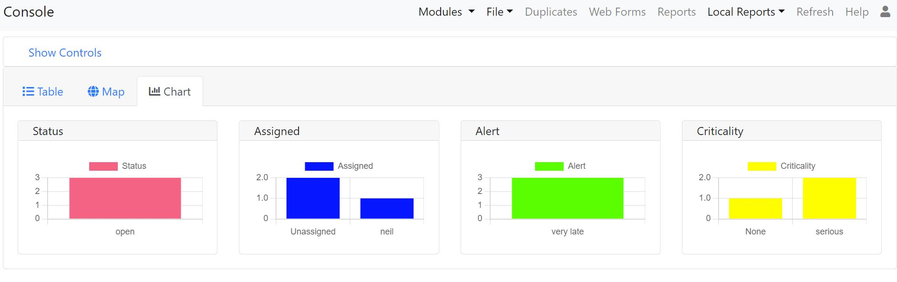
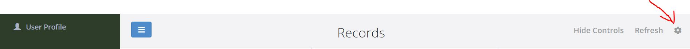
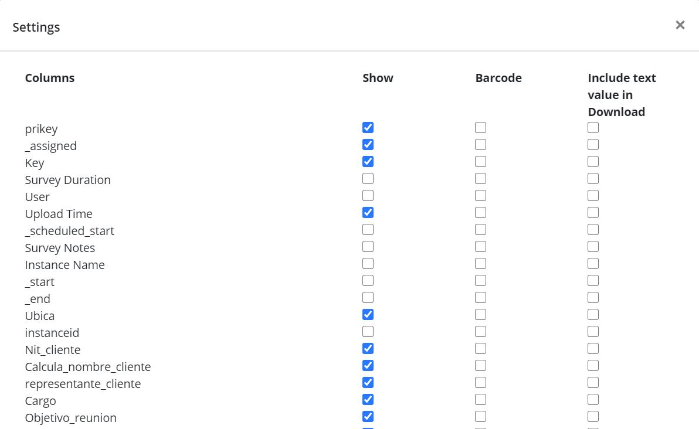
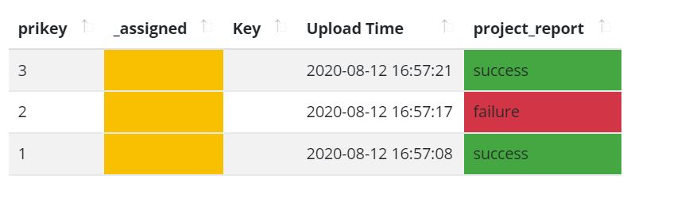

.. _console:

Console
=======

.. contents::
 :local:  
 
The console provides a view of the individual records so that they can be managed.  It is a key component of the Case Management 
capability but is also useful when tracking
submitted result for an Evaluation. 

To get here select the menus *Modules* and then *Console*.

Data Views
----------

Table
+++++

.. figure::  _images/console.jpg
   :align:   center

   The Console
   
Records are shown in order with most recent at the top.  

Map
+++

The map show the location of cases if they include GPS coordinates.  Clicking on a location will show the details of the case.

Chart
+++++

   Chart View

The chart tab currently show 4 vertical column charts:

*  Status.  For the cases currently included shows the frequency of each status value.
*  Assigned.  For the cases currently included shows how many cases are assigned to each person.
*  Alert.  The frequency of alerts that have been triggered by the cases.
*  Criticality.  The frequency of occurrence of values in the criticality column.

.. _console-filters:

Changing the records and columns displayed
------------------------------------------

Records
+++++++

The top half of the page contains the record filters.  These are:

* **Project:** Choose the project containing the survey.
* **Survey:** Select the primary survey, that is the one whose data you want to view.
* **Oversight Survey:** Choose a second survey containing questions that you want to add or edit in the primary survey.
* **Form:** The name of a subform whose data you want to view.  This defaults to "none" which means show the data from the main form.
* **Date Question:** If you only want to see data within a date range then use this to choose the date question that you want to filter by. For example the Upload time, start time of the survey or any other date question in the survey.
* **From Date:** The start date of the filter.
* **To Date:** The end date of the filter. This date range is inclusive, so all date that falls on the selected dates and any date between will be shown.
* **Include Deleted:** Select this if you want to see records that have been deleted.
* **My records:** Records that you have selected for editing.
* **Unassigned Records:** Records that no one has selected for editing.
* **Other Records:** Records being edited by other people.
* **Filter:** This is the advanced filter. For help on how to use this click on the (i) info symbol.  An example might be: ${age} < 25.  This would then only show records where the answer to the question "age" was less than 25.
* **Max Records:** The maximum number of records you want to load.  If you set this to 0 then all records will be loaded.  By default this is set to 1,000 so that loading does not take too long when you have a lot of data.  If you have a lot of records you may want to apply other filters to find the ones you are interested in.
* **Show Entries:** Show records in pages with the specified number of rows.  This filter is found just above the table on the left.
* **Include Completed Cases** Include cases that have a completed status and are not assigned to a user.  By default these are not shown.
* **Search:** Only show records which have the specified text somewhere within them.

Select Filters
^^^^^^^^^^^^^^

A drop down select is automatically created for each question of type select_one and placed underneath the colum that it filters.

.. figure::  _images/filter.jpg
   :align:   center

   A select filter on gender

Sorting
^^^^^^^

Clicking on a column heading will sort on that column.  Clicking again will change the sort direction.

Columns
+++++++

Click on the settings button, as shown below, in order to access the columns dialog.

   The settings button
   
The dialog allows you to select the columns that are shown, those that should be shown as a barcode and whether the value of a barcode should
also be included in reports.

   The columns dialog

Assigning a case to a user
--------------------------

A person with :ref:`Admin<security-groups>` privilege can click on the "Assign User" button to assign the case to 
any user who has access to the survey. Administrators can reassign cases to different people using this button. They
can also set a case to "Unassigned" by assigning it to "None".   From version 25.01 of the server a user can be given the
security privilege :ref:`Console Admin<security-groups>` and they too can assign users on the console without having all the
other privileges of an administrator.

Any person with :ref:`Analyst or Manage Data<security-groups>` privilege can click on the "Lock for Editing" button
to assign themselves to an unassigned case. If the user has finished with a case they can click the "Release" button
to send it back to unassigned.

Editing a record
----------------

Using Oversight Surveys
+++++++++++++++++++++++

Restricting editing of records to using oversight surveys provides a lot of control over what can and cannot be changed.
For example you may have a survey that is used to record customer feedback.  The back office staff are allowed to change
the original status and add comments and resolution but they cannot change any other information collected in the original
feedback.  In this case the oversight form will just have the questions that the back office staff can change.

1.  Select the oversight survey that has the questions to be changed,  the available oversight surveys are those
    surveys in the same group as the main survey
2.  Select the record to be edited
3.  Lock the record.  Only the person who has locked a record, and therefore assigned it to themselves, can
    edit the record.  Administrators can assign records, including those currently locked, to someone else.
4.  Click on the edit button

From version 25.01 of the server this will open the oversight form in a WebForm for editing.  WebForms allow you to include
relevance rules in your oversight forms just as you do in normal data surveys.  However WebForms do not support the "source" parameter
of questions that make annotating answers to other questions easy.  Instead you can do this annotation in the "View" mode.

The user will need **manage data** or **enumerator** security privilege to click on the green edit button to open the oversight form.  T

Oversight survey specific configuration
^^^^^^^^^^^^^^^^^^^^^^^^^^^^^^^^^^^^^^^

For the most part an oversight survey is the same as a normal survey and you just specify it in the console as being used as an oversight survey,
in other words for editing data in the console.  To allow a survey to be used in this way it needs to be loaded into the same group as the survey
whose data you are editing.

There are some configuration settings you can use with oversight surveys:

#.  In the survey settings make it explicit that the survey is for oversight.  If you do this the survey will not be downloaded to fieldTask or
    made available via Web Forms.  Conversely you can specify that a survey is for data collection only so that it cannot be selected as the editing
    survey in the console.
#.  For a text question specify a source parameter which points to an image question.  For example:  "source=issue_photo".  This will cause the text
    question to be automatically populated with labels identified in the the image.  The AWS Rekognition service is used to do this.

View Records and Annotation
---------------------------

The view button can be clicked even when a record is not locked in order to get a detailed view of the record data.  From version 25.01
this is also where you will also do annotations.   This means that updates can be made to questions that reference other questions using a
source parameter even when the user has not locked the record.

Annotating Answers
^^^^^^^^^^^^^^^^^^

You may have collected image, audio or video data and you want to label that media or transcribe it into text.  If it is a text question
you may want to translate that response into a different language.

To do this:

#.  Create a text question in an oversight survey to hold the annotation
#.  Add a parameter source with a value of the name of the question that you want to translate.  For example: "source=comment".
#.  Setting the rows parameter to something like 5, will also make it easier for the user to type in the annotation

Having done this when you view a record in the console the source question will be shown next to the annotation question so that you can
easily update one from the other.

Example 1. Translate a text answer
##################################

.. figure::  _images/annotation1.jpg
   :align:   center
   :alt: Showing the process of annotating a text response

   Annotating a text response
   
.. note:: 

  The user has unselected "Form Data" at top left so that they can focus on the questions that are in the oversight form.
 
Example 2. Transcribe an audio recording
########################################

.. figure::  _images/annotation2.jpg
   :align:   center
   :alt: Showing the process of transcribing an audio response

   Transcribe an audio response
   
Example 3. Transcribe a video recording
#######################################

.. figure::  _images/annotation3.jpg
   :align:   center
   :alt: Showing the process of transcribing a video response

   Transcribe a video response
   
.. _automation:

Automation
##########

.. warning::

  Automatic translations, transcriptions, and image labelling using AWS services for which they charge a fee.  Hence its use is restricted on servers hosted
  by Smap.  If you need this feature contact us to organise for the restriction to be lifted.

Automatic Translation
^^^^^^^^^^^^^^^^^^^^^

The translation can be done automatically by `AWS Translate  <https://aws.amazon.com/translate>`_.  The following additional parameters
need to be added to the question in the oversight form that is going to show the translation:

#.  Add the parameter: auto_annotate=yes
#.  Add a parameter **from_lang** with the value set to the language code of the source language
#.  Add a parameter **to_lang** with the value set to the language code of the language you are translating to

The above parameters are required in addition to the "source" parameter identifying the question that contains the original text.

:ref:`language-codes` 

Automatic Audio Transcription
^^^^^^^^^^^^^^^^^^^^^^^^^^^^^

Audio can be done transcribed automatically using `AWS Transcribe  <https://aws.amazon.com/transcribe/>`_.  The following additional parameters
need to be added to the text question in the oversight form that is going to show the transcription:

#.  Add the parameter: auto_annotate=yes
#.  Add a parameter **from_lang** with the value set to the language code of the audio file

The above parameters are required in addition to the "source" parameter identifying the question that contains the original audio file.

:ref:`language-codes-audio` 

Medical Transcriptions
^^^^^^^^^^^^^^^^^^^^^^

If the audio file contains medical terms then you can add some additional parameters to use `AWS Transcribe  Medical <https://aws.amazon.com/transcribe/medical>`_

#.  Add the parameter: auto_annotate=yes
#.  Add the parameter: medical=yes
#.  Add a parameter to identify the source question which must be of type 'audio':  source=qname
#.  Set the audio type to either "dictation" or "conversation":  med_type=dictation

Only US English is supported as a language for medical transcriptions.

Automatic Labelling of Images
^^^^^^^^^^^^^^^^^^^^^^^^^^^^^

Images can be labelled automatically using `AWS Rekognition  <https://aws.amazon.com/rekognition/>`_.  The following additional parameters
need to be added to the text question in the oversight form that is going to show the transcription:

#.  Add the parameter: auto_annotate=yes
#.  Add a parameter to identify the source question which must be of type 'image':  source=qname

The above parameter is required in addition to the "source" parameter identifying the question that contains the original image file.

:ref:`language-codes-audio` 

Automatic Sentiment Analysis
^^^^^^^^^^^^^^^^^^^^^^^^^^^^^

A sentiment can be automatically calculated for text responses entered in any of the following languages;
English, German, Spanish, Italian, Portuguese, French, Japanese, Korean, Hindi, Arabic and Chinese.
This is done using Amazon Web Services (AWS) Comprehend service. The sentiment can have one of the following
values; Positive, Negative, Neutral or Mixed. A confidence value in the sentiment can also be generated.

#.  Add the parameter: auto_annotate=yes
#.  Add the parameter: sentiment=yes
#.  Add a parameter to identify the source question:  source=qname
#.  Add a parameter to specify the from language:  from_lang=en

The above parameter is required in addition to the "source" parameter identifying the question that contains the original image file.

Updating Multiple Records at once
+++++++++++++++++++++++++++++++++

You can select multiple records using your mouse and the shift or the control key after which the "Bulk Change" button will be shown.

.. figure::  _images/console-bulk1.jpg
   :align:   center
   :alt: Showing console after selecting multiple records

   Multiple Records Selected for a Bulk Change

A page is then displayed that allows you to make changes to all selected records.

.. note::

  Select Multiple questions behave differently to other questions.   Rather than setting the final value of the question in all the records
  you are allowed to either add a selected choice to all records or remove a selected choice.  Hence the value you can select is a select one
  question.  You can then optionally specify the "clear" checkbox to remove the selected choice.

.. warning::

  Batch updates do not require you to reserve the record.  Hence you can update a record that someone else is working on.
  If the permitted values of a select question are determined by another value in the record then the values you can select
  will be determined by the first record that you are updating.  This might allow you then to set invalid values for other 
  records.

History Tab
+++++++++++

Clicking on the history tab will show the changes that have been made to the record.  

.. figure::  _images/console3.jpg
   :align:   center
   :alt: Record History

   Record History
   
In the case above there has been one change to the record.  That change only affected a single question.

If you click on the button labelled "1 Changes" then the change is shown.  In this case the work area was adjusted, The old work
area being the blue square while the new work area is the red square.  

.. note::

  Of course if more than one value in the survey had changed then the label of the button would indicate the number of changes.

.. figure::  _images/console4.jpg
   :align:   center
   :alt: Record Change Detail

   Record Change Detail
   
The history tab show changes, tasks and notifications associated with a record.  You can select **sliders** at the top left
of the history page to filter / show these event types.

Assigning Tasks
+++++++++++++++

When editing a record the user can request that somebody else update the record by assigning a task.   To do this click on 
the **Add Task** button.  A dialog will be shown with similar options as for adding an ad-hoc task.  (:ref:`editing-adding-tasks`).

The differences compared to the task management page are:

1.  The task is automatically set to update the existing record.
2.  The list of surveys that you can select for the task are restricted to those in the current survey group.  All of these surveys
    can work on the current record where as other surveys not in the survey group cannot.
3.  A task group with the same name as the selected survey will be created automatically to hold this task.

Tasks assigned to a record will be shown in the History tab where you can see their status and edit them.

Sending Notifications
+++++++++++++++++++++

An email notification can be sent with an attached PDF or a link to a WebForm containing the record data. This notification
will also be shown in the record history.  Next to the notification will be shown a button labelled "Resend" that can be clicked
to resend a notification.

Drilling Down to Related Data
-----------------------------

The console shows one form of data at a time.  It does not attempt to merge data from a sub form into a parent form. Instead if you have
sub forms in your survey then you can drill down to see their data.  You can also drill down to data in other surveys that can be launched from the 
survey you are viewing in the console.

When you select a record, if there is data that can be drilled down to see then you a drill down button will appear above the data.

.. figure::  _images/dd1.png
   :align:   center
   :alt: Select a record

   Select a Record
   
After clicking on the Drill Down button, the data in the sub form that is connected to the selected record will be shown.  An **Up** button will now
also be shown.  If you can't drill down any further the **Drill Down** button will be hidden.

.. figure::  _images/dd2.jpg
   :align:   center
   :alt: Sub form records

   Sub form records

After clicking on **Up** and selecting a different record then drilling down again we can see the data related to the newly selected record.

.. figure::  _images/dd3.jpg
   :align:   center
   :alt: Sub form records with a different parent

   Sub form records with a different parent

.. _language-codes-audio:

Styling the output
------------------

The color of a data cell can be set using style lists. There are two steps to this:

1. First specify your style list in the **styles** worksheet of an XLSForm

.. csv-table:: Styles Worksheet
  :header: list_name, value, color

  status,success,green
  status,failure,red

2. Second specify the style list for a question to use in the column **style list** of the survey worksheet

.. csv-table:: Survey Worksheet
  :header: type, name, label, style list

  text,project_report,What is the status of the project?, status

   Styled output

Reports
-------

Reports created from the console use the same filters (:ref:`console-filters`) that are used to determine what is displayed on the screen.  The reports can be accessed by
selecting the "File" menu option, you can then select Excel or Word format.  Note Word format is not useful if there are many columns.

*  Word. Downloads the current records and columns into a word document.  QR codes will be shown in this report.  All reports are generated in
   landscape mode.  You should reduce the number of columns to less than 10 before proceeding.
*  Excel.  Downloads the current records into a spreadsheet.

Languages Supported for Automatic Transcription
-----------------------------------------------

The languages available for automatic transcription differ from the languages that can be automatically translated.  There are less languages
supported however some languages have many dialects that are not included in the list of languages for translation.

.. csv-table:: Transcription Languages:
  :width: 100
  :widths: 20,80
  :header-rows: 1
  :file: tables/transcribe.csv
