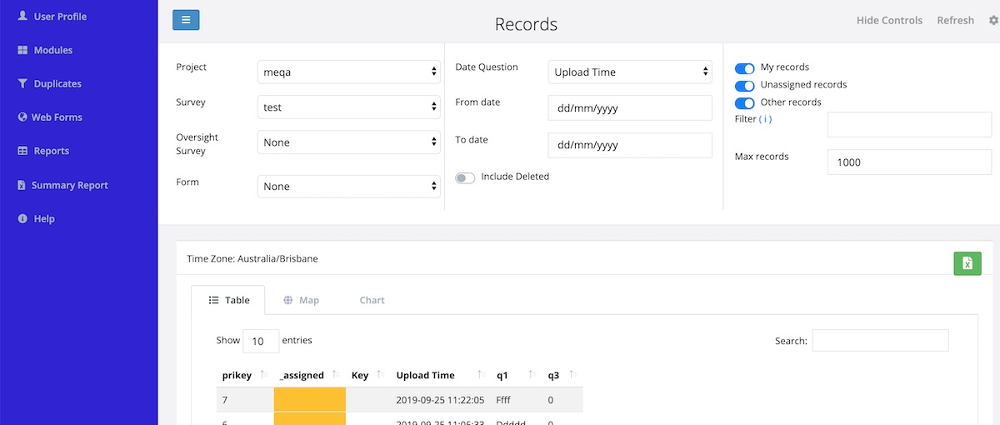

Console
=======

The console provides a view of the individual records so that they can be managed.  It is a key component of the Case Management capability but is also useful when tracking
submitted result for an Evaluation.

   The Console Is

