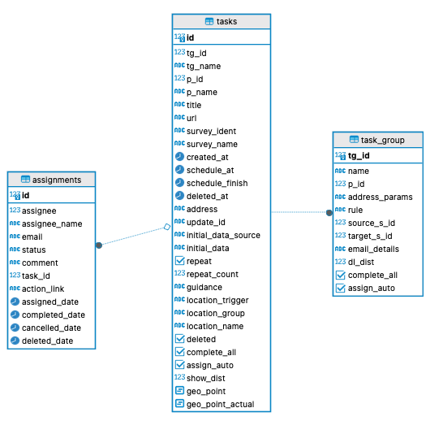

Tasks
=====

.. contents::
 :local:

Overview
--------

   Task Tables

There can be multiple tasks in a task group and multiple assignments for a task.

Task Group
----------

Task groups are used to manage collections of tasks.  They can also have rules that will automatically
generate new tasks. A task group is associated with a project and each project can have many task groups.

Tasks
-----

A task has information about what has to be done such as:

*  The survey to complete
*  Initial data
*  When and where the task should be completed

There can be many tasks in a task group.

Assignments
-----------

Assignments hold details on people who have been assigned to complete a task including:

  *  Status
    * closed
    * cancelled
    * complete
    * deleted
    * submitted
    * error
    * rejected
    * pending
    * new
    * accepted
  * assignee. The user ident of the person assigned a task
  * email. The email address on the assignee if this is an email task.
  * action_link. The URL of assignment details to include in email tasks.