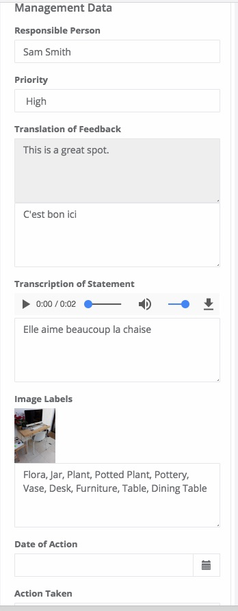

Accountability and Feedback
===========================

This product uses a standard data collection form and oversight forms to support organisations that want to collect 
feedback or complaints and then respond to it.

`Download the example application from here <https://smap.com.au/products/accountability.zip>`_

1 Overview
----------

The accountability product includes 2 forms the first of which is a feedback form that can be completed on a mobile phone 
or in a web browser. The second is an oversight form that can be attached to the feedback form and that can then be used 
to record actions taken in response to the feedback.

The process steps are:

#.  A complaint is recorded using the feedback form
#.  The feedback is submitted to the server. This might be straight away if the form was completed online otherwise it can be 
    done when a network is available
#.  If the feedback contains an image then this is passed to an AWS Rekognition service to identify objects in the image.
#.  The feedback is then manually reviewed, translated into a different language, the audio converted to text and notes added.

   Application Process
   
The feedback form is just a standard form that can be completed in the fieldTask application on a phone or tablet as well as in web-forms 
in a browser. If you were taking feedback in a call centre then you would presumably use web-forms. Alternatively if you were in a 
remote location without data connectivity then you would probably use fieldTask.

1.1 The feedback Form
+++++++++++++++++++++

   Feedback Form

The feedback form collects the following data:

*  Name
*  Age
*  Gender
*  A written description of the problem
*  A photograph of the problemName
*  An audio recording of the impact of the problem
*  The GPS coordinates

You can add additional questions and remove questions to customise this form to suit your purposes.

1.2 The Oversight Form
++++++++++++++++++++++

   Oversight Form
   
The oversight form has the following data entry fields:

*  Responsible person. A text field to enter who is responsible for processing the feedback.
*  Priority. This has the same name as the priority question in the feedback form and hence it shows the same value. The priority can however be changed from the value initially set in the feedback form.
*  Translation of Feedback. This is a text question that is linked to the feedback description set in the feedback form.
*  Transcription of the issue statement. The manager can play the audio statement and type the text into the text field.
*  Image labels. The labels shown were generated automatically by Amazon Rekognition. However they can then be manually modified by the user.
*  Date of any action taken
*  Description of action

2 Initial Setup
---------------

2.1 Create a Project
++++++++++++++++++++

You will need to have the manage security group in order to use the oversight form. Also make sure you have the enum security group.

#.  Select the “Users” menu
#.  Select the user that you logged on as
#.  Give yourself the security group of “manage”

   User Dialog

2.2 Add the forms
+++++++++++++++++

2.2.1 Feedback Form
^^^^^^^^^^^^^^^^^^^^

#.  Select the menu **Forms** or if you can’t see that select **modules** and then **Admin**
#.  Click on **Upload Form**
#.  Click on **Choose File** and select feedback.xlsx
#.  Click upload

2.2.2 Oversight Form
^^^^^^^^^^^^^^^^^^^^

Load this in the same way as for the feedback form.  However **use the "group by" to group it with the feedback form**.  **Group By** is what turns
a form into an oversight form that can be used to annotate data submitted by a data form.

3 Trying it out
---------------

#.  Complete the feedback form using fieldTask or webForms. 
#.  Log on to the server and select the **console**  
#.  Set the **Survey** to "Feedback"
#.  Set the **Oversight Survey** to "oversight"
