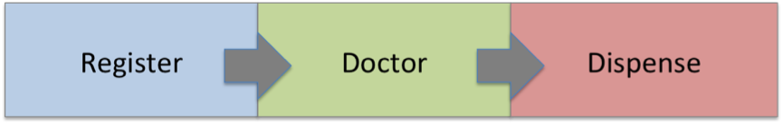
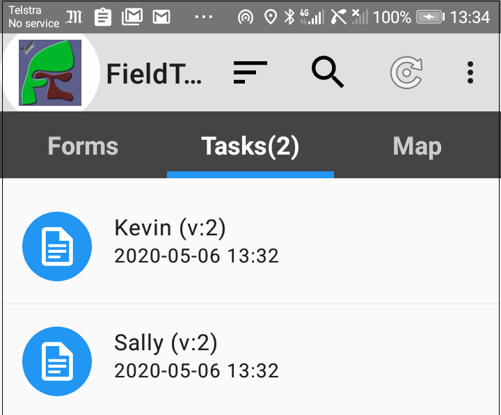
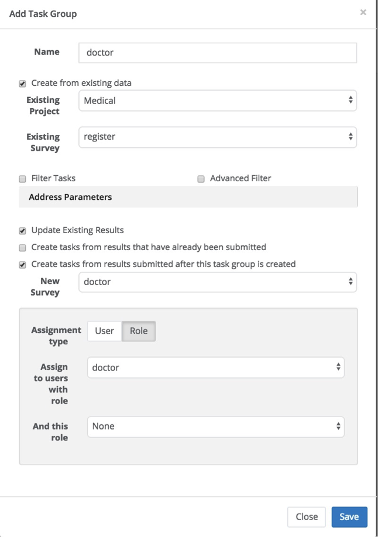
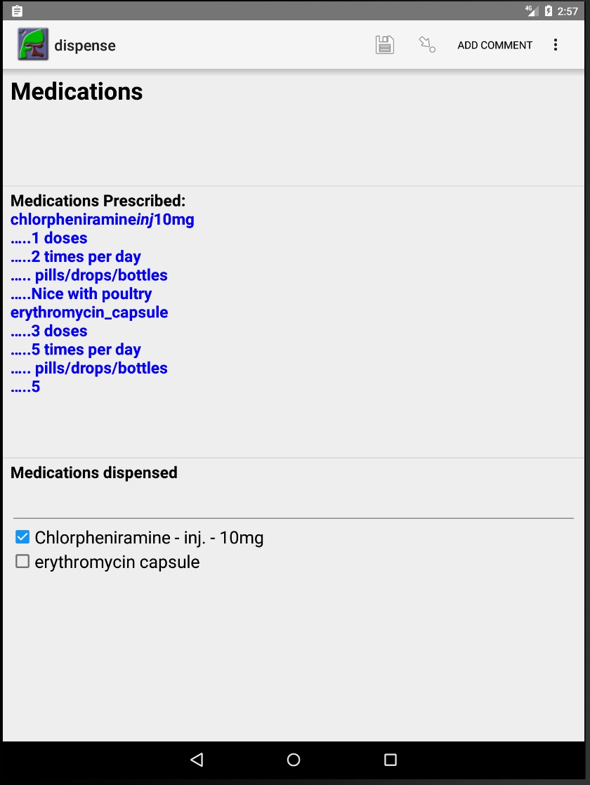

Medical Clinics
===============

.. contents::
 :local:
 
Smap has powerful features for linking data between forms. These include referencing results from other surveys, 
updating records instead of merely always appending, creating tasks using already collected data to pre-fill a form and then assigning 
it for completion to an individual.

All these features and a few more have been brought together in this example application for medical clinics.

`Download the example application from here <https://smap.com.au/products/medicalClinicsProduct.zip>`_

1 Overview
----------

This application has 3 sample forms that can be used to complete a process. Although the example is for a medical clinic 
the same approach could be used for any process. In the case of the medical clinic the process steps are:

#.  A patient is registered as a new patient or as a returning patient in which case their details can be reviewed and updated.
#.  The doctor sees the patient, reviews their history and provides another consultation during which they may prescribe some medications.
#.  A nurse dispenses the medications prescribed by the doctor.

   Application Process
   
Each of the process participants has their own device on which notifications will appear. Hence the doctor will get a notification 
when a patient has been registered. This notification will appear as a list entry with the patient’s name on it. When the doctor is 
ready to see the patient, then they can select the patient’s name to see their details and record the new consultation.

   Patient Notifications
   
The registration person is the only one who needs to select the empty form. 
The nurse and the doctor will get forms pre-populated with patient data. These will show in the tasks tab of their phone or tablet.
   
2 Initial Setup
----------------

2.1 Server Settings
+++++++++++++++++++

It’s a good idea to set fieldTask to automatically refresh so that when, for example, a new patient is registered, the doctor will get 
that patient's file on their phone without having to manually press the reload button.

#.  Go to the users page
#.  Select the “Field Task Options” tab
#.  Enable “Automatic synchronisation”
#.  Also set “Delete Submitted results” to “on”. This will remove patient files from the phone after the consultation.
#.  Press the save button

2.2 Create a Project
++++++++++++++++++++

#.  Logon
#.  Select the menu “Users”
#.  Select the project tab and create a new project

2.3 Create Users and Roles
++++++++++++++++++++++++++

You will need some **users** who will be registering patients, treating them and dispensing pharmaceuticals.

We can use **roles** to control which forms a user can see and whether or not they get notified of a newly registered patient 
or a patient that needs to be dispensed pharmaceuticals. These roles can be quite complex, for example they can be used to allocate 
patients to specific doctors however for this example we are just going to differentiate job types.

#.  Go to the users page
#.  Select the roles tab
#.  Click “Add Role”
#.  Create a role named “register”
#.  Repeat to create a role named “doctor”
#.  Repeat to create a role named “dispense”

Create a user to register patients.

#.  Select the “Users” tab
#.  Click on the “Add User” button
#.  Set their ident to “register”
#.  Set their name to something that makes sense to you (Probably just “Register”)
#.  Either specify their email so they can set their own password or set a password for them. In this example we are creating a generic user that different real people might use so you should probably specify the password. If instead we were creating a user account for a specific person who would act as the “register” then you may want to send them an email so they can set their own password. Use strong passwords!
#.  Give them a security group of “enum” which allows them to fill in a form but nothing else
#.  Give them access to the project you created in the previous step
#.  Give them the “register role”

Repeat to create a user account for a doctor who should get the role of “doctor” and a nurse who should get the role of “dispense”.

2.4 Load the forms into the project
+++++++++++++++++++++++++++++++++++

First upload the register form

#.  Select the menu “Forms” or if you can’t see that select “modules” and then “Admin”.
#.  Click on “Upload Form”
#.  Click on “Choose File” and select the register form
#.  Click upload

Now upload the doctor form **however we want to group these forms together so that they can share data**. To do this
we add the doctor form to the same group as the register form.

#.  Click on “Upload Form”
#.  Click on “Choose File” and select the doctor form
#.  Set the “Group” to the register form.
#.  Click “Upload”

Repeat for the dispense form, again set the group to register

When you are grouping forms in this way it is not important which form you set as the group form however all members of the group must 
refer to the same group form.

2.5 Set the visibility of forms (optional)
++++++++++++++++++++++++++++++++++++++++++

If you want the doctor form to be only visible to users with the doctor role then:

#.  Click on the name of the doctor form on the form management page
#.  Click the menu “Files” then “Roles”
#.  Enable the doctor role

Repeat for the register and dispense forms enabling the appropriate role in each case.

2.6 Configure Notifications
+++++++++++++++++++++++++++

Got to the tasks page by selecting the “modules” menu and then “tasks”.

2.6.1 Doctor Notifications
^^^^^^^^^^^^^^^^^^^^^^^^^^

#.  Select menu “Task Group” then “Add task group”
#.  Give it the name of “doctor”
#.  Select the “create from existing data” checkbox
#.  Set the existing survey to the register survey
#.  Select the “Update existing results” checkbox
#.  Select “Create tasks from results submitted after this task group is created”
#.  Set the new survey to the doctor survey
#.  Set the assignment type to “Role”
#.  Set the “assign to users with role” to “doctor”
#.  Select save

These settings are shown in the image below.

   Notification Dialog

2.6.2 Nurse Notifications
^^^^^^^^^^^^^^^^^^^^^^^^^

#.  Select menu “Task Group” then “Add task group”
#.  Give it the name of “nurse”
#.  Select the “create from existing data” checkbox
#.  Set the existing survey to “doctor”
#.  Select the “Update existing results” checkbox
#.  Select the “Create tasks from results submitted after this task group is created” checkbox
#.  Set the new survey to “dispense”
#.  Set the assignment type to “Role”
#.  Set the “assign to users with role” to “dispense”
#.  Select save

2.7 Adding the reference data
+++++++++++++++++++++++++++++

The doctor and nurse forms both get their list of medications from a CSV file. To make this available to the forms you will need to load 
it onto the server.

#.  Select the “Shared Resources” Menu
#.  Click the “Add Files” button and select the medication.csv file
#.  Click the upload button

3 Trying it out
---------------

You will need three android phones with fieldTask installed; one with the register user, when for the doctor and one for the nurse.

Press the refresh button on fieldTask to download the forms and the settings for the phone from the server. As earlier we set the phones 
to auto update then from now on changes to forms on the server and new patient registrations should automatically be reflected on the phones. 
However if an expected patient does not appear on your phone then you can try pressing refresh again.

   Page for recording dispensed medication
   
3.1 Rejecting Tasks
+++++++++++++++++++

If the patient left before seeing the doctor they can do a long press on the patient’s icon and then select “reject” from the menu.

4 Reporting
-----------

You can use Smap’s reporting functions available from the analysis module. There you can select one of the 3 forms 
and it will show the collected data for that form. There are two issues with this that you may want to address. Firstly you will only get 
incomplete views of the data, either the registration view, the doctor’s view or the nurse’s view depending on the form you selected. 
Secondly there will be quite a few data columns containing data used to support the process and format the information on the phones. 
You don’t really want this data cluttering up your reports.

You can address both of the above issues by creating a new form that has the questions from the other three forms in it. Then load this into 
the same group. Do you reporting on this overview form.

You can also use “roles” to hide columns the register, doctor, nurse forms if you wish.

5 Customising the forms and the process
---------------------------------------

The forms that have been included in the product are much simpler than the ones that you would use in a real medical clinic. 
However you can take these as the starting point and add more questions or even more forms to meet your needs. If there are additional 
capabilities that you need for your particular situation then don’t hesitate to contact us at Smap and we will see if the
system can be enhanced accordingly.

The following considerations when designing your form are particularly relevant to creating a “process” using linked forms. 

5.1 Key Policy
++++++++++++++

You can set the key policy for a survey to “merge” and specify a key, which would be a question or a combination of questions, 
that will be used to identify the unique records. So in the example surveys in this product the key is the patient id. If a 
survey submits data for that patient then if the id already exists the data will be merged. Unanswered questions from the new 
survey will be filled with data from the old one and then the old survey will be replaced. However for sub-forms the new records 
will be appended to the existing records. Hence you can update the name of a patient and then append the new consultation record.

If you also want the sub-form data to be merged then you can put a parameter of “merge=yes” on the begin repeat. This is done for 
the nurse survey where we want the information on which medications were dispensed to be added to the same record created by the 
doctor indicating which records have been newly added.

5.2 Reference sub forms
+++++++++++++++++++++++

Sometimes you want to allow the user to add another record to a repeating group but you don’t want to allow them to modify previous 
records. This is the case in this example process where we want to allow the doctor to review previous consultations in read only mode 
and then to add the outcome of a new consultation.

You can do this by setting a property value of “ref”, for reference, on a begin repeat. For an example refer to the “begin repeat” 
prev_consultation_rpt in the doctor form.

This has the parameter ref=consultation_rpt. consultation_rpt is a normal sub form. The effect of this is that the data for prev_consultation_rpt 
is pulled out of the consultation_rpt form as a read only copy.

A little bit later in the form they can enter the new consultation into the consultation_rpt sub form.

5.2.1 Questions in “reference” sub forms
^^^^^^^^^^^^^^^^^^^^^^^^^^^^^^^^^^^^^^^^

You cannot use a type of calculate to get a value into a reference form. Calculates are only calculated on the phone. Hence you 
should use a question type of “text” when referencing a calculate question completed by another sub form.

The name of each question in the reference form will be the same as the real sub form but it will have an “_” underscore in front of it.

In the reference form we have a text question with name "_medication_1_val"

In the real form we have a calculate question with name "medication_1_val"

Apart from calculates you can use the same question type for your reference question as the real question.

5.2.2 Hiding the reference questions
^^^^^^^^^^^^^^^^^^^^^^^^^^^^^^^^^^^^

The normal way to put hidden data into a form is to use a calculate. However when you are referring to a question in a reference 
sub forms then you can’t use a calculate. This is awkward if you just wanted to use the answer to the question to create another 
value using calculations as we do in the doctor and nurse forms. To support this there is a new appearance of “hidden” that will 
hide a text, select1 etc question.

5.3 Ordering the data pulled from a sub 
+++++++++++++++++++++++++++++++++++++++

You can scroll through multiple records that were added by a previous form however if you want to do this in reverse order, 
most recent first, then you can add a parameter "order=reverse" to the new sub-form.

5.4 Limiting the number of records pulled back from a sub form
++++++++++++++++++++++++++++++++++++++++++++++++++++++++++++++

In the medical clinic process we might have wanted to only see the last consultation. For that case we could have added the parameter 
“instance_count=1”, to the prev_consultation_rpt sub form.

However we wanted to see all previous consultations so we did not do this. But in the consultation_rpt we did not want to see
any of the previous consultations as this is the sub-form that is going to add the new one. So we added the parameter “instance_count=0”