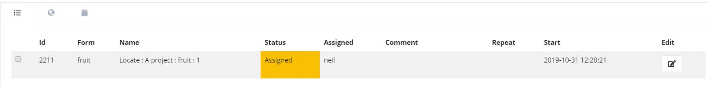
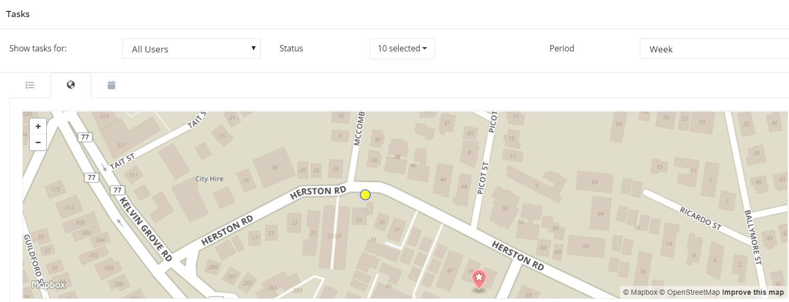
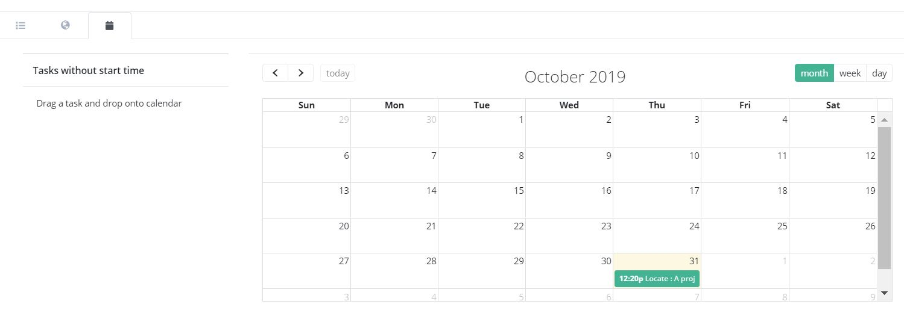
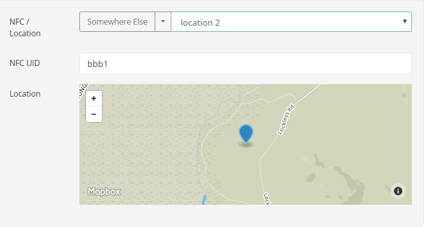

.. _editing-adding-tasks:

Editing / Adding Tasks
======================

.. contents::
 :local:

Once you have created a task group then you can add or edit tasks within it.  This applies whether or not the task group
contains a rule to automatically generate tasks from submissions.

Selecting the Task
------------------

1. Click on the task in the table view

   Select task from table view
   
For the task you want to edit click on the button with the edit icon in the edit column.
   
2. Or Click on the task location in the map view

   
   Select task from map view
   
3. Or Click on the task calendar entry in the map view

   
   Select task from calendar view

Adding a Task
-------------

From the menu bar select **Tasks** then **Add Task**.

Task Settings Dialog
--------------------

.. figure::  _images/tasks6.jpg
   :align:   center
   :width:   300px
   :alt:     Task settings Dialog
   
   Task Settings Dialog

1.  Set the task name
2.  Set the survey to be completed
3.  Assign the task

When editing the task, or creating an ad-hoc task, it can only be assigned directly to a user of the system or to 1 or more email addresses.
The option of assigning to users of a **role** is only available when creating tasks automatically from submitted data.

The **complete all** checkbox can be selected if you want all assigned users to complete the task.

4.  Optionally set the task to persist in fieldTask.  If this checkbox is set then the task will stay in FieldTask even after the user
    has completed it.  The user can then complete the task multiple times and when they are finished they can **reject it** by doing a 
    long press on the task name.

5. Set the start date and time of the task and the end date and time.

6. Add guidance.  This is a free form text field.  If the task was originally created as an automatic task from
   submitted data then this will be filled with the address data, that is answers to questions in the submitted survey.
   However when editing the task you can enter any text.
	
7.  Set the location of the task

Task locations can be GPS coordinates and/or an NFC chip that the user swipes with their phone in order to launch the task.

Use a named Location
++++++++++++++++++++

Named locations are specified in shared resources. (:ref:`shared-resources`)

   
   Selecting a Named Location
	
Specify a new Location
++++++++++++++++++++++

Alternatively just click on the map and/or type in the ID of an NFC chip.

.. figure::  _images/tasks8.jpg
   :align:   center
   :width:   300px
   :alt:     Specifying a New Location
   
   Specifying a New Location

When specifying a new lcoation you can optionally update an existing named location or create a new named location with those
coordinates and/or NFC id.

8.  Optionally set the download distance

If you are assigning a lot of tasks and you want the task to only be visible if the user is close to it then specify a 
download distance.

9.  If this task updates a record of data then you can click on the button "Show in Console" to view the record in the console.