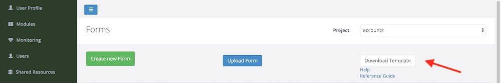

Creating a Survey
=================

Get the Excel template from the server.  

1. In your web browser enter the address of your Smap server.
2. Click on the login menu, this will take you to the Survey Management page.
3. Click on the button marked "Download Template" and the excel template will be downloaded to your computer.

   Downloading the Excel Template

You click on the "upload Form" button in order to load your completed survey back to the server.  The "Create new Form" button will launches
the online editor.

