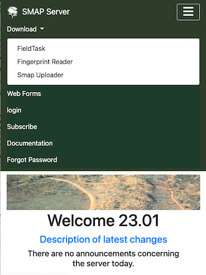

.. _install-fieldtask:

Installation
============

.. contents::
 :local:

If you intend to use Android phones or Tablets to complete surveys, then you will want to install FieldTask on these devices.  Alternatively
you can complete surveys in browsers using WebForms.

You can `get FieldTask from the Google Play store <https://play.google.com/store/apps/details?id=org.smap.smapTask.android>`_.  This is the easiest
way if you have a google account and are installing it on your own phone or tablet.  Search for "fieldTask" with no spaces in order to find it
quickly.

However if you are installing fieldTask on devices that will be shared then you definitely do not want to use your own google account as the
phone user will have access to your gmail.  Also setting up google accounts just to install the app is tedious.  In this case a better approach
is to download fieldTask from the server.

1. Download
-----------

For SmapServer 23.01 and above, fieldTask is downloaded from the download menu on the server home page. Using the internet browser on your phone enter the URL of your 
Smap Server.  If you are using the public server then that would be https://sg.smap.com.au.  Then select the **download** menu and select **FieldTask**.  
The application will then be downloaded to your phone.

   Download
   
For versions of the server prior to 23.01 select the FieldTask button.

.. figure::  _images/installFT1.jpg
   :align:   center
   :width: 	 200px
   :alt:     Click on the fieldTask icon to download

   Download the old way

2. Viewing the state of your download
-------------------------------------

Drag down with your finger from the top of the screen in order to see how your download is progressing.  Then tap on
the fieldTask apk to install it or upgrade.

   View download state

3. Accepting unknown sources
----------------------------

Google take quite extensive steps to validate applications that are in the Google Play store, however here we are downloading
the app directly from the Smap server.  So an "unknown" source from Google's perspective and the phone may require you to 
confirm that you understand the risks.  

.. figure::  _images/installFT3.png
   :align:   center
   :width: 	 200px
   :alt:     Accept installation from unknown sources

   Accept installation from unknown sources
   
FieldTask should now install.

4. Minimal Configuration
------------------------

To start using FieldTask you will need to go to then menu and then "General Settings" to set

*  The URL of the server
*  Your username
*  Your password

Follow the instructions in :ref:`getting-started-create-sg-account` to get your username and password.

5. Required Permissions
-----------------------

When you open fieldTask and also while using the app it will ask you to accept a number of permissions.  Most of these are self 
evident however the controversial one is shown when you first open a form.

  Allow FieldTask to make and manage phone calls.

If you don't accept this, when opening a form, then you will see a message stating why it is required and the form will not open.  This 
permission is used only to get the identifier for the android device, its *device id*.  This information is critical for
quality assurance as it identifies which device submitted which survey results.   However there is no need to worry FieldTask will 
not make any phone calls on your behalf.
