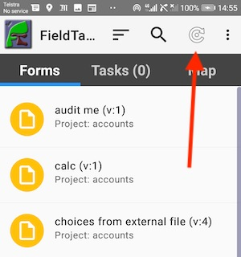
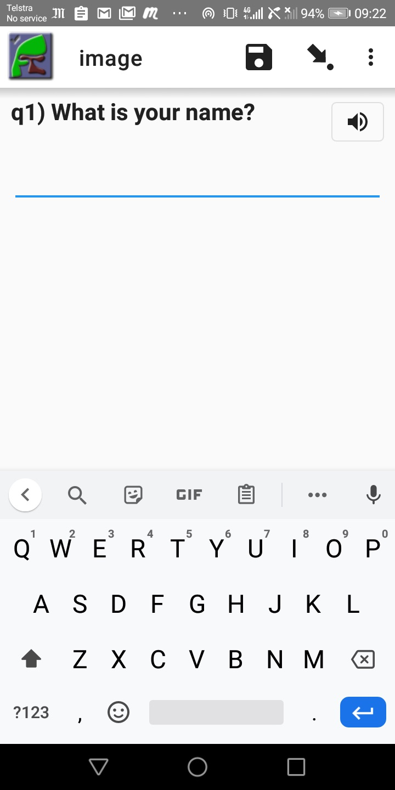

Using FieldTask
===============

.. contents::
 :local:

Synchronising with the Server
-----------------------------

Press the **refresh** button on the main screen to synchronise the device with the server.  This will:

1.  Upload any completed instances
2.  Download any new or changed surveys / forms
3.  Download any new or changed tasks

   
   Refresh Button
 
Adding notes
------------

You can add free form notes to any question by selecting **menu** and then **Add comment** while completing a survey.
Although the question name is included in the note automatically,  a single note for the entire survey is actually created.  
All the notes you add for each question get combined.  They can then be seen in the survey notes column when viewing results.

Changing the Language
---------------------

You can change the survey language displayed by selecting **menu** and then **change language** while completing a survey.

FieldTask Settings
------------------

There are many settings that you can configure on the device using **menu** and **general settings**.  Many of these can
also be specified on the server (:ref:`mobile-device-settings`).  If specified on the server the settings will override those on the phone for all devices.

Playing Media Questions
-----------------------

If an audio or video file is added to a question (:ref:`media`) then an icon will be shown that the user can seelect to play the media.

   Playing Media

If the media is set to auto play then the text of the question will show as blue and the icon will be grayed out while the file is playing.
