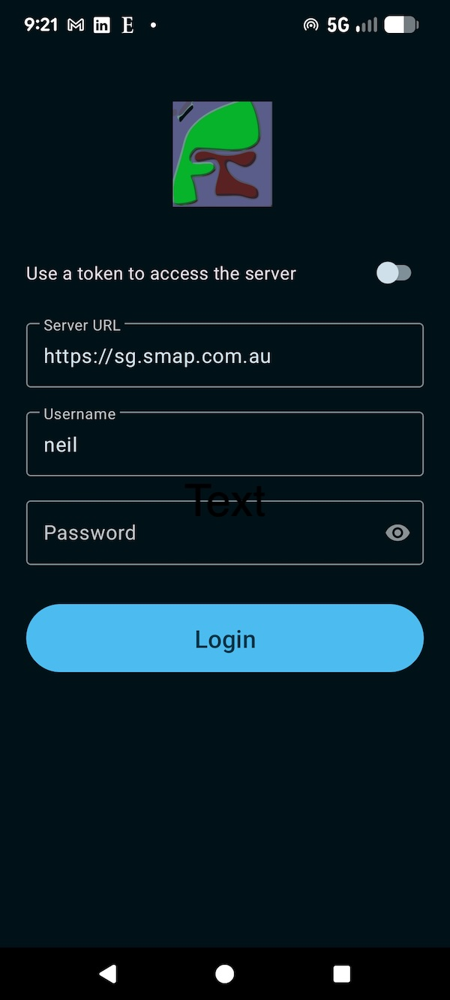
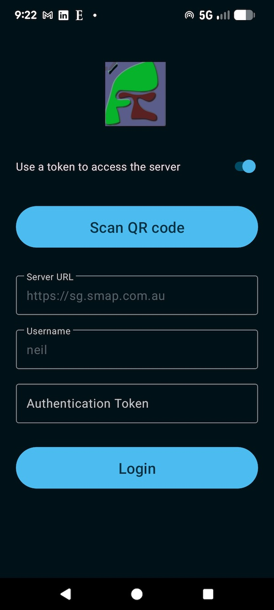
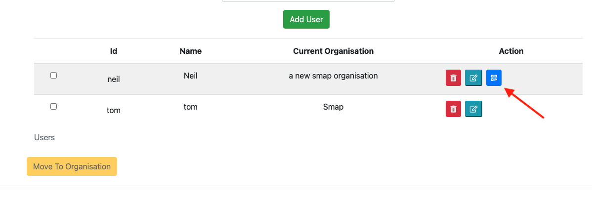
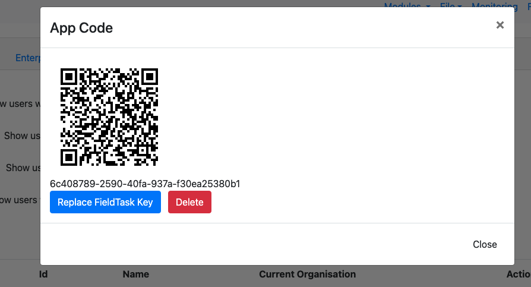
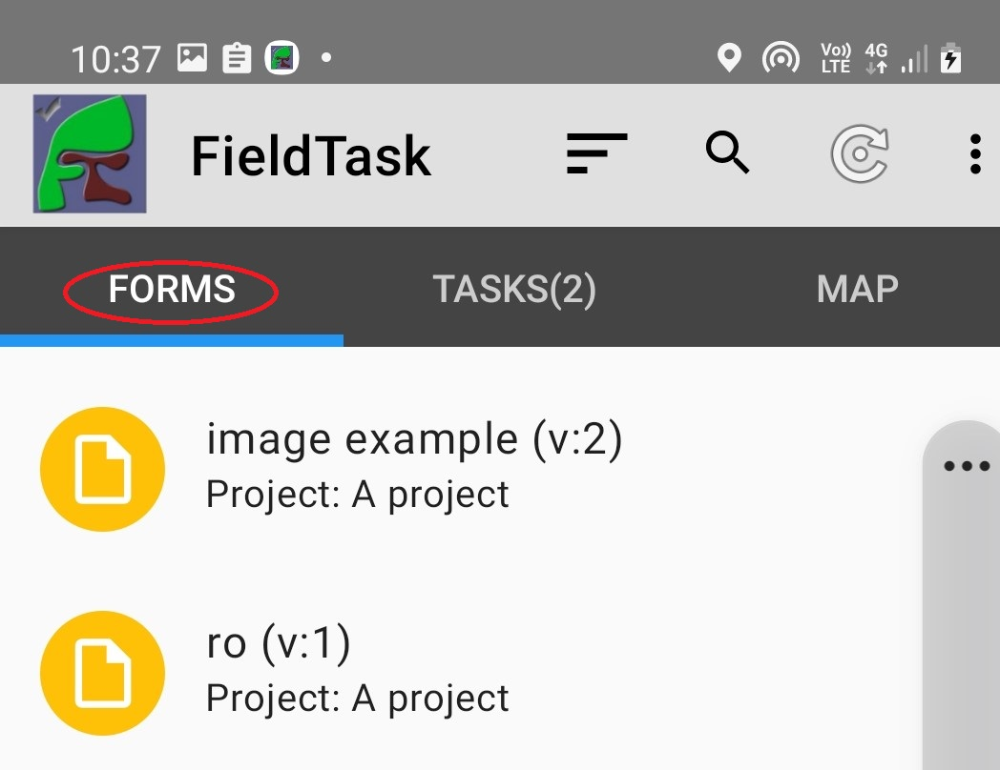
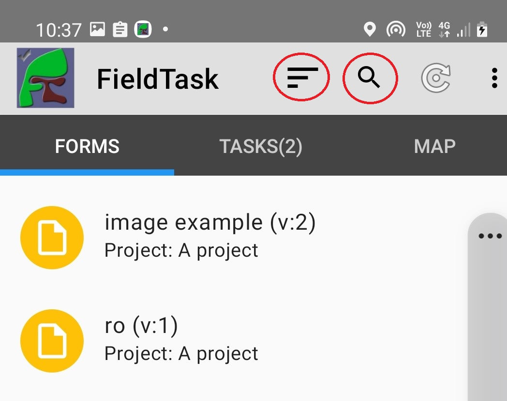
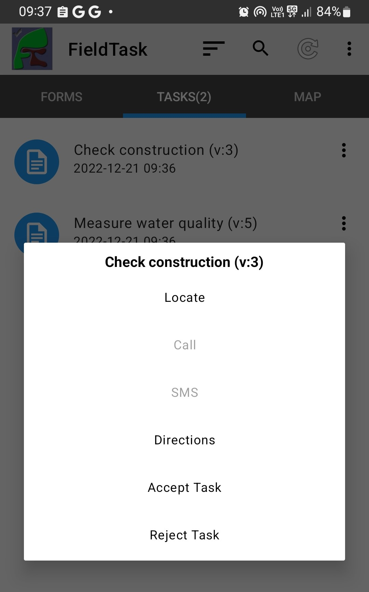

Using FieldTask
===============

.. contents::
 :local:

Logging On
----------

Logon Page
++++++++++

When you first start FieldTask a logon page will be shown. Your administrator can also specify on the server that every time you
start FieldTask this page will be shown and you need to log on.

   Login Page

You can then specify the URL of your server and enter your username and password to log on.

Scanning a QR Code to log on
++++++++++++++++++++++++++++

Alternatively you can select the switch labelled **Use a token to access the server** and then scan a QR code to log on.

   Logon by scanning a QR code

The QR code will set the username and server URL so these are read-only. You will also not need a password with this approach so that is hidden.
To start scanning press the **Scan QR Code** button. An administrator can show the QR code on a screen by navigating to the user administration page
and selecting the QR button next to the user's name. These buttons will only be shown for users that have enumerator privilege.

   Button to show QR Code

   QR Code to Scan

Changing logon details in settings
++++++++++++++++++++++++++++++++++

If you have to log on every time you open FieldTask then the logon page may be the only one where you set your logon credentials. However if
that is not required then you may want to change the server, username, password or token. This can be done in settings. Select:

#.  **Menu**
#.  **General settings**
#.  **Server**

You can then change your logon details in the same way you set them on the logon page.

Synchronising with the Server
-----------------------------

Press **Refresh** on the main screen to synchronise the device with the server. This will:

1.  Upload any completed instances
2.  Download any new or changed surveys / forms
3.  Download any new or changed tasks

.. figure::  _images/ftRefresh.jpg
   :align:   center
   :class: with-border
   :alt:     Press refresh to synchronise
   
   Refresh Button

 In FieldTask5 you can also swipe down on the form list or task list to initiate a refresh.
 
Starting a Survey Form
----------------------

Select the **Forms** tab, as shown circled below, and then tap the survey that you want to complete.

   
   Launch Survey
 
Finding the Survey
------------------

If you have a lot of forms on your phone then it may be hard to find the one you want to open. However you can use
**Search** or **Order by** to make the form easier to find. These buttons are circled in the image below.

**Search**. When you type some characters into the search bar, only those forms that contain that
sequence of characters in their name are shown.

   
   Find a survey form

**Order By**.  You can order survey forms by:

  * Name Ascending
  * Name Descending
  * Order Downloaded Ascending
  * Order Downloaded Descending
  * Project Name Ascending
  * Project Name Descending

Task instances can be ordered by:

  * Name Ascending
  * Name Descending
  * Order Downloaded Ascending
  * Order Downloaded Descending
  * Status, finalised first
  * Status, not finalized first

.. note::

  It is good practice to only have the single survey that an enumerator needs to complete on the phone.  The
  fewer surveys that they have to choose from the less likely the wrong survey will be completed.

Adding notes
------------

You can add free form notes to any question by selecting **Menu** and then **Add comment** while completing a survey.
Although the question name is included in the note automatically,  a single note for the entire survey is actually created.  
All the notes you add for each question get combined.  They can then be seen in the survey notes column when viewing results.

Changing the Language
---------------------

You can change the survey language displayed by selecting **Menu** and then **Change language** while completing a survey.

FieldTask Settings
------------------

There are many settings that you can configure on the device using **Menu** and **General settings**. Many of these can
also be specified on the server (:ref:`mobile-device-settings`).  If specified on the server the settings will override those on the phone for all devices.

Playing Media Questions
-----------------------

If an audio or video file is added to a question (:ref:`media`) then an icon will be shown that the user can select to play the media.

.. figure::  _images/ftmedia.jpg
   :align:   center
   :alt:     Playing media
   :width:   300

   Playing Media

If the media is set to auto play then the text of the question will show as blue and the icon will be grayed out while the file is playing.

Task Actions
------------

Each task on the tasks tab includes a menu at the right which you can select to show a list of choices for that task.

   Selecting an action for a task

Locate
++++++

This choice will be enabled if the task has been specified to be completed at a location. Selecting it will show the location of the task on the map tab.

Call
++++

If a contact number is available for the task, this opens the phone dialer.

Directions
++++++++++

This choice will be enabled if the task has been specified to be completed at a location with coordinates. Selecting it will open Google maps in directions
mode with the destination set to the location of the task.

Accept Task
+++++++++++

If a task has been created with the **Self Assign** checkbox set, then a user can accept that task here.

Reject Task
+++++++++++

An assigned task can be rejected by selecting this choice. A reason for rejecting the task must be specified. For a case the case will be unassigned.
