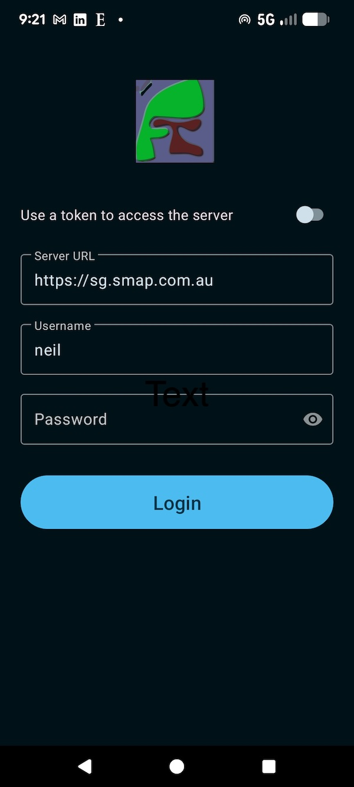
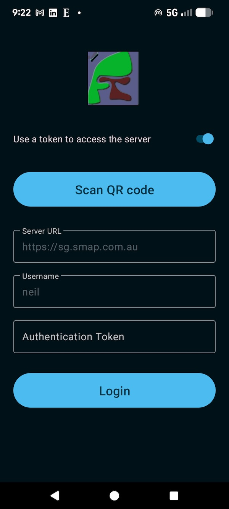
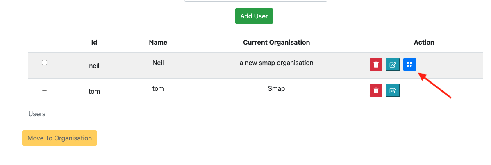
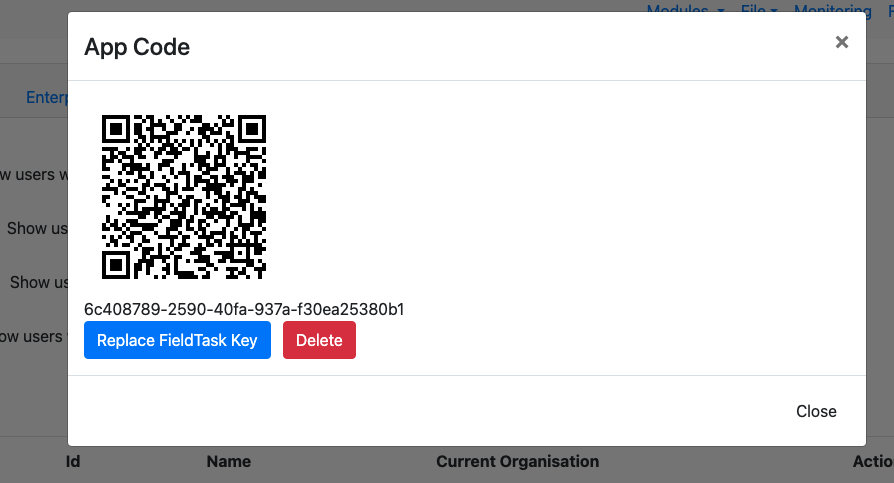
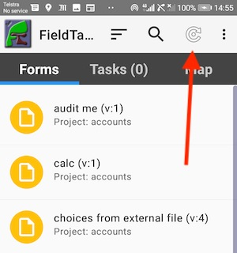
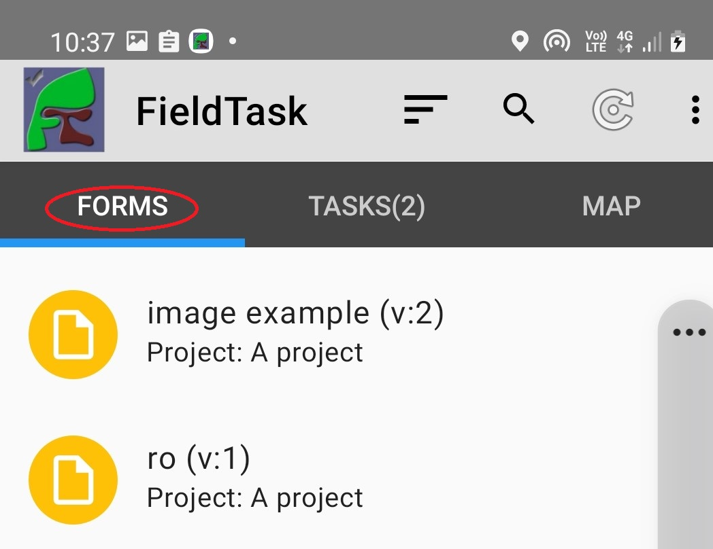
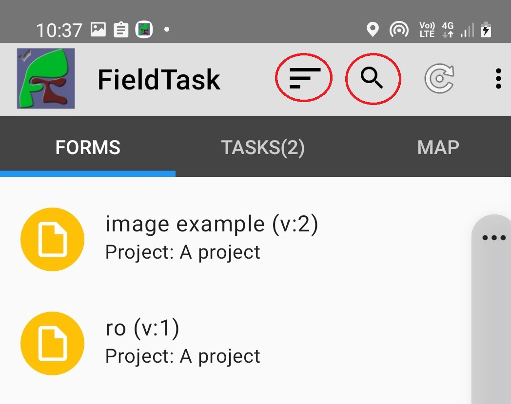
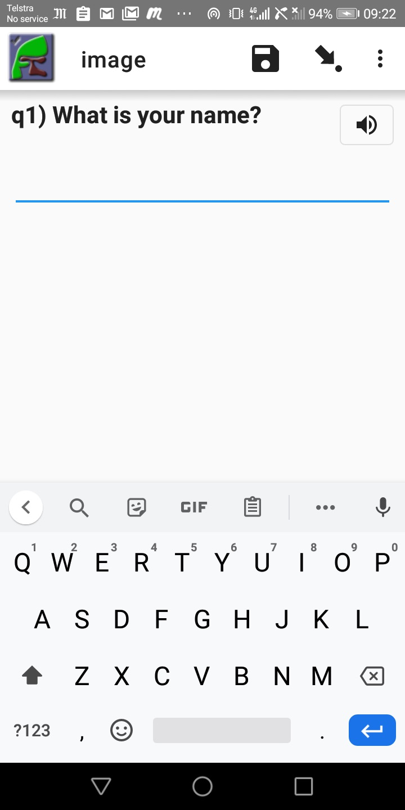
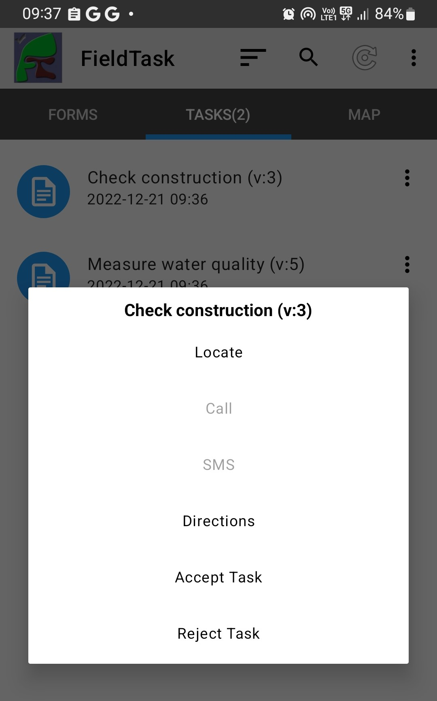

Using FieldTask
===============

.. contents::
 :local:

The main screen has three tabs — **Forms**, **Tasks** and **Map**. For a description of each of these see :doc:`fieldTask-screens`.

Logging On
----------

Logon Page
++++++++++

When you first start FieldTask a logon page will be shown. Your administrator can also set an option on the server
(:ref:`mobile-device-settings`) that requires you to log on every time you start FieldTask.

   Logon Page

You can then specify the URL of your server and enter your username and password to log on.

.. note::

    The first time a user logs on to a device, the device needs internet connectivity so that the username and
    password can be checked on the server.  The details of the last 5 users to log on are remembered, and those
    users can then log on again while offline.

Scanning a QR Code to log on
++++++++++++++++++++++++++++

Alternatively you can select the switch labelled **Use a token to access the server** and then scan a QR code to log on.

   Logon by scanning a QR code

The QR code sets the username and server URL, so those fields are disabled. A password is not needed with this approach so that
field is hidden. To start scanning press the **Scan QR code** button. An administrator can show the QR code on a screen by
navigating to the user administration page and selecting the QR button next to the user's name. These buttons are only shown
for users in the **Enumerator** security group (:ref:`security-groups`).

   Button to show QR Code

   QR Code to Scan

Changing logon details in settings
++++++++++++++++++++++++++++++++++

If you have to log on every time you open FieldTask then the logon page may be the only place where you set your credentials. However if
that is not required then you may want to change the server, username, password or token. This can be done in settings. Select:

#.  **Menu**
#.  **Settings**
#.  **Server**

You can then change your logon details in the same way you set them on the logon page.

Synchronising with the Server
-----------------------------

Press the **Refresh Task List** button on the toolbar, circled below, to synchronise the device with the server. You can also swipe down on
the form list or the task list to start a refresh. Synchronising will:

1.  Upload any completed instances
2.  Download any new or changed surveys / forms, and remove any forms you no longer have access to
3.  Download any new or changed tasks

   Refresh Button

In the tasks tab, the icons of completed instances change from purple to green when they have been sent to the server. Instances with a
green icon are removed at the start of the next refresh. If an instance cannot be sent because its survey is blocked or has been deleted,
it stays on the device and is shown with a grey icon. For a description of each icon see :ref:`task-states`.

Completing a Survey
-------------------

Starting a Survey Form
++++++++++++++++++++++

Select the **Forms** tab, as shown circled below, and then tap the survey that you want to complete.

   Launch Survey

Finding a Survey
++++++++++++++++

If you have a lot of forms on your phone then it may be hard to find the one you want to open. However you can use
**Filter the list** (the search icon) or **Sort the list** to make the form easier to find. These buttons are circled in the image below.

   Find a survey form

**Filter the list**. When you type some characters into the search bar, only those forms that contain that
sequence of characters in their name are shown. The sort icon is hidden while the search bar is open.

**Sort the list**. Survey forms can be sorted by:

  * Name, A-Z
  * Name, Z-A
  * Date, newest first
  * Date, oldest first
  * Project, A-Z
  * Project, Z-A

Tasks and instances can be sorted by:

  * Name, A-Z
  * Name, Z-A
  * Date, newest first
  * Date, oldest first
  * Status, finalized first
  * Status, unfinalized first
  * Distance, closest first
  * Distance, farthest first

.. note::

  It is good practice to only have the single survey that an enumerator needs to complete on the phone.  The
  fewer surveys that they have to choose from the less likely the wrong survey will be completed.

Adding Notes
++++++++++++

You can add free form notes to any question by selecting **Menu** and then **Add Comment** while completing a survey.
Notes added to each question are combined into a single note for the whole survey, with the question name added automatically.
They can then be seen in the survey notes column when viewing results.

Changing the Language
+++++++++++++++++++++

You can change the survey language displayed by selecting **Menu** and then **Change Language** while completing a survey.

Playing Media Questions
+++++++++++++++++++++++

If an audio or video file is added to a question (:ref:`media`) then an icon will be shown that the user can select to play the media.

   Playing Media

If the media is set to auto play then the text of the question will show as blue and the icon will be grayed out while the file is playing.

Clearing the Remote Cache
+++++++++++++++++++++++++

Select **Menu** and then **Clear Remote Cache** while completing a survey to discard the answers that FieldTask has cached from online
lookups (:ref:`looking-up-data`). Use this if a lookup returns a stale value.

Task Actions
------------

Each task on the tasks tab includes a menu at the right which you can select to show a list of choices for that task.

   Selecting an action for a task

Locate
++++++

Enabled if the task has coordinates. Selecting it will show the location of the task on the map tab.

Call
++++

Enabled if a phone number is available for the task. Selecting it opens the phone dialer.

SMS
+++

Enabled if a phone number is available for the task. Selecting it opens the messaging app with the number filled in.

Directions
++++++++++

Enabled if the task has coordinates. Selecting it opens the location of the task in the map app on your phone.

Accept Task
+++++++++++

A task that has not yet been accepted can be accepted here. This is mostly used for tasks created with the **Self Assign** checkbox set
(:doc:`self-assign`), as those tasks cannot be started until they are accepted. This choice is not shown for a case.

Reject Task
+++++++++++

A task that is new or accepted can be rejected by selecting this choice. A reason for rejecting the task must be specified. For a case
this choice is labelled **Release Case** and the case will be unassigned.

You can also swipe a task left or right in the task list to reject it. The same dialog asking for a reason will be shown. Survey forms in the
list cannot be swiped.

FieldTask Settings
------------------

There are many settings that you can configure on the device using **Menu** and **Settings**. Many of these can
also be specified on the server (:ref:`mobile-device-settings`).  Settings specified on the server override the settings
on every device.

The same settings can be reached while completing a survey by selecting **Menu** and then **Settings**. The one exception is the app
language, under **User Interface**, which cannot be changed while a survey is open.
