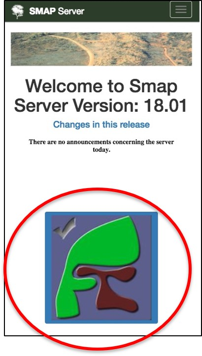
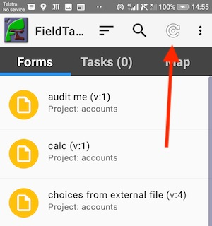
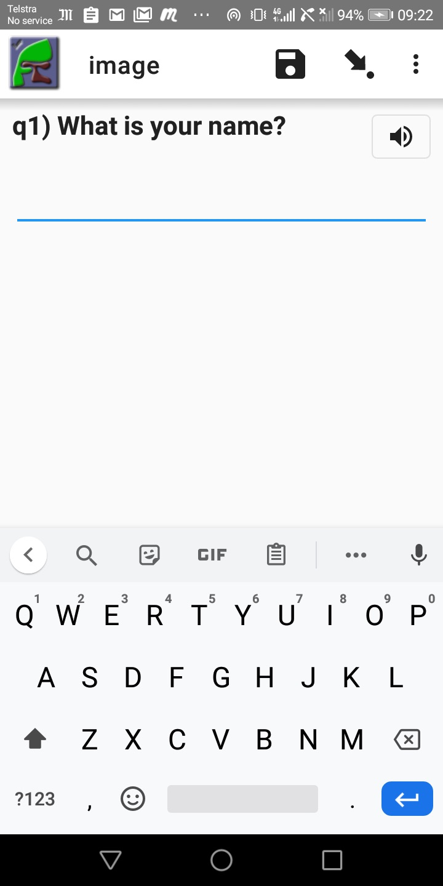

Field Task
==========

Contents:

.. contents::
 :local:

.. _install-fieldtask:

Install FieldTask
-----------------

If you are going to be using Android phones or Tablets to complete surveys then you will want to install FieldTask on these devices.  Alternatively
you can complete surveys in browsers using Webforms.

You can `get FieldTask from the Google Play store <https://play.google.com/store/apps/details?id=org.smap.smapTask.android>`_.  This is the easiest
way if you have a google account and are installing it on your own phone or tablet.  Search for "fieldTask" with no spaces in order to find it
quickly.

However if you are installing fieldTask on devices that will be shared then you definitely do not want to use your own google account as the
phone user will have access to your gmail.  Also setting up google accounts just to install the app is tedious.  In this case a much better approach
is to download fieldTask from the server.

1. Download
++++++++++++

In the internet browser on your phone enter the URL of your Smap Server.  If you are using the public server then that would be
https://sg.smap.com.au.  Then select the FieldTask button.  The application will then be downloaded to your phone.

   Download
   
2. Viewing the state of your download
+++++++++++++++++++++++++++++++++++++

Drag down with your finger from the top of the screen in order to see how your download is progressing.  Then press on
the fieldTask apk to install it or upgrade.

.. figure::  _images/installFT2.png
   :align:   center
   :width: 	 200px
   :alt:     Drag down from the top of the screen

   View download state

3. Accepting unknown sources
++++++++++++++++++++++++++++

Google take quite extensive steps to validate applications that are in the Google Play store, however here we are downloading
the app directly from the Smap server.  So an "unknown" source from Google's perspective and the phone may require you to 
confirm that you understand the risks.  

.. figure::  _images/installFT3.png
   :align:   center
   :width: 	 200px
   :alt:     Accept installation from unknown sources

   Accept installation from unknown sources
   
FieldTask should now install.

4. Minimal Configuration
++++++++++++++++++++++++

To start using FieldTask you will need to go to then menu and then "General Settings" to set

*  The URL of the server
*  Your username
*  Your password

Follow the instructions in :ref:`getting-started-create-sg-account` to get your username and password.

5. Required Permissions
+++++++++++++++++++++++

When you open fieldTask and also while using the app it will ask you to accept a number of permissions.  Most of these are self 
evident however the controversial one is shown when you first open a form.

  Allow FieldTask to make and manage phone calls.

If you don't accept this, when opening a form, then you will see a message stating why it is required and the form will not open.  This 
permission is used only to get the identifier for the android device, its *device id*.  This information is critical for
quality assurance as it identifies which device submitted which survey results.   However there is no need to worry FieldTask will 
not make any phone calls on your behalf.

.. note::

  The message shown if you don't accept the above permission is from ODK Collect which is the tool that FieldTask uses to fill in 
  a form.

Main Screen
-----------

On the fieldTask main screen there are 3 tabs

1. Forms
+++++++++

All the blank surveys that are available to be filled in.  Select a survey in order to fill it in.  Once you have completed
the survey an instance is created that is then submitted to the server.  The blank form will still be present ready to be 
completed again.

2. Tasks
+++++++++   

Any tasks that have been assigned to the user as well as completed or in progress instances.  

Once an instance has been submitted to the server you cannot modify it.  These submitted instances will disappear the next
time you do a refresh.

An instance that is **finalized**, that is has been marked as complete but not submitted, cannot be edited however 
you can review the data and add notes.  However this ability to review the data in a finalized survey while it is on the 
phone can be disabled by a setting in the **Mobile App Options** tab on the user management page.

Incomplete instances can be opened for editing.  If you do a long press on an incomplete instance or task then you can **reject** it. 
Effectively it will be deleted.  You need to provide a reason for this action.

Tasks in different states will be shown in a different color:

*  Rejected / Deleted:  Brown
*  Late:  Red
*  In progress: Yellow
*  Submitted: Greeen
*  Finalised: Purple

3. Map
++++++

Shows the location of tasks on the map.  A short press on the task will show its name and open a menu that allows you to use
google maps to plan a route to that task.  A long press on the task in the map will open it for editing.

Synchronising with the Server
-----------------------------

Press the **refresh** button on the main screen to synchronise the device with the server.  This will:

1.  Upload any completed instances
2.  Download any new or changed surveys / forms
3.  Download any new or changed tasks

   
   Refresh Button
 
Adding notes
------------

You can add free form notes to any question by selecting **menu** and then **Add comment** while completing a survey.
Although the question name is included in the note automatically,  a single note for the entire survey is actually created.  
All the notes you add for each question get combined.  They can then be seen in the survey notes column when viewing results.

Changing the Language
---------------------

You can change the survey language displayed by selecting **menu** and then **change language** while completing a survey.

FieldTask Settings
------------------

There are many settings that you can configure on the device using **menu** and **general settings**.  Many of these can
also be specified on the server (:ref:`mobile-device-settings`).  If specified on the server the settings will override those on the phone for all devices.

Playing Media Questions
-----------------------

If an audio or video file is added to a question (:ref:`media`) then an icon will be shown that the user can seelect to play the media.

   Playing Media

If the media is set to auto play then the text of the question will show as blue and the icon will be grayed out while the file is playing.
