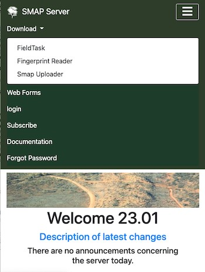
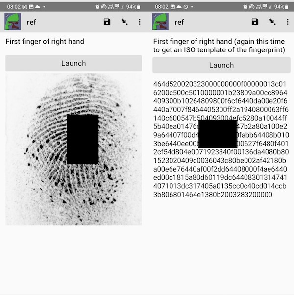

.. _feature-fingerprints:

Fingerprints
============

.. contents::
 :local:

Setup
-----

The fingerprints are captured using a fingerprint reader which is a physical device that scans the finger.  An Android app also needs to be installed on 
the device to interface to the reader.

Fingerprint Readers
-------------------

Mantra MFS100
+++++++++++++

*  Produced by: Mantratec
*  Cost:  Approximately 80 USD

This reader plugs into the USB port on the phone which is running fieldTask. Assuming this port on the phone is USB-C then you will also need a USB-C to USB-A adapter.

Website:  https://www.mantratec.com/products/Fingerprint-Sensors/MFS100-Fingerprint-Scanner

Mantra MFS500
+++++++++++++

*  Produced by: Mantratec
*  Cost:  Approximately 80 USD

This reader plugs into the USB port on the phone which is running fieldTask. Assuming this port on the phone is USB-C then you will also need a USB-C to USB-A adapter.

Website:  https://www.mantratec.com/products/Fingerprint-Sensors/MFS500

Reader App
----------

There are currently two reader apps one for each of the two supported Mantra fingerprint readers.  The MFS500 version is
going to be updated to support MFS100 as well but we are not there yet.

Smap Fingerprint reader can be downloaded onto the device from the server home page under the download menu.
To do this use a browser on the device to go to the server home page and select the download menu.

   Downloading the fingerprint reader

Old Version - MFS100
++++++++++++++++++++

This app is an extension of the opensource Keppel app, the extension being to capture fingerprints as an image,
Keppel only supports the ISO 19794-4 fingerprint template.

New Version - MFS500
++++++++++++++++++++

A custom reader that uses the MFS500 API.

The form
--------

An instruction to call the fingerprint reader can be added to either an image question or a text question as shown below.

.. csv-table:: survey
  :header: type, name, label, appearance

  image, fp1, capture fingerprint image, ex:uk.ac.lshtm.keppel.android.SCAN(type='image')
  text, fp2, capture fingerprint iso template, ex:uk.ac.lshtm.keppel.android.SCAN(type='image')

The result will look like the following:

   Captured fingerprint data

Matching Fingerprints
---------------------

.. note::

  Users who can run matches against fingerprints must have the security group **Follow Links**

Matching functionality will be increased progressively according to need. 

On the console, if have the required security group and you select a record, a new button labeled “Links” will be shown. 
Click on this button to open a page that shows the image 
finger prints and any records that match. The default minimum score required for a match is 40.0. You can change this score and press the search button 
to redo the search. If you click on the link to a matching record it will open the record in a web form.

Matching Algorithm
++++++++++++++++++

Smap is using an open source fingerprint matching tool called `SourceAFIS <https://sourceafis.machinezoo.com/algorithm>`_. Commercial alternatives offer more 
accurate matching however being open source results in a more sustainable system. Organisations collecting fingerprints should also investigate using fieldTask 
to collect fingerprints that can be used to train an Artificial Intelligence system to find matches.

Linkage Cache
+++++++++++++

Fingerprint data is stored in a cache, this includes:

*  The fingerprint template generated from the fingerprint image
*  A link to the original image
*  The survey identifier
*  The question containing the data
*  The instance identifier that identifies the record

This cache will need to be rebuilt when initialising fingerprint matching. From
then each time a new fingerprint is added to the system it will be inserted into the cache.

Rebuilding the linkage cache will:

*  Get a list of every question that captures a fingerprint
*  Create a record in the table for every instance in those questions

Fingerprint Templates
+++++++++++++++++++++

Matching is done between fingerprint templates and not images.  The forward batch file computes this for all
images in the linkage table that do not have a template.
