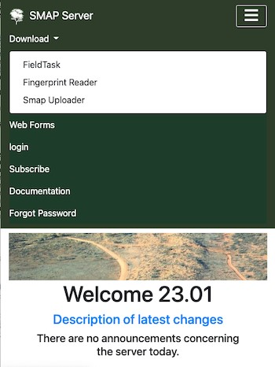
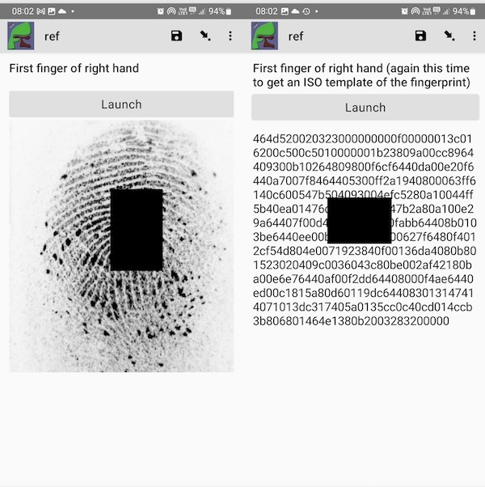

.. _feature-fingerprints:

Fingerprints
============

.. contents::
 :local:

Setup
-----

The fingerprints are captured using a fingerprint reader which is a physical device that scans the finger.  An Android app also needs to be installed on 
the device to interface to the reader.

Fingerprint Readers
-------------------

Mantra MFS500
+++++++++++++

*  Produced by: Mantratec
*  Cost:  Approximately 80 USD

This reader plugs into the USB port on the phone which is running fieldTask. Assuming this port on the phone is USB-C then you will also need a USB-C to USB-A adapter.

Website:  https://www.mantratec.com/products/Fingerprint-Sensors/MFS500

Mantra MFS100
+++++++++++++

*  Produced by: Mantratec
*  Cost:  Approximately 80 USD

.. warning::

  MFS100 is not supported on the latest version of FieldTask.

This reader plugs into the USB port on the phone which is running fieldTask. Assuming this port on the phone is USB-C then you will also need a USB-C to USB-A adapter.

Website:  https://www.mantratec.com/products/Fingerprint-Sensors/MFS100-Fingerprint-Scanner

Reader App
----------

Smap Fingerprint reader can be downloaded onto the device from the server home page under the download menu.
To do this use a browser on the device to go to the server home page and select the download menu.

   Downloading the fingerprint reader

The reader app needs to be installed on the same phone as FieldTask.  FieldTask will start it up when it is asked to get a
finger print.

The form
--------

An instruction to call the fingerprint reader can be added to either an image question or a text question as shown below.

.. csv-table:: survey
  :header: type, name, label, appearance

  image, fp1, capture fingerprint image, ex:au.smap.fingerprintreader.SCAN(type='image')
  text, fp2, capture fingerprint iso template, ex:au.smap.fingerprintreader.SCAN(type='iso')

The result will look like the following:

   Captured fingerprint data

Matching Fingerprints
---------------------

.. warning::

  Matching is not currently supported.  The algorithm was not accurate enough to be useful.

