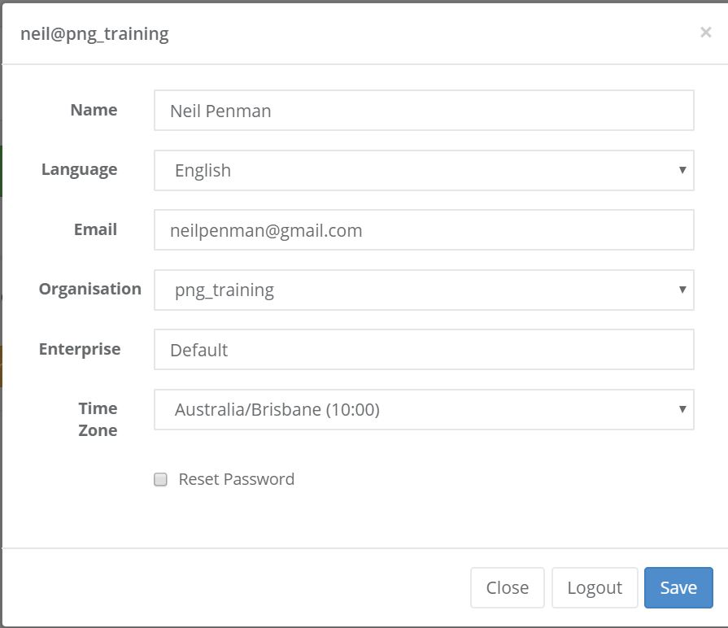

Getting Started
===============

.. contents::
 :local:
 
This document walks you through some basic steps to get started using Smap.

.. _getting-started-create-sg-account:

Create an account on the hosted server
--------------------------------------

Using your web browser navigate to https://sg.smap.com.au
Click on the "register" menu and fill in the requested details.  You will need to enter your email address so that an email can be
sent with a link that you can use to set your password.  

Make sure to read the terms and conditions for use of the free server. 

Once you have set a password you can logon using your email address as your user ident and logon to the server.

Registering creates an "organisation" and within this organisation you can add additional users, projects and surveys. Only users
created by you in your organisation can access your data.

.. note::

  Not all the menu options and features described in this document will be visible to all users.

Using the Server
----------------

Once you have logged on you can create surveys and manage your data collection. 

Navigation
++++++++++

The Smap server is divided into **modules** including Admin, Analysis, Edit and Tasks.  To navigate between modules**
select the **modules** menu and then the module you want to go to.  Within each module there will then be multiple functions
that you can access via the menu bar.

Your Profile
++++++++++++

On all screens the first menu option will be for your user profile. 

   
   User Profile
   
Here you can set your:
 
*  Name.  Note this is not the identifier that you use to logon with
*  Language.  The language of the server.  English, Spanish, French, Hindi, Arabic, Portuguese with the
   first two being most complete.  If you want to contribute to translating the server into additional
   languages then contact support.
*  Your email address.  You will need this if you ever have to reset your password.
*  Organisation. You may have access to multiple organisations in which case you can select the one you want
   use here. 
*  Enterprise.  A higher level of compartmentalisation than organisation.
*  Time Zone.  Specify the time zone you want to use to view data in and for reports.
*  Change your password.
*  Logout.  Logout of your account.  Note if you are using Firefox you will also need to close Firefox in order to complete
   the logout.

Selecting a Project
+++++++++++++++++++

On most screens you can select a project which will change the surveys and other resources that are shown on the page.

Install Field Task on your Android Devices
------------------------------------------

:ref:`install-fieldtask`

