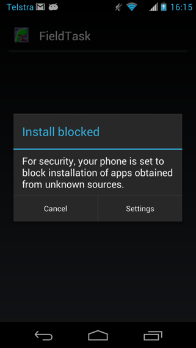

Getting Started
===============

This document walks you through some basic steps to get started using Smap.

Contents:

.. contents::
 :local:

.. _getting-started-create-sg-account:

Create an account on the hosted server
--------------------------------------

Using your web browser navigate to https://sg.smap.com.au
Click on the "register" menu and fill in the requested details.  You will need to enter your email address so that an email can be
sent with a link that you can use to set your password.  

Make sure to read the terms and conditions for use of the free server. 

Once you have set a password you can logon using your email address as your user ident and logon to the server.

Registering creates an "organisation" and within this organisation you can add additional users, projects and surveys. Only users
created by you in your organisation can access your data.

.. _getting-started-install-fieldTask:

Install FieldTask
-----------------

If you are going to be using Android phones or Tablets to complete surveys then you will want to install FieldTask on these devices.  Alternatively
you can complete surveys in browsers using Webforms.

You can `get FieldTask from the Google Play store <https://play.google.com/store/apps/details?id=org.smap.smapTask.android>`_.  This is the easiest
way if you have a google account and are installing it on your own phone or tablet.

However if you are installing fieldTask on devices that will be shared then you definitely do not want to use your own google account as the
phone user will have access to your gmail.  Also setting up google accounts just to install the app is tedious.  In this case a much better approach
is to download fieldTask from the server.

1. Download
++++++++++++

In the internet browser on your phone enter the URL of your Smap Server.  If you are using the public server then that would be
https://sg.smap.com.au.  Then select the FieldTask button.  The application will then be downloaded to your phone.

.. figure::  _images/installFT1.jpg
   :align:   center
   :width: 	 200px
   :alt:     Click on the fieldTask icon to download

   Download
   
2. Viewing the state of your download
+++++++++++++++++++++++++++++++++++++

Drag down with your finger from the top of the screen in order to see how your download is progressing.  Then press on
the fieldTask apk to install it or upgrade.

.. figure::  _images/installFT2.png
   :align:   center
   :width: 	 200px
   :alt:     Drag down from the top of the screen

   View download state

3. Accepting unknown sources
++++++++++++++++++++++++++++

Google take quite extensive steps to validate applications that are in the Google Play store, however here we are downloading
the app directly from the Smap server.  So an "unknown" source from Google's perspective and the phone may require you to 
confirm that you understand the risks.  

   Accept installation from unknown sources
   
FieldTask should now install.

