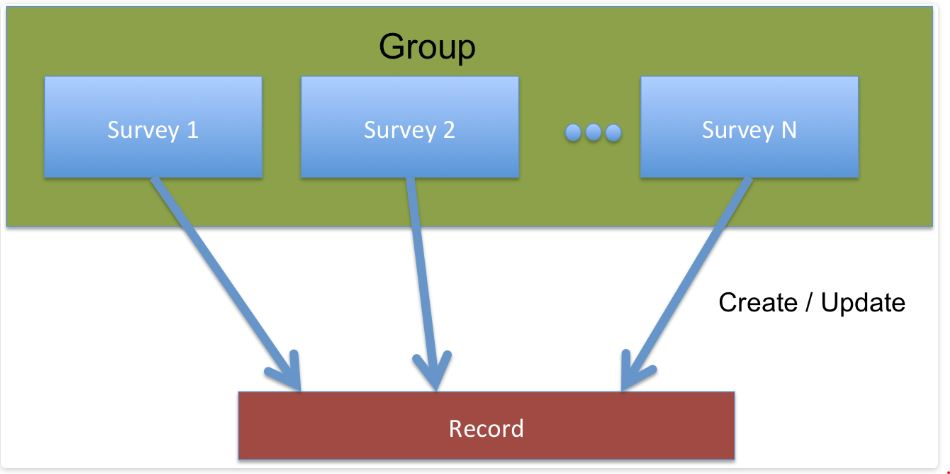

.. _survey_groups:

Survey Group
============

.. contents::
 :local:
 
When a completed survey is submitted, a record on the server is created or updated. Records are stored in database tables.
You can **group** surveys so that they all **share the same records**.  This allows you to, for example, 
create a record with survey A and then update it with survey B.   

   Group Concepts

.. warning::

  Do not confuse these groups with the "begin group" type in surveys which groups questions together.  The groups described
  here group surveys together rather than questions.
  
If surveys are grouped when you view their data you will see the same records, however the columns of data will depend on
the questions in the form that you are viewing.  If two grouped surveys have a question with the same name then the same
data will be shown in both surveys.
