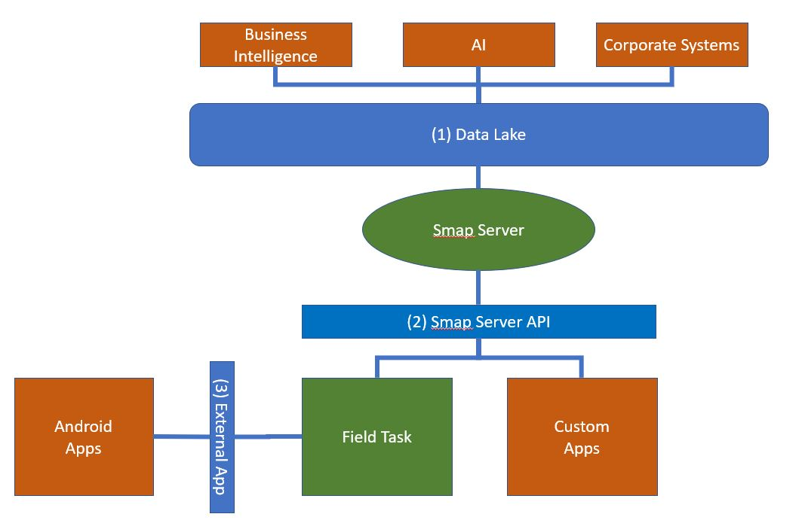

.. _integration:

Integration
===========

.. contents::
 :local:

Applications built with Smap can be integrated with other applications in multiple ways.  The following diagram shows the primary
interfaces in blue.  Typical external applications are shown in orange and the Smap components in green.

   Integration
   
1) Data Lake
------------

Data tables, images, video and other files collected using MDC can be pushed to a data lake where the data can be processed by data analytics tools 
pushed to other systems.

2) Smap Server API
------------------

Custom apps such as Progressive Web Apps, Native Mobile Apps or corporate systems can call this API to retrieve and update data.
(:ref:`apis`)

3) Android External App
-----------------------

From forms, running inside Field Task, external applications can be called to retrieve data.  (:ref:`external-applications`)